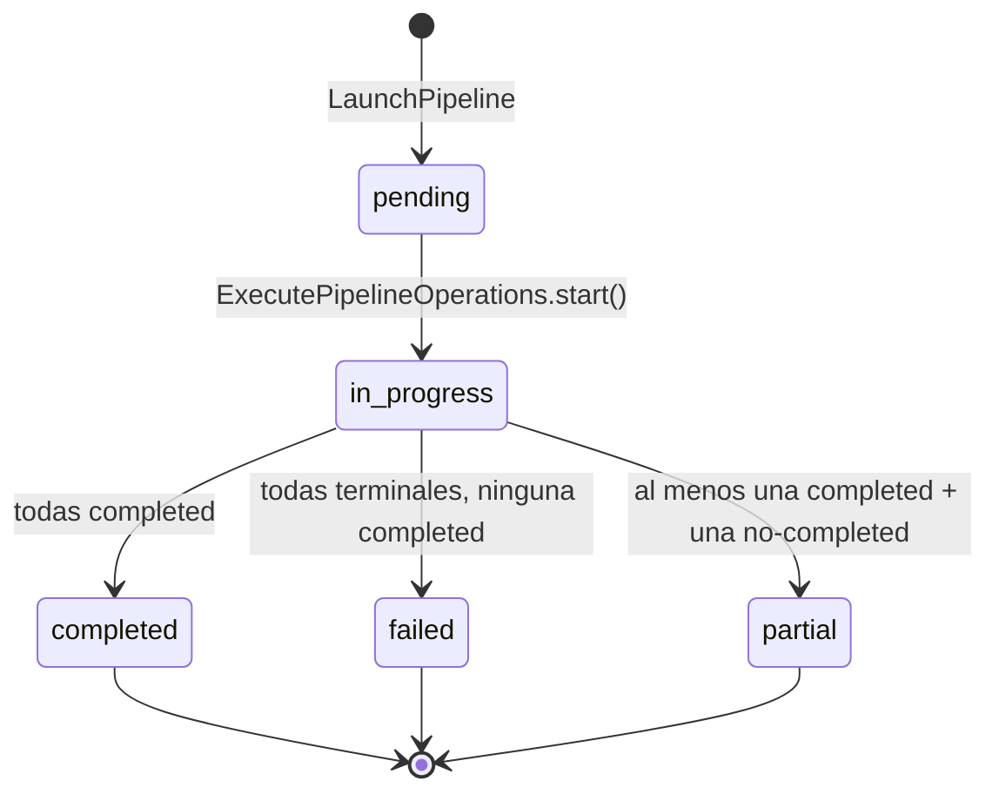

# Arquitectura del Módulo Pipelines v1

## Visión General

El módulo `pipelines` orquesta la ejecución de múltiples kits en múltiples servidores (o grupos) de forma paralela. Un pipeline define una combinación de `targets[]` (servidores/grupos) y `kits[]`. Al lanzarlo, genera una operación por cada combinación `kit × servidor` y delega la ejecución individual al módulo `operations` vía `OperationLauncherAdapter`.

```
app/v1/pipelines/
├── domain/
│   ├── entities/          # Pipeline, PipelineExecution
│   ├── value_objects/     # PipelineTarget, PipelineKitConfig, PipelineStatus
│   └── exceptions/        # PipelineNotFoundError, PipelineExecutionNotFoundError, etc.
├── application/
│   ├── commands/          # CreatePipeline, UpdatePipeline, DeletePipeline, LaunchPipeline
│   ├── queries/           # GetPipeline, ListPipelines, GetPipelineExecutions, GetPipelineExecutionDetail
│   ├── tasks/             # ExecutePipelineOperations (async background)
│   ├── dtos/              # PipelineResult, PipelineExecutionResult, etc.
│   ├── exceptions.py      # UseCaseException, PipelineInProgressError, etc.
│   └── interfaces/        # PipelineRepository, PipelineExecutionRepository, OperationLauncher, etc.
├── infrastructure/
│   ├── persistence/       # PipelineModel, PipelineExecutionModel (SQLAlchemy)
│   ├── repositories/      # SQLAlchemyPipelineRepository, SQLAlchemyPipelineExecutionRepository
│   ├── adapters/           # OperationLauncherAdapter, ServerReadAdapter, KitReadAdapter, OperationReadAdapter
│   └── presentation/      # routes.py, schemas.py, deps.py, exception_handlers.py
```

---

## Capa Domain

### Entity: `Pipeline`

Definición reutilizable (template) que combina kits con servidores target.

| Campo | Tipo | Descripción |
|-------|------|-------------|
| `id` | str | Identidad |
| `user_id` | str | Propietario (RN-01) |
| `name` | str | Nombre descriptivo |
| `description` | str \| None | — |
| `targets` | list[PipelineTarget] | Servidores/grupos donde ejecutar. No servidor local (RN-17) |
| `kits` | list[PipelineKitConfig] | Kits con sudo/debug_level opcionales |
| `values` | dict | Valores de configuración compartidos |
| `sudo` | bool | Default global (RN-14) |
| `debug_level` | str | Default global (`none` \| `errors` \| `full`) (RN-15) |
| `created_at` | datetime | — |
| `updated_at` | datetime | — |

**Comandos:**
- `update(name, description, targets, kits, values, sudo, debug_level)` — mutación controlada
- `resolved_sudo_for(kit_id)` — RN-14: kit override > global
- `resolved_debug_level_for(kit_id)` — RN-15: kit override > global > "none"
- `has_local_server(local_server_ids)` — RN-17: devuelve True si algún target es local

### Entity: `PipelineExecution`

Instancia concreta de una ejecución. Ciclo: `pending → in_progress → completed/failed/partial`.

| Campo | Tipo | Descripción |
|-------|------|-------------|
| `id` | str | Identidad |
| `pipeline_id` | str | Pipeline origen |
| `user_id` | str | Propietario |
| `status` | PipelineStatus | Estado agregado (RN-20) |
| `operation_ids` | list[str] | IDs de las operaciones generadas |
| `snapshot` | dict | Copia inmutable de targets+kits+values (RN-21) |
| `created_at` | datetime | — |
| `started_at` | datetime \| None | — |
| `finished_at` | datetime \| None | — |

**Comandos:**
- `start()` — `pending → in_progress`
- `mark_finished(operation_statuses)` — RN-20: calcula estado agregado

**Estado agregado (RN-20):**
- `completed` → todas las operaciones en `completed`
- `failed` → todas terminales sin ninguna `completed`
- `partial` → al menos una `completed` + al menos una `failed`/`cancelled`/`cancelled_unsafe`

### Value Objects

| VO | Valores | Invariantes |
|----|---------|-------------|
| `PipelineTarget` | `server_id: str` | No vacío |
| `PipelineKitConfig` | `kit_id: str, sudo: bool\|None, debug_level: str\|None` | kit_id no vacío; debug_level en {none, errors, full} |
| `PipelineStatus` | `pending, in_progress, completed, failed, partial` | Transición válida solo pending→in_progress→terminal |

### Domain Exceptions

| Excepción | Descripción |
|-----------|-------------|
| `PipelineNotFoundError` | Pipeline no existe o no pertenece al usuario (RN-01) |
| `PipelineExecutionNotFoundError` | Ejecución no encontrada |
| `InvalidPipelineTargetError` | server_id vacío |
| `InvalidPipelineKitConfigError` | kit_id vacío o debug_level inválido |
| `InvalidPipelineStatusError` | Transición de estado inválida |

### Application Exceptions

| Excepción | Descripción |
|-----------|-------------|
| `PipelineInProgressError` | Pipeline tiene ejecuciones activas (RN-16) |
| `LocalServerInPipelineError` | Servidor local en targets (RN-17) |
| `PipelineNotLaunchableError` | Kit no usable al lanzar (RN-09) |

---

## Capa Application

### Commands

| Command | Descripción | Validaciones |
|---------|-------------|-------------|
| `CreatePipeline` | Crea y persiste un pipeline | RN-17: no servidor local |
| `UpdatePipeline` | Mutación controlada | RN-01: ownership; RN-16: sin ejecuciones activas; RN-17: no local |
| `DeletePipeline` | Elimina un pipeline | RN-01: ownership; RN-16: sin ejecuciones activas |
| `LaunchPipeline` | Lanza PipelineExecution + encola tarea async | RN-01: ownership; RN-09: kits usables; RN-21: snapshot |

### Queries

| Query | Descripción |
|-------|-------------|
| `GetPipeline` | Detalle de un pipeline (RN-01: ownership) |
| `ListPipelines` | Lista paginada del usuario |
| `GetPipelineExecutions` | Historial de ejecuciones paginado (RN-01) |
| `GetPipelineExecutionDetail` | Detalle con operaciones individuales (RN-01) |

### Async Task: `ExecutePipelineOperations`

1. Carga pipeline y execution via repositorios
2. `execution.start()` → persiste
3. Expande targets: servidor directo o grupo → `server_ids` individuales
4. Para cada (kit_config, server_id): `OperationLauncher.launch(...)` con `resolved_sudo_for()` y `resolved_debug_level_for()`
5. Guarda `operation_ids` en la ejecución
6. Polling hasta que todas las operaciones son terminales
7. `execution.mark_finished(operation_statuses)` → RN-20 → persiste

### Ports (Interfaces)

| Puerto | Ubicación | Métodos |
|--------|-----------|---------|
| `PipelineRepository` | `application/interfaces/` | `save, find_by_id, find_all_by_user, update, delete, has_active_executions, find_by_id_no_ownership` |
| `PipelineExecutionRepository` | `application/interfaces/` | `save, find_by_id, find_by_pipeline_id, update, find_latest_by_pipeline` |
| `OperationLauncher` | `application/interfaces/` | `launch(user_id, server_id, kit_id, values, sudo, debug_level) → operation_id` |
| `ServerRepository` (cross-module) | `application/interfaces/` | `find_server_by_id_internal, find_group_by_id_internal, find_servers_by_ids` |
| `OperationRepository` (cross-module) | `application/interfaces/` | `find_by_id_internal` |
| `KitRepository` (cross-module) | `application/interfaces/` | `find_by_id_internal` |
| `TaskQueue` | `operations/application/interfaces/` | `enqueue(fn, *args)` |

---

## Capa Infrastructure

### Persistence Models

| Tabla | Columnas | Índices |
|-------|----------|---------|
| `pipelines` | id, user_id, name, description, targets (JSON), kits (JSON), values (JSON), sudo, debug_level, created_at, updated_at | user_id, name |
| `pipeline_executions` | id, pipeline_id, user_id, status, operation_ids (JSON), snapshot (JSON), started_at, finished_at, created_at | pipeline_id, user_id, status |

### Repositories

| Puerto | Adaptador | Tests |
|--------|-----------|-------|
| `PipelineRepository` | `SQLAlchemyPipelineRepository` | 8 tests (T-19) |
| `PipelineExecutionRepository` | `SQLAlchemyPipelineExecutionRepository` | 6 tests (T-20) |

### Cross-module Adapters

| Puerto | Adaptador | Descripción |
|--------|-----------|-------------|
| `OperationLauncher` | `OperationLauncherAdapter` | Envuelve `LaunchOperation` del módulo operations |
| `ServerRepository` | `ServerReadAdapter` | Lee servers/grupos sin ownership |
| `OperationRepository` | `OperationReadAdapter` | Lee operaciones sin ownership (solo `find_by_id_internal`) |
| `KitRepository` | `KitReadAdapter` | Lee kits sin ownership (solo `find_by_id_internal`) |

### Presentation (FastAPI)

| Método | Path | Use Case | HTTP |
|--------|------|----------|------|
| POST | `/api/v1/pipelines` | `CreatePipeline` | 201 |
| GET | `/api/v1/pipelines` | `ListPipelines` | 200 |
| GET | `/api/v1/pipelines/{id}` | `GetPipeline` | 200 |
| PUT | `/api/v1/pipelines/{id}` | `UpdatePipeline` | 200 |
| DELETE | `/api/v1/pipelines/{id}` | `DeletePipeline` | 204 |
| POST | `/api/v1/pipelines/{id}/executions` | `LaunchPipeline` | 201 |
| GET | `/api/v1/pipelines/{id}/executions` | `GetPipelineExecutions` | 200 |
| GET | `/api/v1/pipelines/{id}/executions/{exec_id}` | `GetPipelineExecutionDetail` | 200 |

### Exception Handlers

| Excepción | HTTP |
|-----------|------|
| `PipelineNotFoundError` | 404 |
| `PipelineExecutionNotFoundError` | 404 |
| `PipelineInProgressError` | 409 |
| `LocalServerInPipelineError` | 422 |
| `PipelineNotLaunchableError` | 422 |
| `UseCaseException` (catch-all) | 422 |

---

## Flujo de Lanzamiento de Pipeline

```
POST /api/v1/pipelines/{id}/executions
    │
    ▼
LaunchPipeline.execute(user_id, pipeline_id)
    │
    ├─ pipeline_repository.find_by_id()          → verifica ownership (RN-01)
    ├─ [para cada kit] kit_repository.find_by_id_internal()
    │     Verifica kit.is_usable() (RN-09: synced + no deleted)
    │
    ├─ snapshot = {targets, kits, values, sudo, debug_level}  (RN-21)
    ├─ execution = PipelineExecution(status=pending)
    ├─ execution_repository.save()
    ├─ task_queue.enqueue(ExecutePipelineOperations, execution.id)
    │
    ▼
PipelineExecutionResult DTO → HTTP 201

[En background — ExecutePipelineOperations:]
    │
    ├─ execution.start()  → persiste
    │
    ├─ Para cada (kit_config, server_id):
    │     sudo_eff = pipeline.resolved_sudo_for(kit_config.kit_id)      (RN-14)
    │     debug_eff = pipeline.resolved_debug_level_for(kit_config.kit_id) (RN-15)
    │     op_id = await OperationLauncher.launch(
    │         user_id, server_id, kit_id, values, sudo_eff, debug_eff)
    │     execution.operation_ids.append(op_id)
    │
    ├─ execution_repository.update()  → persiste operation_ids
    │
    ├─ Polling: ¿todas las ops terminales?
    │     Sí → execution.mark_finished(operation_statuses)  (RN-20)
    │          execution_repository.update()
    │     No → espera 5s, reintenta
    │
    └─ Resultado: completed / failed / partial
```

---

## Composition Root (`main.py`)

```python
# Lifespan: pipeline task closure
async def _execute_pipeline_fn(execution_id: str) -> None:
    async for session in get_db_session(_session_factory):
        # ... crea repositorios y adaptadores con sesión propia
        task = ExecutePipelineOperations(
            pipeline_repository=...,
            execution_repository=...,
            server_repository=PipelinesServerReadAdapter(session),
            operation_launcher=OperationLauncherAdapter(launch_operation=...),
            operation_repository=PipelinesOperationReadAdapter(session),
        )
        await task.execute(execution_id)

app.state.execute_pipeline_fn = _execute_pipeline_fn
```

---

## Diagramas

### Ciclo de vida de PipelineExecution



### Ejecución en matriz kit × servidor

```mermaid
flowchart TD
    A([POST /pipelines/id/executions]) --> B[LaunchPipeline.execute]
    B --> C{Validar ownership}
    C -- No --> E404([404])
    C -- Sí --> D{Validar kits usables}
    D -- No --> E422([422])
    D -- Sí --> F[Crear PipelineExecution\nstatus: pending]
    F --> G[Capturar snapshot]
    G --> H[Encolar ExecutePipelineOperations]
    H --> I([201 PipelineExecutionResult])

    subgraph Background ["ExecutePipelineOperations (async)"]
        J[execution.start()] --> K[Expandir targets:\nservidor directo o grupo]
        K --> L[Para cada kit×servidor:\nlaunch(OperationLauncher)]
        L --> M[Guardar operation_ids]
        M --> N[Polling: todas terminales?]
        N -- No --> N
        N -- Sí --> O[mark_finished(RN-20)]
    end
```