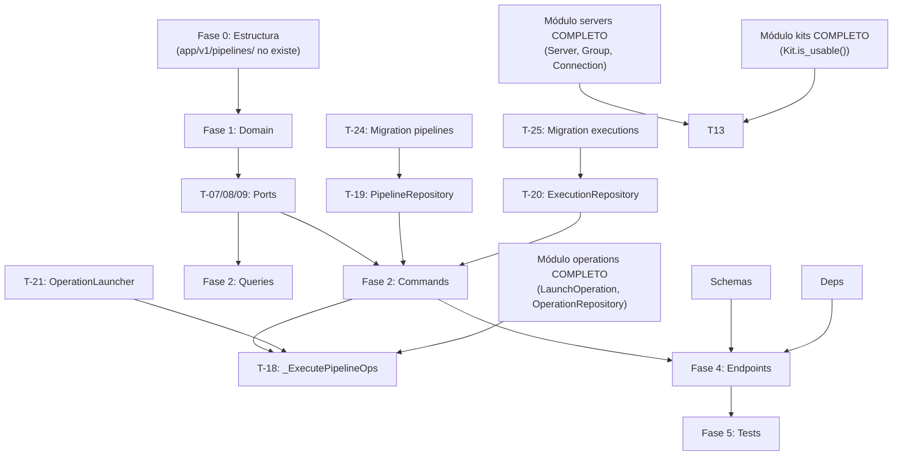
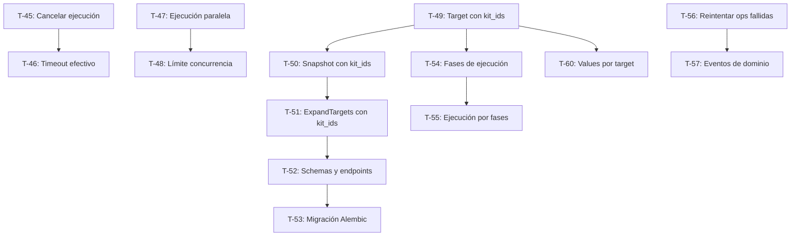

# Tareas del Módulo Pipelines v1.0.0

**Estado:** 139 tests GREEN — Fases 0–5 completadas ✅

> Módulo que gestiona pipelines de configuración — ejecuciones de N kits × M servidores (o grupos)
> en paralelo. Un pipeline genera automáticamente N×M operaciones individuales y agrega su estado.
> Depende completamente de `operations` (LaunchOperation), `servers` (Server/Group), `kits` (Kit).

## Fase 0: Estructura Clean Architecture

**✅ COMPLETADA**

- [x] **T-00.1**: Crear `app/v1/pipelines/` con `__init__.py` y estructura `domain/` (`entities/`, `value_objects/`, `exceptions/`) con sus `__init__.py`
- [x] **T-00.2**: Crear `application/` con subcarpetas `commands/`, `queries/`, `tasks/`, `dtos/`, `interfaces/` y sus `__init__.py`
- [x] **T-00.3**: Crear `application/exceptions.py` (UseCaseException, PipelineInProgressError, LocalServerInPipelineError, PipelineNotLaunchableError)
- [x] **T-00.4**: Crear `infrastructure/` con subcarpetas `persistence/`, `repositories/`, `adapters/`, `presentation/` y sus `__init__.py`
- [x] **T-00.5**: Crear tests directory `tests/v1/pipelines/` con subcarpetas `test_domain/`, `test_use_cases/`, `test_infrastructure/`, `test_presentation/` y sus `__init__.py`

## Fase 1: Entidades y Value Objects (Domain Layer)

**✅ COMPLETADA — 69 tests GREEN**

- [x] **T-01**: Value Object `PipelineTarget` — 7 tests GREEN
- [x] **T-02**: Value Object `PipelineKitConfig` — 12 tests GREEN
- [x] **T-03**: Value Object `PipelineStatus` — 14 tests GREEN
- [x] **T-04**: Entity `Pipeline` — 16 tests GREEN (update, resolved_sudo_for, resolved_debug_level_for, has_local_server, equality)
- [x] **T-05**: Entity `PipelineExecution` — 14 tests GREEN (start, mark_finished RN-20, equality, invalid transitions)
- [x] **T-06**: Domain Exceptions — `PipelineNotFoundError`, `PipelineExecutionNotFoundError`, `InvalidPipelineTargetError`, `InvalidPipelineKitConfigError`, `InvalidPipelineStatusError`

## Fase 2: Use Cases (Application Layer) — CQRS

### Ports (Interfaces)

- [x] **T-07**: Port `PipelineRepository` ABC en `application/interfaces/pipeline_repository.py` — métodos: `save(pipeline)`, `find_by_id(id, user_id)`, `find_all_by_user(user_id, page, per_page)`, `update(pipeline)`, `delete(id)`, `has_active_executions(pipeline_id)` — 0 tests
- [x] **T-08**: Port `PipelineExecutionRepository` ABC en `application/interfaces/pipeline_execution_repository.py` — métodos: `save(execution)`, `find_by_id(id)`, `find_by_pipeline_id(pipeline_id, page, per_page)`, `update(execution)`, `find_latest_by_pipeline(pipeline_id)` — 0 tests
- [x] **T-09**: Port `OperationLauncher` ABC en `application/interfaces/operation_launcher.py` — método: `launch(user_id, server_id, kit_id, values, sudo, debug_level)` → devuelve `operation_id: str`. Wrapper de `LaunchOperation` del módulo operations. Permite desacoplar pipelines de la implementación concreta de operations — 0 tests
- [x] **T-09.1**: Port `ServerRepository` (read-only, cross-module) en `application/interfaces/server_repository.py` — métodos: `find_server_by_id_internal(server_id)`, `find_group_by_id_internal(group_id)`, `find_servers_by_ids(server_ids)` — 0 tests
- [x] **T-09.2**: Port `OperationRepository` (read-only, cross-module) en `application/interfaces/operation_repository.py` — método: `find_by_id_internal(operation_id)` para polling del estado en `_ExecutePipelineOperations` — 0 tests

### Commands

- [x] **T-10**: Command `CreatePipeline(user_id, name, description, targets, kits, values, sudo, debug_level)` → devuelve `PipelineResult` — valida que ningún target es servidor `local` (RN-17), persiste Pipeline — 5 tests ✅
- [x] **T-11**: Command `UpdatePipeline(user_id, pipeline_id, name, description, targets, kits, values, sudo, debug_level)` → devuelve `PipelineResult` — valida ownership (RN-01), valida sin ejecuciones activas (RN-16), valida no servidor local en targets (RN-17), persiste — 5 tests ✅
- [x] **T-12**: Command `DeletePipeline(user_id, pipeline_id)` → `None` — valida ownership (RN-01), valida sin ejecuciones activas (RN-16 implícito), elimina — 4 tests ✅
- [x] **T-13**: Command `LaunchPipeline(user_id, pipeline_id)` → devuelve `PipelineExecutionResult` — valida ownership (RN-01), expande targets (servers directos + servers de grupos), valida todos los kits usables (RN-09), crea `PipelineExecution pending`, persiste, encola `_ExecutePipelineOperations` async. Si algún kit del pipeline no está sincronizado, falla antes de encolar — 6 tests ✅

### Queries

- [x] **T-14**: Query `GetPipeline(user_id, pipeline_id)` → devuelve `PipelineResult` — valida ownership — 2 tests ✅
- [x] **T-15**: Query `ListPipelines(user_id, page, per_page)` → devuelve `PipelineListResult` paginado — 2 tests ✅
- [x] **T-16**: Query `GetPipelineExecutions(user_id, pipeline_id, page, per_page)` → valida ownership, devuelve `PipelineExecutionListResult` paginado con resumen por ejecución (status, launched_at, finished_at, ops total/completadas/falladas) — 2 tests ✅
- [x] **T-17**: Query `GetPipelineExecutionDetail(user_id, pipeline_id, execution_id)` → valida ownership del pipeline, devuelve `PipelineExecutionDetailResult` con snapshot + lista completa de operaciones individuales (server_id, kit_id, status, error) — 3 tests ✅

### Async Task (Application Layer)

- [x] **T-18**: Async task `_ExecutePipelineOperations(execution_id)` en `application/tasks/execute_pipeline_operations.py` — orquesta la ejecución del pipeline:
  1. Carga el pipeline y la execution via repositorios
  2. Expande targets: servers directos + todos los servers de grupos (via `ServerRepository.find_servers_by_group`)
  3. Para cada combinación (kit, server) → llama `OperationLauncher.launch(...)` (resolviendo `sudo` y `debug_level` via `pipeline.resolved_sudo_for(kit_id)` y `pipeline.resolved_debug_level_for(kit_id)`). Guarda todos los `operation_id` generados en `execution.operation_ids`
  4. Llama `execution.start()` + persiste
  5. Polling hasta que todas las ops sean terminales (polling cada 5s, timeout global 30min RNF-08)
  6. Llama `execution.mark_finished(operation_statuses)` con los estados finales de todas las ops (RN-20)
  7. Persiste `execution` con estado final — 10 tests ✅

### DTOs

- [x] **T-18.1**: Crear DTOs: `PipelineResult`, `PipelineListResult`, `PipelineExecutionResult`, `PipelineExecutionListResult`, `PipelineExecutionDetailResult` — sin tests directos ✅

  **FASE 2 COMPLETADA: 39 tests GREEN**

## Fase 3: Infrastructure (Repositories y Adapters)

### Repositories

- [x] **T-19**: `SQLAlchemyPipelineRepository` — implementa `PipelineRepository` port. Targets/kits como JSON — 8 tests ✅
- [x] **T-20**: `SQLAlchemyPipelineExecutionRepository` — implementa `PipelineExecutionRepository` port. Operation_ids/snapshot como JSON — 6 tests ✅

### Adapter OperationLauncher

- [x] **T-21**: `OperationLauncherAdapter` — wrapper de `LaunchOperation` — 3 tests ✅

### Cross-module Adapters

- [x] **T-21.1**: `ServerReadAdapter` (pipelines) — delega a `SQLAlchemyServerRepository`
- [x] **T-21.2**: `OperationReadAdapter` (pipelines) — delega a `SQLAlchemyOperationRepository.find_by_id_no_ownership`
- [x] **T-21.3**: `KitReadAdapter` (pipelines) — delega a `SQLAlchemyKitRepository.find_by_id_internal`

### Composition Root

- [x] **T-22**: Extender `main.py` con adaptadores del módulo pipelines — `SQLAlchemyPipelineRepository`, `SQLAlchemyPipelineExecutionRepository`, `OperationLauncherAdapter`, `ServerReadAdapter`, `OperationReadAdapter`, `KitReadAdapter`, `ExecutePipelineOperations` closure

### Persistence Models

- [x] **T-23**: Modelos SQLAlchemy en `infrastructure/persistence/models.py` — tablas `pipelines`, `pipeline_executions`

### Database Migrations (Alembic)

- [x] **T-24**: Alembic migration: tabla `pipelines`
- [x] **T-25**: Alembic migration: tabla `pipeline_executions`

### Presentation

- [x] **T-26**: Schemas Pydantic en `schemas.py` — `CreatePipelineRequest`, `UpdatePipelineRequest`, `PipelineResponse`, `PipelineExecutionResponse`, `PipelineExecutionDetailResponse`, etc.
- [x] **T-27**: `deps.py` — dependencias FastAPI: repositorios, adaptadores cross-module, use cases
- [x] **T-28**: Exception handlers en `exception_handlers.py` — `PipelineNotFoundError` → 404, `PipelineInProgressError` → 409, `LocalServerInPipelineError` → 422, `PipelineNotLaunchableError` → 422

  **FASE 3 COMPLETADA: 17 tests GREEN**

## Fase 4: Presentation (FastAPI Endpoints)

- [x] **T-29**: `POST /api/v1/pipelines` — crear pipeline → 201 ✅
- [x] **T-30**: `GET /api/v1/pipelines` — listar pipelines paginados → 200 ✅
- [x] **T-31**: `GET /api/v1/pipelines/{id}` — obtener pipeline → 200/404 ✅
- [x] **T-32**: `PUT /api/v1/pipelines/{id}` — actualizar pipeline → 200/404/409 ✅
- [x] **T-33**: `DELETE /api/v1/pipelines/{id}` — eliminar pipeline → 204/404/409 ✅
- [x] **T-34**: `POST /api/v1/pipelines/{id}/executions` — lanzar pipeline → 201/422 ✅
- [x] **T-35**: `GET /api/v1/pipelines/{id}/executions` — historial de ejecuciones → 200 ✅
- [x] **T-35.1**: `GET /api/v1/pipelines/{id}/executions/{exec_id}` — detalle de ejecución → 200/404 ✅

  **FASE 4 COMPLETADA: 8 endpoints**

## Fase 5: Tests (TDD)

### Tests de Presentación

- [x] **T-37**: Tests de presentación pipelines — 14 tests GREEN ✅

  **FASE 5 COMPLETADA: 14 tests GREEN**

## Fase 6: Documentación y Validación

- [x] **T-41**: ARCHITECTURE.md actualizado con implementación real ✅
- [x] **T-42**: VALIDATION.md — validación de requisitos RF y RN ✅
- [x] **T-43**: Review y refactoring de código — sin regresiones, 411 tests GREEN globales ✅
- [x] **T-44**: API_GUIDE.md con ejemplos curl para todos los endpoints ✅

| Fase | Estado | Tests | Completitud |
|------|--------|-------|-------------|
| Fase 0 - Estructura | ✅ **COMPLETADA** | — | 100% |
| Fase 1 - Domain Layer | ✅ **COMPLETADA** | 69 GREEN | 100% |
| Fase 2 - Use Cases (CQRS) | ✅ **COMPLETADA** | 49 GREEN (T-10 a T-18) | 100% |
| Fase 3 - Infrastructure | ✅ **COMPLETADA** | 17 GREEN (T-19 a T-28) | 100% |
| Fase 4 - Presentation | ✅ **COMPLETADA** | 14 GREEN (T-29 a T-35.1) | 100% |
| Fase 5 - Tests | ✅ **COMPLETADA** | 14 GREEN (T-37) | 100% |
| Fase 6 - Documentación | ⏳ **PENDIENTE** | — | 0% |

**TOTAL: 139 tests GREEN**

## Fase 6: Documentación y Ajustes

- [ ] **T-41**: Documentación técnica → [ARCHITECTURE.md](../ARCHITECTURE.md) ya creado ✅ — verificar coverage
- [ ] **T-42**: Validación de requisitos vs implementación (todos los RF y RN)
- [ ] **T-43**: Review y refactoring de código
- [ ] **T-44**: API_GUIDE.md con ejemplos curl para todos los endpoints

### Próximos Pasos

1. 🔴 **CRÍTICO**: Módulos `servers`, `kits` y `operations` deben estar 100% implementados antes de empezar pipelines
2. ⏳ Ejecutar Fase 0 (crear carpeta `app/v1/pipelines/`)
3. ⏳ Implementar Domain (Pipeline, PipelineExecution entities + VOs + RN-20 aggregation)
4. ⏳ Implementar Ports (5 interfaces — 3 cross-module)
5. ⏳ Implementar Commands/Queries con TDD
6. ⏳ Implementar `_ExecutePipelineOperations` async task
7. ⏳ Implementar `OperationLauncherAdapter` (wrapper de LaunchOperation)
8. ⏳ Crear 2 migrations Alembic
9. ⏳ Crear 8 endpoints FastAPI

## Dependencias de Tareas

**Dependencias críticas:**

- **T-00.X** → Todo el módulo (EL DIRECTORIO NO EXISTE)
- **Módulo `servers` COMPLETO** → T-10 (CreatePipeline valida no servidor local), T-13 (LaunchPipeline expande grupos), T-18 (task necesita server info)
- **Módulo `kits` COMPLETO** → T-13 (LaunchPipeline valida `kit.is_usable()`)
- **Módulo `operations` COMPLETO** → T-13 y T-18 (`OperationLauncher` envuelve `LaunchOperation`, T-18 hace polling de `OperationRepository`)
- **T-05 (PipelineExecution + mark_finished)** → T-18 (la tarea async llama `mark_finished` para RN-20)
- **T-21 (OperationLauncherAdapter)** → T-18 (la tarea usa el launcher)

## Estadísticas

- **Total de tareas**: 44 tareas explícitas
- **Fases**: 7 (incluyendo Fase 0 de setup)
- **Tests estimados**: ~100 total
- **Endpoints**: 8 (CRUD + launch + status + history)
- **Entidades**: 2 (Pipeline, PipelineExecution)
- **Value Objects**: 3 (PipelineTarget, PipelineKitConfig, PipelineStatus)
- **Use Cases**: 8 (4 commands + 4 queries) + 1 async task
- **Ports cross-module**: 3 (ServerRepository, OperationRepository, OperationLauncher)
- **Adapters**: 1 (OperationLauncherAdapter)
- **Repositories**: 2 (SQLAlchemyPipelineRepository, SQLAlchemyPipelineExecutionRepository)
- **Migrations Alembic**: 2 (pipelines, pipeline_executions)
- **Bloqueo**: Último módulo a implementar — depende de `servers`, `kits` y `operations`

## Cobertura de Reglas de Negocio

| RN | Descripción | Tareas | Estado |
|----|-------------|--------|--------|
| RN-01 | Ownership — solo pipelines propios | T-10, T-11, T-12, T-13, T-14, T-15, T-16, T-17 | ✅ Implementado |
| RN-14 | `sudo` por kit prioridad sobre global | T-04 `resolved_sudo_for()`, T-18 | ✅ Implementado |
| RN-15 | `debug_level` por kit prioridad sobre global | T-04 `resolved_debug_level_for()`, T-18 | ✅ Implementado |
| RN-16 | No actualizar si hay ejecución activa | T-07 `has_active_executions()`, T-11, T-12 | ✅ Implementado |
| RN-17 | Servidor local → no permitir en pipeline | T-10, T-11 | ✅ Implementado |
| RN-20 | Estado agregado: all completed/failed/partial | T-05 `mark_finished()`, T-18 | ✅ Implementado |
| RN-21 | Snapshot inmutable de config al lanzar | T-13 `LaunchPipeline._build_snapshot()` | ✅ Implementado |

**Estado RN v1: 7 implementadas, 0 pendientes**

---

## v2.0.0 — Mejoras de Pipelines

**Estado:** Pendiente

> Mejoras identificadas tras la v1.0.0: cancelación, paralelización, roles por target,
> concurrencia, reintentos, eventos, snapshots de kits y fases de ejecución.

### Fase 7: Cancelación y Timeout Efectivo

- [ ] **T-45**: Cancelar PipelineExecution — `CancelPipelineExecution` command
  - `POST /api/v1/pipelines/{id}/executions/{exec_id}/cancel`
  - Transición `in_progress → cancelled` en PipelineExecution
  - Cancelar operaciones pendientes (marcar como `cancelled`)
  - Publicar evento `PipelineExecutionCancelled`
- [ ] **T-46**: Timeout efectivo — al superar el timeout global (RNF-08), marcar operaciones pendientes como `cancelled_unsafe`
  - Actualmente el timeout marca la ejecución como `failed` pero las operaciones SSH siguen corriendo
  - Necesita mecanismo para cancelar operaciones individuales en el módulo operations

### Fase 8: Ejecución Paralela y Concurrencia

- [ ] **T-47**: Ejecución paralela de operaciones — reemplazar `for server_id... for kit_config...` secuencial por `asyncio.gather`
  - `ExecutePipelineOperations._launch_operations()` lanza todas las operaciones en paralelo
  - Actualmente se lanzan una a una (secuencial)
- [ ] **T-48**: Límite de concurrencia configurable — `Semaphore(max_concurrent)` en `ExecutePipelineOperations`
  - RNF-06: soportar mínimo 50 operaciones SSH concurrentes
  - Parámetro configurable (default: 10) para limitar el número de conexiones SSH simultáneas
  - Evitar saturar servidores con demasiadas operaciones en paralelo

### Fase 9: Roles por Target (kits específicos por grupo de servidores)

- [ ] **T-49**: Extender `PipelineTarget` con `kit_ids` y `values` opcionales
  - Cambio de modelo: `PipelineTarget(server_id, kit_ids?, values?)`
  - Si `kit_ids` es None → usa los kits globales del pipeline (comportamiento actual)
  - Si `kit_ids` tiene valores → solo esos kits se aplican a ese target
  - Permite: "masters con kit-1, workers con kit-2"
- [ ] **T-50**: Extender `LaunchPipeline._build_snapshot()` para capturar `kit_ids` y `values` por target
  - RN-21: el snapshot debe reflejar la config real usada por cada target
- [ ] **T-51**: Actualizar `ExecutePipelineOperations._expand_targets()` para resolver kits por target
  - Si el target tiene `kit_ids`, usar esos; si no, usar los globales del pipeline
- [ ] **T-52**: Actualizar schemas Pydantic y endpoints para aceptar `kit_ids` y `values` por target
- [ ] **T-53**: Migración Alembic para nueva columna JSON en `pipelines.targets`

### Fase 10: Fases de Ejecución (dependencias entre targets)

- [ ] **T-54**: Añadir `phase` opcional a `PipelineTarget`
  - `PipelineTarget(server_id, kit_ids?, values?, phase?)`
  - Phase es un entero (1, 2, 3...). Default: 1
  - Los targets con phase=1 se ejecutan antes que los de phase=2
  - Permite: "primero masters (phase=1), luego workers (phase=2)"
- [ ] **T-55**: `ExecutePipelineOperations` ejecuta por fases secuenciales
  - Fase 1: lanzar todos los targets con phase=1, esperar a que terminen
  - Fase 2: lanzar todos los targets con phase=2, esperar a que terminen
  - ...y así hasta la fase máxima
  - Si una fase falla completamente, las siguientes no se ejecutan (mark_finished con los resultados parciales)

### Fase 11: Reintentos y Eventos

- [ ] **T-56**: Reintentar operaciones fallidas de una PipelineExecution
  - `POST /api/v1/pipelines/{id}/executions/{exec_id}/retry`
  - Crea una nueva PipelineExecution que solo lanza las operaciones que fallaron
  - Reutiliza el snapshot de la ejecución original
- [ ] **T-57**: Publicar eventos de dominio `PipelineExecutionCompleted`, `PipelineExecutionFailed`, `PipelineExecutionCancelled`
  - Otros módulos pueden reaccionar (notificaciones, alertas, métricas)
- [ ] **T-58**: Progreso en tiempo real — añadir campos `completed_count`, `failed_count`, `total_count` a `PipelineExecution`
  - Evita tener que consultar las operaciones individuales para saber el progreso
  - Se actualizan durante el polling en `ExecutePipelineOperations`

### Fase 12: Snapshot de Kits

- [ ] **T-59**: Capturar versión y hash del kit en el snapshot al lanzar
  - Actualmente RN-21 captura `targets`, `kits` y `values` pero no la versión/contentido del kit
  - Si un kit se modifica tras el lanzamiento, la ejecución usa la versión actual
  - Solución: almacenar `kit_version` y `kit_last_commit_sha` en el snapshot por cada kit

### Fase 13: Variables por Target

- [ ] **T-60**: Soportar `values` por target (además de por kit)
  - Permite: `--node-type=master` para targets del grupo masters, `--node-type=worker` para workers
  - Los values por target se mergean con los globales del pipeline y los del kit

### Dependencias v2

### Estadísticas v2

- **Total tareas v2**: 16 (T-45 a T-60)
- **Fases**: 7 (7 a 13)
- **Nuevos endpoints**: 2 (cancel, retry)
- **Cambios de modelo**: PipelineTarget (kit_ids, values, phase)
- **Nuevos commands**: CancelPipelineExecution, RetryPipelineExecution
- **Nuevos eventos**: PipelineExecutionCompleted, PipelineExecutionFailed, PipelineExecutionCancelled
