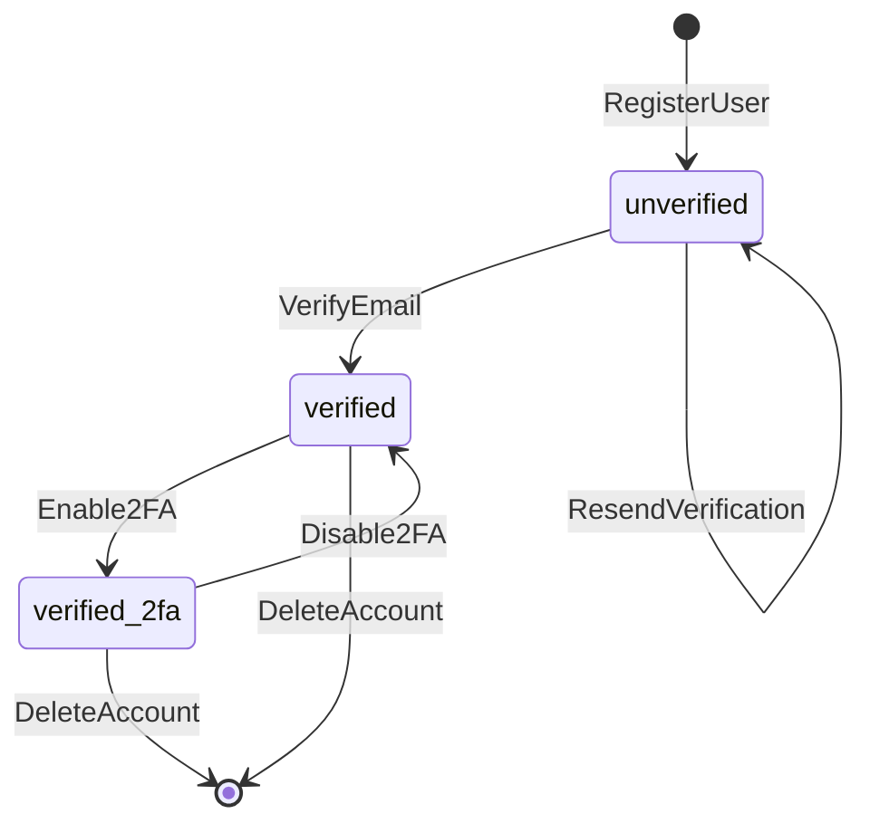
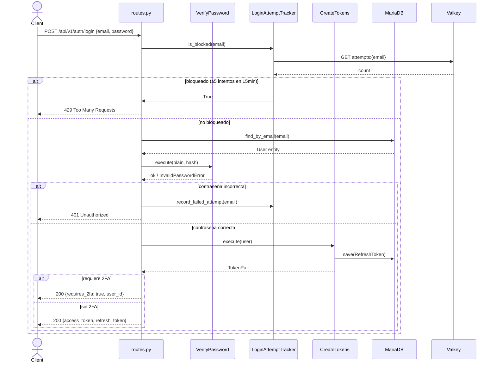
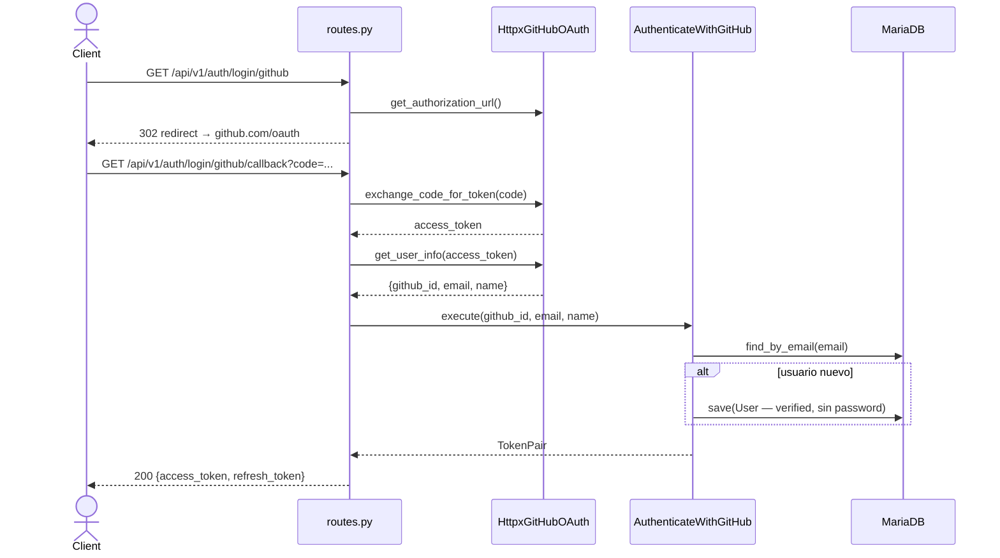

# Arquitectura del Módulo Auth v1

## Visión General

El módulo `auth` implementa autenticación y gestión de identidad siguiendo Clean Architecture con separación estricta en cuatro capas. Las dependencias solo apuntan hacia adentro: `infrastructure` → `application` → `domain`.

```
app/v1/auth/
├── domain/          # Núcleo — sin dependencias externas
├── application/     # Orquestación — depende solo de domain
└── infrastructure/  # Implementaciones concretas + endpoints HTTP
```

---

## Capa Domain

**Responsabilidad:** Modelar el negocio sin conocimiento de frameworks ni infraestructura.

### Entities

| Entity | Identidad | Campos principales | Comandos | Queries |
|--------|-----------|-------------------|---------|---------|
| `User` | `id` | name, email (VO), password_hash, is_verified, is_2fa_enabled, totp_secret | `enable_2fa()`, `disable_2fa()`, `verify_email()`, `update_name()`, `update_password()` | `is_verified()`, `is_2fa_required()`, `has_oauth_password()` |
| `RefreshToken` | `id` | user_id, token, expires_at | — | `is_expired()` |
| `VerificationToken` | `id` | user_id, token, type, expires_at | — | `is_expired()` |
| `PasswordHistory` | `id` | user_id, password_hash, created_at | — | — |

### Value Objects

| VO | Validaciones | Comportamiento |
|----|-------------|----------------|
| `Email` | formato RFC, no vacío | `.normalized()`, `.domain()` |
| `Password` | ≥8 chars, 1 mayúscula, 1 minúscula, 1 número | `.validate()` |
| `JWTToken` | estructura JWT válida | `.get_user_id()`, `.get_expiration()`, `.is_expired()`, `.is_access_token()` |

### Domain Events

Publicados **después** de `repository.save()` en los use cases correspondientes:

| Evento | Publisher | Payload |
|--------|-----------|---------|
| `UserRegistered` | `RegisterUser` | `{user_id, email}` |
| `EmailVerified` | `VerifyEmail` | `{user_id, email}` |
| `PasswordChanged` | `ChangePassword` | `{user_id}` |
| `TwoFAEnabled` | `Enable2FA` | `{user_id}` |
| `TwoFADisabled` | `Disable2FA` | `{user_id}` |

### Domain Exceptions

```
InvalidEmailError          → Email con formato inválido
InvalidPasswordError       → Password que no cumple complejidad
InvalidUserError           → Usuario con datos inválidos
InvalidRefreshTokenError   → RefreshToken con datos inválidos
InvalidVerificationTokenError
InvalidPasswordHistoryError
UserNotFoundError
TokenNotFoundError
TokenExpiredError
TokenAlreadyUsedError
```

---

## Capa Application

**Responsabilidad:** Orquestar domain, puertos e interfaces. Nunca devuelve entities al exterior — siempre DTOs.

### CQRS: Commands vs Queries

**Commands** (`application/commands/`) — mutan estado, pueden publicar eventos:

| Command | Descripción | Evento publicado |
|---------|-------------|-----------------|
| `RegisterUser` | Crea usuario, genera token verificación, envía email | `UserRegistered` |
| `VerifyEmail` | Marca email como verificado | `EmailVerified` |
| `ChangePassword` | Valida contraseña actual, verifica historial, actualiza | `PasswordChanged` |
| `ResetPassword` | Restablece contraseña con token de reset | — |
| `RequestPasswordReset` | Genera token reset, envía email | — |
| `GenerateVerificationToken` | Genera token de verificación | — |
| `RevokeRefreshToken` | Invalida refresh token (logout) | — |
| `Enable2FA` | Genera secret TOTP, activa 2FA en entity | `TwoFAEnabled` |
| `Disable2FA` | Limpia secret TOTP, desactiva 2FA | `TwoFADisabled` |
| `UpdateUserProfile` | Actualiza nombre de usuario | — |
| `CreateTokens` | Genera par access/refresh tokens, persiste refresh | — |
| `RefreshAccessToken` | Rotación: invalida token anterior, genera nuevo par | — |
| `AuthenticateWithGitHub` | OAuth GitHub: obtiene/crea usuario, genera tokens | — |

**Queries** (`application/queries/`) — solo leen, sin efectos secundarios:

| Query | Descripción |
|-------|-------------|
| `AuthenticateUser` | Verifica email+password, devuelve `UserProfile` |
| `VerifyAccessToken` | Decodifica y valida JWT access token |
| `VerifyPassword` | Compara plain vs hash bcrypt |
| `HashPassword` | Genera hash bcrypt (rounds=12) |
| `GetUserProfile` | Obtiene datos de perfil por user_id |
| `Verify2FA` | Verifica código TOTP del usuario |

### DTOs (retorno de use cases)

```
RegistrationResult     → user_id
UserProfile            → id, name, email, is_verified, is_2fa_enabled
TokenPair              → access_token, refresh_token, expires_in, token_type
AuthenticationResult   → user_id, email, requires_2fa
PasswordChangeResult   → changed_at
VerificationResult     → token, expires_at
TOTPSetup              → secret, qr_code_uri, provisioning_uri
```

### Interfaces (Ports)

Contratos ABC que la infraestructura implementa:

```
UserRepository               → save, find_by_email, find_by_id, update, delete
RefreshTokenRepository       → save, find_by_token, delete, delete_by_user_id, count_by_user_id, find_by_user_id
VerificationTokenRepository  → save, find_by_token, delete, delete_by_user_id, find_by_user_id
PasswordHistoryRepository    → save, find_last_n_by_user
EmailService                 → send_verification_email, send_password_reset_email, send_password_changed_notification, send_2fa_enabled_notification
JWTProvider                  → create_access_token, create_refresh_token, decode_token, verify_token
TOTPProvider                 → generate_secret, generate_qr_code, verify_code, get_provisioning_uri
GitHubOAuth                  → get_authorization_url, exchange_code_for_token, get_user_info
LoginAttemptTracker          → record_failed_attempt, is_blocked, reset_attempts, get_remaining_attempts
RateLimiter                  → is_allowed, increment
EventBus (shared)            → publish, subscribe
```

---

## Capa Infrastructure

**Responsabilidad:** Implementar los puertos y exponer la API HTTP.

### Adapters (implementaciones de puertos)

| Puerto | Implementación | Tecnología |
|--------|---------------|------------|
| `JWTProvider` | `PyJWTProvider` | python-jose |
| `TOTPProvider` | `PyOTPTOTPProvider` | pyotp + qrcode |
| `EmailService` | `AiosmtplibEmailService` | aiosmtplib |
| `GitHubOAuth` | `HttpxGitHubOAuth` | httpx |
| `EventBus` | `InMemoryEventBus` | shared/infrastructure |

### Repositories (implementaciones SQLAlchemy)

| Puerto | Implementación | Tabla |
|--------|---------------|-------|
| `UserRepository` | `SQLAlchemyUserRepository` | `users` |
| `RefreshTokenRepository` | `SQLAlchemyRefreshTokenRepository` | `refresh_tokens` |
| `VerificationTokenRepository` | `SQLAlchemyVerificationTokenRepository` | `verification_tokens` |
| `PasswordHistoryRepository` | `SQLAlchemyPasswordHistoryRepository` | `password_history` |

### Services

| Puerto | Implementación | Backend |
|--------|---------------|---------|
| `LoginAttemptTracker` | `ValkeyLoginAttemptTracker` | Valkey (Redis-compatible) |
| `RateLimiter` | `ValkeyRateLimiter` | Valkey (Redis-compatible) |

### Presentation (FastAPI)

**`routes.py`** — Endpoints organizados por dominio funcional:

| Grupo | Endpoints |
|-------|-----------|
| Registro | `POST /register`, `POST /verify-email`, `POST /resend-verification` |
| Login | `POST /login`, `GET /login/github`, `GET /login/github/callback`, `POST /login/2fa` |
| Tokens | `POST /refresh`, `POST /logout` |
| Password | `POST /password/forgot`, `POST /password/reset`, `PUT /users/me/password` |
| Perfil | `GET /users/me`, `PUT /users/me`, `DELETE /users/me`, `GET /users/me/data` |
| 2FA | `POST /users/me/2fa/enable`, `POST /users/me/2fa/verify`, `POST /users/me/2fa/disable` |

**`deps.py`** — Funciones `get_*` que FastAPI usa como `Depends()`:
- Scoped por request: `get_db_session()`, `get_user_repository()`, etc.
- Singleton: `get_jwt_provider()`, `get_event_bus()`, `get_login_attempt_tracker()`, etc.

**`middlewares.py`** — `RequireEmailVerification`: bloquea endpoints críticos si el email no está verificado (RN-02). Security headers en todas las respuestas.

**`exception_handlers.py`** — Convierte excepciones de dominio a HTTP responses:

```
DomainException           → 400
EmailAlreadyExistsError   → 409
UnauthorizedOperationError → 403
ResourceNotFoundError     → 404
UserBlockedError          → 429
InfrastructureException   → 503
```

**`schemas.py`** — Schemas Pydantic de request/response. Validación de entrada en capa HTTP, nunca en use cases.

---

## Composition Root (`main.py`)

Único lugar donde infrastructure y application se conectan. Instancia singletons y registra routers:

```python
# Singletons (una instancia para toda la app)
settings = Settings()
event_bus = InMemoryEventBus()
valkey_client = ...
login_attempt_tracker = ValkeyLoginAttemptTracker(valkey_client)
rate_limiter = ValkeyRateLimiter(valkey_client)
jwt_provider = PyJWTProvider(settings.JWT_SECRET, settings.JWT_ALGORITHM)
# ...

# Scoped por request (via Depends)
async def get_db_session() -> AsyncGenerator[AsyncSession, None]:
    async with session_factory() as session:
        yield session
        await session.commit()  # rollback automático si hay excepción
```

---

## Flujo de un Request Típico

Ejemplo: `POST /api/v1/auth/login`

```
HTTP Request
    │
    ▼
routes.py::login()          ← FastAPI resuelve Depends()
    │
    ├─ user_repository.find_by_email()    ← SQLAlchemyUserRepository
    ├─ login_attempt_tracker.is_blocked() ← ValkeyLoginAttemptTracker
    │
    ▼
VerifyPassword().execute()  ← Query (application layer)
    │
    ▼
CreateTokens().execute()    ← Command (application layer)
    │
    ├─ User.is_2fa_required()             ← Entity domain logic
    ├─ jwt_provider.create_access_token() ← PyJWTProvider
    ├─ refresh_token_repository.save()    ← SQLAlchemyRefreshTokenRepository
    │
    ▼
LoginResponse               ← Pydantic schema → JSON HTTP 200
```

---

## Decisiones de Diseño (ADRs)

| ADR | Decisión |
|-----|---------|
| [ADR-001](../adrs/001-valkey-cache-store.md) | Valkey para rate limiting y login attempts |
| [ADR-002](../adrs/002-mariadb-primary-database.md) | MariaDB como DB principal |
| [ADR-006](../adrs/006-error-handling-strategy.md) | Excepciones Python nativas (no Result/Either) |
| [ADR-007](../adrs/007-clean-architecture.md) | Clean Architecture con CQRS y DI manual |
| [ADR-008](../adrs/008-event-driven-observability.md) | InMemoryEventBus en Fase 1 (monolito modular) |

---

## Diagramas

### Ciclo de vida del usuario



### Flujo de autenticación (POST /login)



### Flujo OAuth GitHub (GET /login/github → callback)


