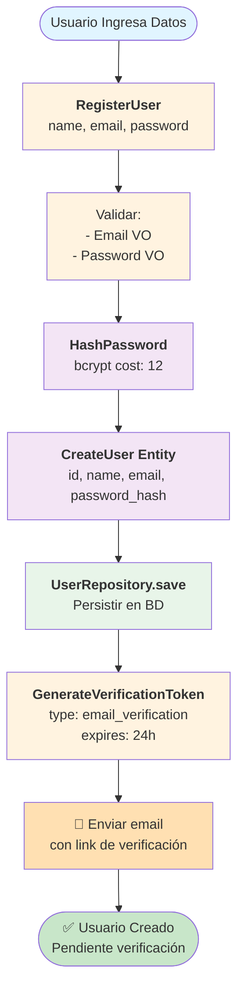
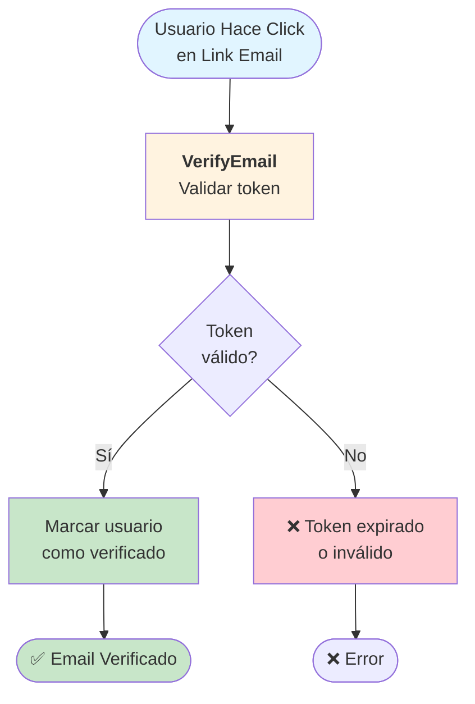
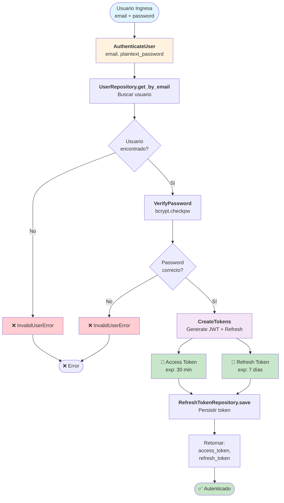
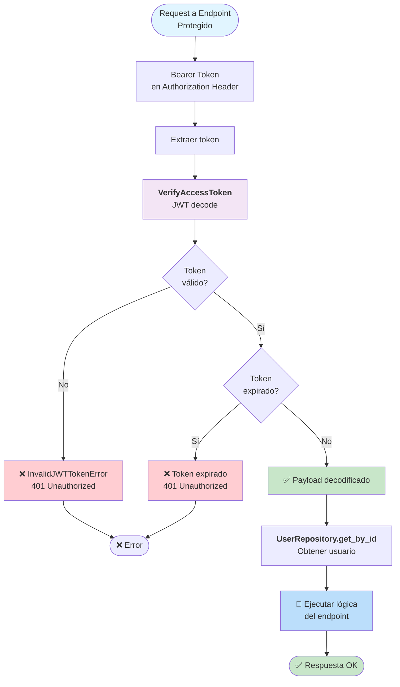
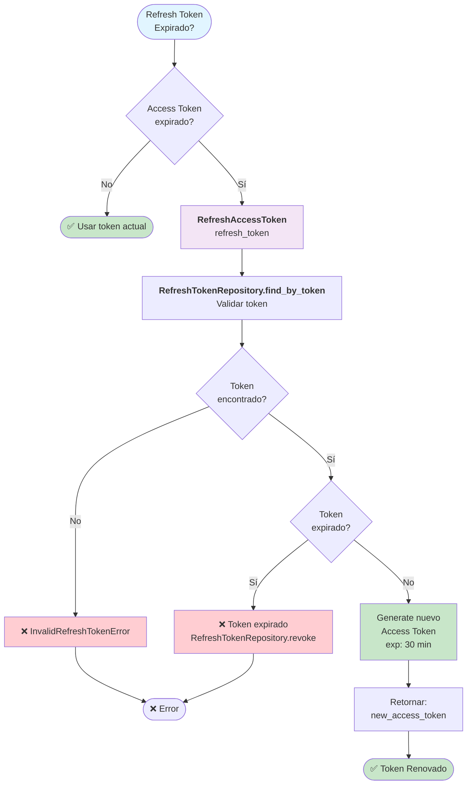
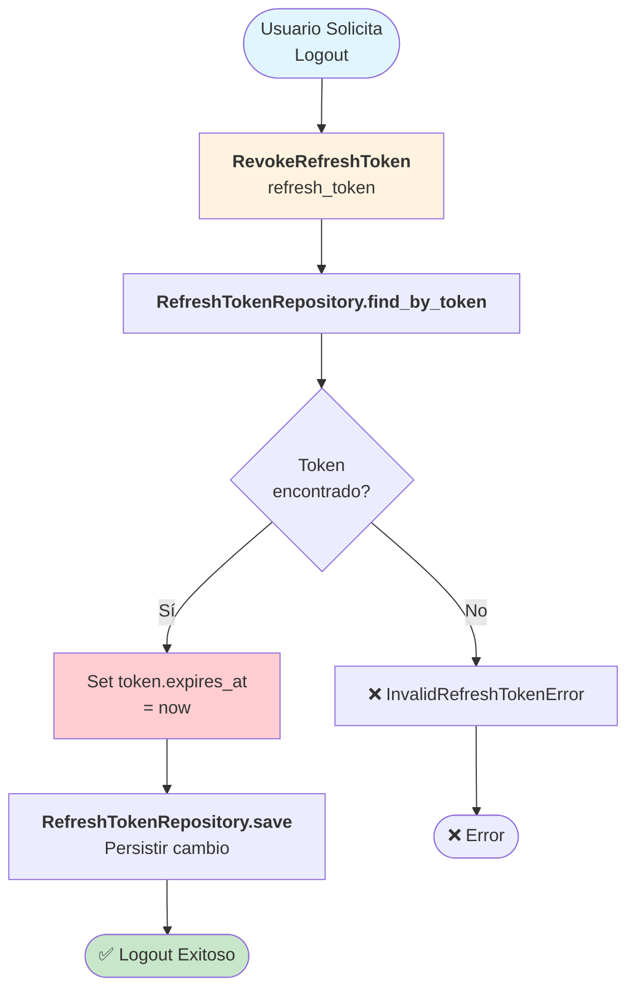
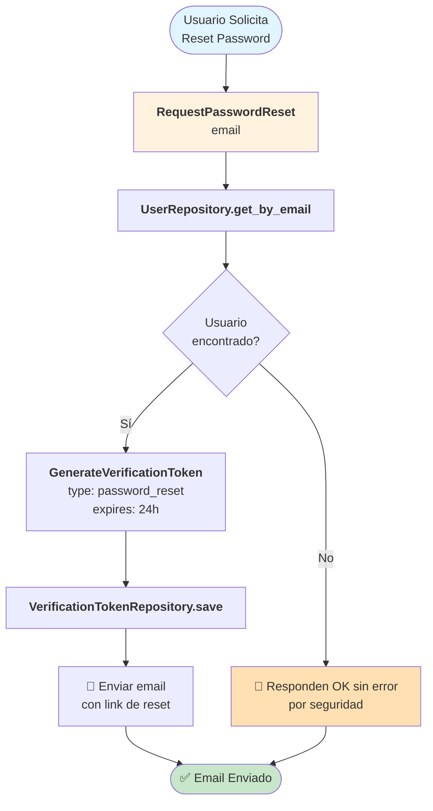
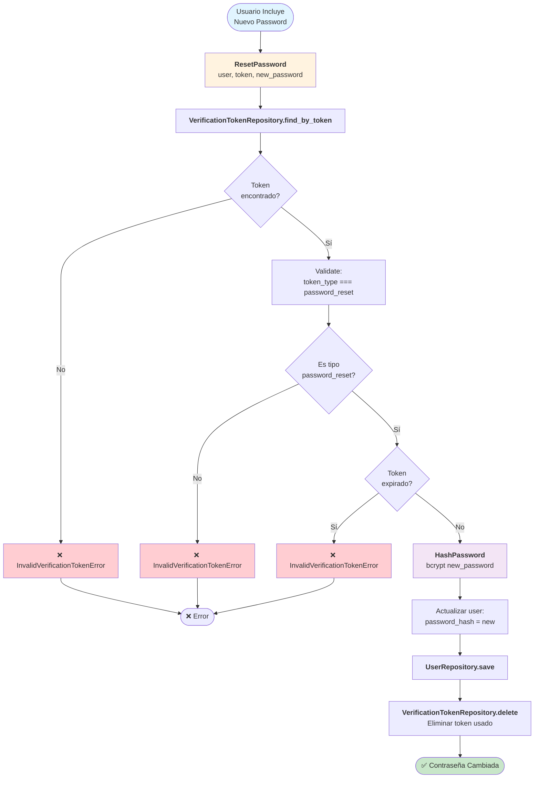
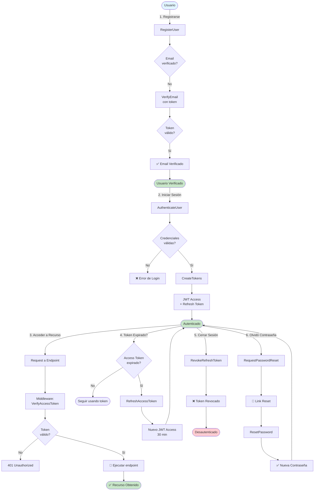

# 🔐 Workflow de Autenticación - ikctl

## Resumen Ejecutivo

El módulo de autenticación de ikctl implementa un sistema securo basado en:
- **JWT Access Token** (30 min): Para acceso a recursos
- **Refresh Token** (7 días): Para obtener nuevos access tokens
- **Email Verification**: Validación de email con tokens de expiración
- **Password Reset**: Solicitud y restablecimiento de contraseña seguro
- **2FA TOTP**: Autenticación de dos factores (planeado)
- **OAuth2 GitHub**: Integración social (planeado)

---

## 📊 Flujos de Autenticación

### 1. Registro de Usuario (Sign Up)

### 2. Verificación de Email

### 3. Login (Autenticación)

### 4. Acceso a Recursos (Token Verification)

### 5. Refresh Token (Renovar Access Token)

### 6. Logout (Revoke Refresh Token)

### 7. Password Reset (Olvida Contraseña)

### 8. Cambiar Contraseña (Con Token Reset)

---

## 🏗️ Capas de Arquitectura

```mermaid
flowchart LR
    subgraph Domain["🔷 Domain Layer (Lógica de Negocio)"]
        VOs["Value Objects<br/>- Email<br/>- Password<br/>- JWTToken"]
        Entities["Entities<br/>- User<br/>- RefreshToken<br/>- VerificationToken"]
        Exceptions["Exceptions<br/>- InvalidEmailError<br/>- InvalidUserError<br/>- InvalidTokenError"]
    end
    
    subgraph App["🟩 Application Layer (Use Cases)"]
        UC1["HashPassword"]
        UC2["VerifyPassword"]
        UC3["AuthenticateUser"]
        UC4["CreateTokens"]
        UC5["VerifyAccessToken"]
        UC6["RefreshAccessToken"]
        UC7["RevokeRefreshToken"]
        UC8["RequestPasswordReset"]
        UC9["ResetPassword"]
        UC10["VerifyEmail"]
        UC11["GenerateVerificationToken"]
        UC12["RegisterUser"]
    end
    
    subgraph Infra["🟦 Infrastructure Layer"]
        Repos["Repositories<br/>- UserRepository<br/>- RefreshTokenRepository<br/>- VerificationTokenRepository"]
        Adapters["Adapters<br/>- JWTTokenProvider<br/>- EmailService<br/>- TOTPProvider"]
    end
    
    subgraph Pres["🟡 Presentation Layer"]
        Endpoints["FastAPI Endpoints<br/>- POST /register<br/>- POST /login<br/>- POST /logout<br/>- POST /refresh<br/>- POST /password/reset<br/>- GET /users/me"]
    end
    
    Domain --> App
    App --> Infra
    Infra --> Pres
    Pres --> Endpoints
    
    style Domain fill:#e3f2fd
    style App fill:#e8f5e9
    style Infra fill:#e0f2f1
    style Pres fill:#fff3e0
```

---

## 📦 Mapeo Use Cases → Endpoints

| Use Case | Endpoint | Method | Body |
|----------|----------|--------|------|
| `RegisterUser` | `/api/v1/register` | POST | `{name, email, password}` |
| `AuthenticateUser` + `CreateTokens` | `/api/v1/login` | POST | `{email, password}` |
| `VerifyAccessToken` | Middleware de todas las rutas protegidas | - | Header: `Authorization: Bearer <token>` |
| `RefreshAccessToken` | `/api/v1/refresh` | POST | `{refresh_token}` |
| `RevokeRefreshToken` | `/api/v1/logout` | POST | `{refresh_token}` |
| `RequestPasswordReset` | `/api/v1/password/forgot` | POST | `{email}` |
| `ResetPassword` | `/api/v1/password/reset` | POST | `{token, new_password}` |
| `VerifyEmail` | `/api/v1/verify-email` | POST | `{token}` |

---

## 🔒 Seguridad Implementada

- ✅ **Passwords**: bcrypt con costo 12 (~70ms por hash)
- ✅ **JWT**: HS256, SECRET_KEY en .env
- ✅ **Token Expiration**: Access (30min) + Refresh (7days)
- ✅ **Email Verification**: Tokens únicos con expiración 24h
- ✅ **Password Reset**: Tokens de un solo uso con validación de tipo
- ⏳ **2FA**: TOTP (planeado)
- ⏳ **Rate Limiting**: Por email/IP (planeado)
- ⏳ **OAuth2**: GitHub (planeado)

---

## 📈 Flujo General (Visión Integral)

---

## 🚀 Implementación Actual

### Tests Completados

**Fase 1 - Domain Layer**: ✅ 40 tests GREEN
- Value Objects (Email, Password, JWTToken): 21 tests
- Entities (User, RefreshToken, VerificationToken): 19 tests

**Fase 2 - Application Layer**: ✅ 28 tests GREEN
- 12 Use Cases con 2-3 tests cada uno

**Fase 3 - Infrastructure**: 🔄 3 tests GREEN (UserRepository)
- RefreshTokenRepository (próximo)
- VerificationTokenRepository (próximo)

**Fase 4 - Presentation**: ⏳ Pendiente
- FastAPI endpoints (17 endpoints planeados)

---

**Última actualización**: 2026
**Estado del módulo**: En desarrollo activo
**Metodología**: TDD (Test-Driven Development)
