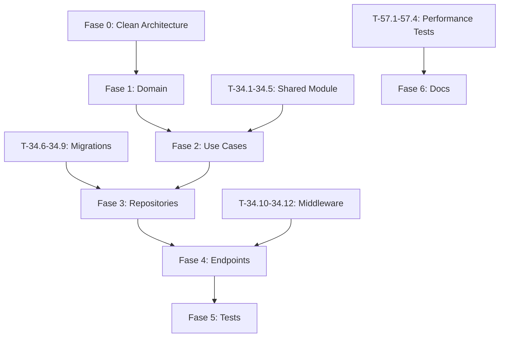

# Tareas del Módulo Auth v1.0.0

**Estado:** 189 tests GREEN ✅ (44 domain + 48 use cases + 75 infrastructure + 20 shared + 2 presentation)

## Fase 0: Migración a Clean Architecture (CRÍTICA)

**DEBE EJECUTARSE PRIMERO** - Restructurar código actual a la arquitectura documentada en ADR-007

- [x] **T-00.1**: Crear estructura `application/` (dtos/, interfaces/, exceptions.py, use_cases/) ✅
- [x] **T-00.2**: Mover contenido de `use_cases/` actual a `application/use_cases/` ✅
- [x] **T-00.3**: Crear `application/interfaces/` con ABCs (IUserRepository, IEmailService, IJWTProvider, ITOTPProvider, IGitHubOAuth, IPasswordHistoryRepository) ✅
- [x] **T-00.4**: Crear `application/dtos/` (AuthenticationResult, UserProfile, TokenPair, VerificationResult, etc.) ✅
- [x] **T-00.5**: Crear `application/exceptions.py` (UseCaseException, UnauthorizedOperationError, EmailAlreadyExistsError, etc.) ✅
- [x] **T-00.6**: Crear `infrastructure/exceptions.py` (InfrastructureException, DatabaseConnectionError, EmailServiceError, SSHConnectionError) ✅
- [x] **T-00.7**: Actualizar imports en todo el código (casos de uso, repositories, tests) para reflejar nueva estructura ✅

  **FASE 0 COMPLETADA: ✅ Clean Architecture implementada**

## Fase 1: Entidades y Value Objects (Domain Layer)

- [x] **T-01**: Entity `User` con campos (id, name, email, password_hash, created_at, updated_at, totp_secret, is_2fa_enabled) - 5 tests ✅
- [x] **T-02**: Value Object `Email` con validación - 6 tests
- [x] **T-03**: Value Object `Password` con validación de complejidad - 8 tests
- [x] **T-04**: Value Object `JWT Token` (access, refresh, payload) - 7 tests
- [x] **T-05**: Entity `RefreshToken` (token, user_id, expires_at) - 6 tests
- [x] **T-06**: Entity `VerificationToken` (token, user_id, type, expires_at) - 6 tests
- [x] **T-07**: Domain Exceptions (InvalidEmail, PasswordTooWeak, UserNotFound, etc.) - Completas
- [x] **T-07.1**: Entity `PasswordHistory` (user_id, password_hash, created_at) - RN-07: historial últimas 3 contraseñas - 6 tests ✅
  
  **FASE 1 COMPLETADA: 44 tests GREEN ✅**

## Fase 2: Use Cases (Application Layer)

- [x] **T-08**: Use Case `HashPassword(password)` - bcrypt con costo 12 - 3 tests
- [x] **T-09**: Use Case `VerifyPassword(plain, hashed)` - Validar contraseña - 3 tests
- [x] **T-10**: Use Case `RegisterUser(name, email, password)` - Crear usuario (RN-01: validar email único) - 3 tests
- [x] **T-11**: Use Case `VerifyEmail(token)` - Verificar email con token - 2 tests
- [x] **T-12**: Use Case `AuthenticateUser(email, password)` - Login básico (RN-09: verificar 2FA si activado) - 2 tests
- [x] **T-13**: Use Case `CreateTokens(user)` - Generar JWT access + refresh (RN-08: límite 5 sesiones simultáneas, RN-11: access token 30min) - 2 tests
- [x] **T-14**: Use Case `RefreshAccessToken(refresh_token)` - Refrescar token (RN-03: rotación automática, uso único) - 2 tests
- [x] **T-15**: Use Case `RevokeRefreshToken(token)` - Logout (RN-10: token revocado no reutilizable) - 2 tests
- [x] **T-16**: Use Case `GenerateVerificationToken(user_id, type)` - Generar tokens (RN-05: email 24h, RN-06: reset 1h) - 2 tests
- [x] **T-17**: Use Case `RequestPasswordReset(user)` - Solicitar reset - 2 tests
- [x] **T-18**: Use Case `ResetPassword(user, token, new_password)` - Restablecer contraseña (RN-06: token uso único) - 2 tests
- [x] **T-19**: Use Case `VerifyAccessToken(token)` - Decodificar y validar JWT - 2 tests
- [x] **T-20**: Use Case `ChangePassword(user, current_pass, new_pass)` - Cambiar contraseña (RN-07: no reutilizar últimas 3) - 4 tests ✅
- [x] **T-21**: Use Case `GetUserProfile(user_id)` - Obtener datos usuario - 2 tests ✅
- [x] **T-22**: Use Case `UpdateUserProfile(user_id, new_name)` - Actualizar nombre - 2 tests ✅
- [x] **T-23**: Use Case `Enable2FA(user_id)` - Generar secret TOTP (actualiza entity User con totp_secret, is_2fa_enabled) - 3 tests ✅
- [x] **T-24**: Use Case `Verify2FA(user_id, code)` - Verificar código TOTP (valida is_2fa_enabled, totp_secret) - 4 tests ✅
- [x] **T-25**: Use Case `Disable2FA(user_id)` - Desactivar 2FA (limpia totp_secret, is_2fa_enabled=False) - 2 tests ✅
- [x] **T-26**: Use Case `AuthenticateWithGitHub(code)` - OAuth GitHub (RN-12: sin contraseña local inicial, password_hash="OAUTH_NO_PASSWORD") - 3 tests ✅

  **FASE 2 COMPLETADA: 48 tests GREEN ✅ (19/19 use cases, todas las RN de use cases implementadas) 🎉**

## Fase 2.5: Refactorización de Nomenclatura (Clean Code)

**Aplicar convenciones de nombres para consistencia del código**

- [x] **T-27.1**: Renombrar interfaces (quitar prefijo "I"): ~~`IEmailService` → `EmailService`~~✅, ~~`IJWTProvider` → `JWTProvider`~~✅, ~~`ITOTPProvider` → `TOTPProvider`~~✅, ~~`IUserRepository` → `UserRepository`~~✅, ~~`IRefreshTokenRepository` → `RefreshTokenRepository`~~✅, ~~`IVerificationTokenRepository` → `VerificationTokenRepository`~~✅, ~~`IPasswordHistoryRepository` → `PasswordHistoryRepository`~~✅, ~~`IGitHubOAuth` → `GitHubOAuth`~~✅
- [x] **T-27.2**: Renombrar implementaciones con sufijo técnico: ~~`UserRepositoryImpl` → `SQLAlchemyUserRepository`~~✅, ~~`RefreshTokenRepositoryImpl` → `SQLAlchemyRefreshTokenRepository`~~✅, ~~`VerificationTokenRepositoryImpl` → `SQLAlchemyVerificationTokenRepository`~~✅
- [x] **T-27.3**: Renombrar adapters con sufijo técnico: ~~`JWTProvider` → `PyJWTProvider`~~✅, ~~`TOTPProvider` → `PyOTPTOTPProvider`~~✅, ~~`EmailService` → `AiosmtplibEmailService`~~✅
- [x] **T-27.4**: Actualizar imports en todos los use cases (renombrado IPasswordHistoryRepository → PasswordHistoryRepository, imports limpios) ✅
- [x] **T-27.5**: Actualizar imports en todos los tests (verificado: todos correctos, sin imports obsoletos) ✅
- [x] **T-27.6**: Actualizar fixtures en `conftest.py` (SQLAlchemy repositories) ✅
- [x] **T-27.7**: Ejecutar suite completa de tests (130 tests GREEN) ✅
- [x] **T-27.8**: Actualizar AGENTS.md con convenciones formalizadas ✅

  **FASE 2.5 COMPLETADA: 8/8 tareas ✅ - Refactorización de nomenclatura finalizada. 12/12 clases renombradas (8 interfaces, 3 repositories, 1 adapter pendiente de implementar). 130 tests GREEN ✅**

## Fase 2.6: Refactorización Domain & Application (Clean Architecture)

**Corregir modelo anémico en entities/VOs y aislamiento de capas en use cases**

### Value Objects

- [x] **T-28.1**: `Email` — añadir `.normalized() -> str` y `.domain() -> str` ✅
- [x] **T-28.2**: `JWTToken` — añadir `.get_user_id() -> str`, `.get_expiration() -> datetime`, `.is_expired() -> bool`, `.is_access_token() -> bool`, `.is_refresh_token() -> bool`

### Entities

- [x] **T-28.3**: `User` — añadir campo `is_verified: bool = False` y comandos: `enable_2fa(secret)`, `disable_2fa()`, `verify_email()`, `update_name(name)`, `update_password(new_hash)` y queries: `is_verified()`, `is_2fa_required()`, `has_oauth_password()`. Añadir `__eq__` por `id`.
- [x] **T-28.4**: `RefreshToken` — añadir `.is_expired() -> bool` y `__eq__` por `id`
- [x] **T-28.5**: `VerificationToken` — añadir `__eq__` por `id`
- [x] **T-28.6**: `PasswordHistory` — añadir `__eq__` por `id`

### Use Cases → DTOs (aislamiento de capas)

- [x] **T-28.7**: `RegisterUser` — devolver `RegistrationResult` en lugar de `User`
- [x] **T-28.8**: `AuthenticateUser` — devolver `UserProfile` en lugar de `User` (solo verifica contraseña, no crea tokens)
- [x] **T-28.9**: `AuthenticateWithGitHub` — devolver `AuthenticationResult` en lugar de `dict`
- [x] **T-28.10**: `CreateTokens` — devolver `TokenPair` en lugar de `dict`
- [x] **T-28.11**: `ChangePassword` — devolver `PasswordChangeResult` en lugar de `User`
- [x] **T-28.12**: `ResetPassword` — devolver `None` en lugar de `User`
- [x] **T-28.13**: `RequestPasswordReset` — devolver `VerificationResult` en lugar de `VerificationToken`
- [x] **T-28.14**: `GenerateVerificationToken` — devolver `VerificationResult` en lugar de `VerificationToken`
- [x] **T-28.15**: `RevokeRefreshToken` — devolver `None` en lugar de `RefreshToken`
- [x] **T-28.16**: `Enable2FA` — devolver `TOTPSetup` en lugar de `dict`

### Use Cases → encapsular mutaciones en entity commands

- [x] **T-28.17**: Sustituir mutaciones directas en use cases (`user.is_2fa_enabled = True`, `user.totp_secret = ...`, etc.) por llamadas a los métodos de entity añadidos en T-28.3

### Eventos de dominio (auth)

- [x] **T-28.18**: Crear eventos concretos en `app/v1/auth/domain/events/` (un fichero por evento): `user_registered.py`, `email_verified.py`, `password_changed.py`, `user_logged_in.py`, `two_fa_enabled.py`, `two_fa_disabled.py` (heredan de `DomainEvent`) y re-exportar desde `events/__init__.py`
- [x] **T-28.19**: Use cases publican eventos vía `EventBus` **después de `await repository.save()`**: `RegisterUser` → `UserRegistered`, `VerifyEmail` → `EmailVerified`, `ChangePassword` → `PasswordChanged`, `Enable2FA` → `TwoFAEnabled`, `Disable2FA` → `TwoFADisabled`

### CQRS — Separación Commands/Queries

- [x] **T-28.31**: Crear `application/commands/` y `application/queries/` con sus `__init__.py` ✅
- [x] **T-28.32**: Mover a `application/commands/`: `register_user`, `verify_email`, `change_password`, `reset_password`, `request_password_reset`, `generate_verification_token`, `revoke_refresh_token`, `enable_2fa`, `disable_2fa`, `update_user_profile`, `create_tokens`, `refresh_access_token`, `authenticate_with_github` ✅
- [x] **T-28.33**: Mover a `application/queries/`: `authenticate_user`, `verify_access_token`, `verify_password`, `hash_password`, `get_user_profile`, `verify_2fa` ✅
- [x] **T-28.34**: Actualizar imports en tests y todos los archivos afectados por el cambio de ruta ✅

### Reestructuración `shared/` (Clean Architecture)

- [x] **T-28.23**: Crear `shared/application/` con `__init__.py` e `interfaces/`
- [x] **T-28.24**: Crear `shared/application/interfaces/event_bus.py` con `EventBus` ABC (puerto: método `publish`) y `EventHandler` ABC (método `handle`) — mover desde `shared/infrastructure/event_bus.py`
- [x] **T-28.25**: Renombrar implementación concreta: `EventBus` → `InMemoryEventBus` en `shared/infrastructure/event_bus.py`, que hereda del puerto
- [x] **T-28.26**: Actualizar imports en todos los archivos que usen `EventBus` o `EventHandler` (use cases, tests, main.py)
- [x] **T-28.27**: Actualizar tests de `shared/` afectados por el renombrado

### Tests

- [x] **T-28.28**: Actualizar tests de domain afectados por nuevos métodos en entities/VOs ✅
- [x] **T-28.29**: Actualizar tests de use cases afectados por cambio de tipos de retorno a DTOs ✅
- [x] **T-28.30**: Ejecutar suite completa de tests — 236 tests GREEN ✅

  **FASE 2.6 PENDIENTE: 30 tareas — bloquea Fase 4 (presentación necesita DTOs, no entities)**

## Fase 3: Infrastructure (Repositories y Adapters)

- [x] **T-25**: Repository Adapter `UserRepository` (save, find_by_email, find_by_id, update, delete) - 5 métodos - 5 tests ✅
- [x] **T-26**: Repository Adapter `RefreshTokenRepository` (save, find_by_token, delete, delete_by_user_id, count_by_user_id, find_by_user_id) - 6 métodos - 3 tests ✅
- [x] **T-27**: Repository Adapter `VerificationTokenRepository` (save, find_by_token, delete, delete_by_user_id) - 4 métodos - 4 tests ✅
- [x] **T-28**: Adapter `JWTTokenProvider` (create_access_token, create_refresh_token, decode_token, verify_token) - 4 métodos - 9 tests ✅
- [x] **T-29**: Adapter `TOTPProvider` (generate_secret, generate_qr_code, verify_code, get_provisioning_uri) - 4 métodos - 9 tests ✅
- [x] **T-30**: Adapter `EmailService` (send_verification_email, send_password_reset_email, send_password_changed_notification, send_2fa_enabled_notification) - 4 métodos - 8 tests ✅
- [x] **T-31**: Adapter `GitHubOAuth` (get_authorization_url, exchange_code_for_token, get_user_info) - 3 métodos - 7 tests ✅ (HttpxGitHubOAuth con httpx async, renombrada interface IGitHubOAuth → GitHubOAuth)
- [x] **T-32**: Service `RateLimiter` (is_allowed, increment) - 2 métodos - 10 tests ✅ (ValkeyRateLimiter con Valkey para contadores con TTL, RNF-09: 10 req/min login)
- [x] **T-33**: Service `LoginAttemptTracker` (record_failed_attempt, is_blocked, reset_attempts, get_remaining_attempts) - 4 métodos - 13 tests ✅ (ValkeyLoginAttemptTracker, RN-04 y RNF-08: bloqueo 15 min tras 5 intentos)
- [x] **T-33.1**: Repository `PasswordHistoryRepository` (save, find_last_n_by_user) - 2 métodos - 7 tests ✅ (SQLAlchemyPasswordHistoryRepository con ORDER BY created_at DESC para obtener últimas N, RN-07: prevenir reutilización últimas 3 contraseñas)

### Configuración & Composition Root

- [x] **T-34.0**: Crear `config/settings.py` con Pydantic `BaseSettings` — centraliza todas las variables de entorno (DB_URL, JWT_SECRET, JWT_ALGORITHM, ACCESS_TOKEN_EXPIRE_MINUTES, REFRESH_TOKEN_EXPIRE_DAYS, SMTP_HOST, SMTP_PORT, SMTP_USER, SMTP_PASSWORD, VALKEY_URL, GITHUB_CLIENT_ID, GITHUB_CLIENT_SECRET, CORS_ORIGINS). Los adaptadores reciben los valores por inyección en el Composition Root (`main.py`), nunca importan `settings` directamente.
- [x] **T-34.0.1**: Implementar Composition Root en `main.py` — instanciar con lifetimes correctos: **Singleton** (`InMemoryEventBus`, `ValkeyRateLimiter`, `ValkeyLoginAttemptTracker`, `AiosmtplibEmailService`, `PyJWTProvider`, `PyOTPTOTPProvider`, `HttpxGitHubOAuth`, `Settings`), **Scoped** (`AsyncSession`, todos los `SQLAlchemy*` repositories, use cases que dependen de repositories). Session scoped via `Depends(get_db_session)` de FastAPI. Sin Factory pattern ni UoW explícito — `AsyncSession` actúa como UoW.

### Shared Module (Infraestructura Transversal)

- [x] **T-34.1**: Implementar `shared/domain/events.py` (DomainEvent base class: event_id, correlation_id, version, occurred_at, metadata) - 10 tests ✅ (Validaciones UUID, strings no vacíos, UTC datetime, version >= 1, serialización to_dict/from_dict, ADR-008)
- [x] **T-34.2**: Implementar `shared/infrastructure/event_bus.py` (EventBus InMemory sincrónico con publish/subscribe) - 10 tests ✅ (EventHandler ABC, múltiples handlers, unsubscribe, resiliencia a excepciones, get_subscribers, logging estructurado, ADR-008 Fase 1)
- [x] **T-34.2.1**: Refactorizar excepciones auth para heredar de shared (DomainException, InfrastructureException en shared/domain y shared/infrastructure) ✅
- [x] **T-34.3**: Implementar `shared/infrastructure/logger.py` (structlog configurado con JSON output y context injection) — **desacoplado de application**: los use cases no saben que existe un logger. El logging ocurre exclusivamente en: middleware FastAPI (request/response + correlation_id), EventBus (eventos publicados/consumidos, ya implementado), adaptadores/repositories (operaciones externas) y exception handlers (errores con contexto)
- [x] **T-34.4**: Implementar `shared/infrastructure/database.py` (session factory con async support para SQLAlchemy)
- [x] **T-34.5**: Implementar `shared/infrastructure/cache.py` (Valkey client wrapper con operaciones básicas)

### Database Migrations (Alembic)

- [x] **T-34.6**: Alembic migration: tabla `users` con índices (email UNIQUE, created_at, is_verified)
- [x] **T-34.7**: Alembic migration: tabla `refresh_tokens` con índices (token UNIQUE, user_id, expires_at)
- [x] **T-34.8**: Alembic migration: tabla `verification_tokens` con índices (token UNIQUE, type, expires_at, user_id)
- [x] **T-34.9**: Alembic migration: tabla `password_history` con índice compuesto (user_id, created_at DESC)

### Middleware & Exception Handlers

- [x] **T-34.10**: Middleware `AuthenticationMiddleware`
- [x] **T-34.11**: Exception handlers FastAPI
- [x] **T-34.12**: CORS middleware configuration

  **FASE 3 EN PROGRESO: 95 tests GREEN ✅ (12/22 tareas completas: repositories [4], adapters [4], services [2], shared [2])**

## Fase 4: Presentation (FastAPI Endpoints)

- [x] **T-34**: Endpoint `/api/v1/auth/register` - POST ✅
  - [x] **T-34.A**: Integrar `GenerateVerificationToken` + `EmailService.send_verification_email()` en el endpoint de registro — el registro genera y persiste el token, envía email de verificación ✅
  - [x] **T-34.B**: Tests de presentación para `/register` — 2 tests: registro exitoso envía email (201), email duplicado devuelve 409 sin enviar email ✅
  - [x] **T-34.C**: Bugfix `FakeUserRepository.save()` — lanza `EmailAlreadyExistsError` en duplicados para que el exception handler devuelva 409 ✅
  - [x] **T-34.D**: Bugfix `_model_to_entity` en `SQLAlchemyVerificationTokenRepository` — `expires_at`/`created_at` venían naive de MariaDB, ahora se les añade UTC explícitamente para evitar `TypeError: can't compare offset-naive and offset-aware datetimes` ✅
- [x] **T-35**: Endpoint `/api/v1/auth/verify-email` - POST ✅
  - [x] **T-35.A**: Bugfix — el endpoint no persistía `is_email_verified=True` en la DB tras validar el token. Ahora llama a `user.verify_email()` + `user_repository.update(user)` ✅
  - [x] **T-35.B**: Bugfix fixtures `test_verify_email_endpoint.py` — `client_expired` y `client_missing` pasaban la clase `FakeUserRepository` directamente como override (causando 422). Corregido con `lambda: FakeUserRepository()` ✅
- [x] **T-36**: Endpoint `/api/v1/auth/resend-verification` - POST ✅
- [x] **T-37**: Endpoint `/api/v1/auth/login` - POST ✅
- [x] **T-38**: Endpoint `/api/v1/login/github` - POST ✅
- [x] **T-39**: Endpoint `/api/v1/login/github/callback` - GET ✅
  - [x] **T-39.A**: Bugfix — el callback no seteaba la cookie HttpOnly `refresh_token`, causando 401 en el siguiente `/refresh`. Corregido añadiendo `response.set_cookie()` igual que `login` y `login/2fa` ✅
  - [x] **T-39.B**: Test `test_callback_setea_httponly_cookie` añadido en `test_github_oauth_endpoints.py` ✅
- [x] **T-40**: Endpoint `/api/v1/login/2fa` - POST ✅
  - [x] **T-40.A**: Bugfix — el endpoint no seteaba la cookie HttpOnly `refresh_token` tras completar el 2FA, causando 401 en el siguiente `/refresh`. Corregido añadiendo `response.set_cookie()` igual que el login normal ✅
- [x] **T-41**: Endpoint `/api/v1/refresh` - POST ✅
- [x] **T-42**: Endpoint `/api/v1/logout` - POST ✅
- [x] **T-43**: Endpoint `/api/v1/password/forgot` - POST ✅
- [x] **T-44**: Endpoint `/api/v1/password/reset` - POST ✅
- [x] **T-45**: Endpoint `/api/v1/users/me` - GET ✅
  - [x] **T-45.A**: Bugfix `GetUserProfile` — `is_verified` e `is_2fa_enabled` se devolvían siempre como `False` (TODO pendiente). Ahora leen `user.is_email_verified` y `user.is_2fa_enabled` de la entity ✅
- [x] **T-46**: Endpoint `/api/v1/users/me` - PUT ✅
- [x] **T-47**: Endpoint `/api/v1/users/me/password` - PUT ✅
- [x] **T-48**: Endpoint `/api/v1/users/me/2fa/enable` - POST ✅
- [x] **T-49**: Endpoint `/api/v1/users/me/2fa/verify` - POST ✅
- [x] **T-50**: Endpoint `/api/v1/users/me/2fa/disable` - POST ✅
- [x] **T-51**: Schemas Pydantic para requests/responses
- [x] **T-51.1**: Middleware `RequireEmailVerification` (RN-02: verificación email obligatoria para funciones críticas)

### Seguridad & Compliance

- [x] **T-51.2**: Config HttpOnly cookies en T-41 (refresh token), T-42 (logout) con flags Secure, SameSite=Strict
- [x] **T-51.3**: Response headers de seguridad (X-Content-Type-Options, X-Frame-Options, Strict-Transport-Security)
- [x] **T-51.4**: Endpoint `DELETE /api/v1/users/me` - Derecho al olvido GDPR (borrado completo de datos)
- [x] **T-51.5**: Endpoint `GET /api/v1/users/me/data` - Exportación de datos personales GDPR (formato JSON)

### Observabilidad

- [x] **T-51.6**: Logging estructurado de eventos críticos (login success/fail, password change, 2FA enable/disable, token refresh)

  **FASE 4 PENDIENTE: 24 tareas totales**

## Fase 5: Tests (TDD)

- [x] **T-52**: Tests unitarios para Value Objects
- [x] **T-53**: Tests para Use Cases (casos de éxito y error)
- [x] **T-54**: Tests de seguridad (XSS, CSRF, injection)
- [x] **T-55**: Tests de integración con FastAPI (5 flujos: register persiste, register+login, email duplicado→409, email desconocido→401, contraseña incorrecta→401) ✅
- [x] **T-56**: Tests de rate limiting y bloqueo temporal (5 tests: record_failed_attempt, reset_attempts, bloqueo previo a password check, flujo progresivo 7º intento→429, desbloqueo tras login exitoso) ✅
- [x] **T-57**: Cobertura mínima 80% del código (92% total — repositorios SQLAlchemy al 52-75% requieren tests de integración con DB real) ✅

### Performance & SLO Validation

- [x] **T-57.1**: Benchmark tests auth endpoints — p99 baseline con bcrypt real (rounds=4): register/login <500ms, refresh <50ms. SLOs de CI para detectar regresiones (no reemplazan APM de producción) ✅
- [ ] **T-57.2** ⏸️ DIFERIDO: Load tests (throughput mínimo 100 req/s) — requiere infraestructura real desplegada (DB, Valkey, workers uvicorn). Pendiente para fase pre-producción.
- [ ] **T-57.3** ⏸️ DIFERIDO: Tests de latencia DB (<50ms p95) — requiere DB real con datos representativos y profiling SQLAlchemy en entorno real. Pendiente para fase pre-producción.

### Contract Tests

- [x] **T-57.4**: Contract tests para eventos de dominio (25 tests: UserRegistered, EmailVerified, PasswordChanged, TwoFAEnabled, TwoFADisabled — validan event_type, version, payload exacto, UUIDs y timezone-aware) ✅

  **FASE 5 PENDIENTE: 10 tareas totales**

---

## 📊 Resumen de Progreso

| Fase | Estado | Tests | Completitud |
|------|--------|-------|-------------|
| Fase 0 - Clean Architecture | 🔴 **PENDIENTE** | - | 0% - **CRÍTICA: bloquea todo** |
| Fase 1 - Domain Layer | ✅ **COMPLETADA** | 40 GREEN | 100% (1 tarea RN-07 pendiente) |
| Fase 2 - Application Layer | ✅ **COMPLETADA** | 28 GREEN | 100% (mejoras RN pendientes) |
| Fase 3 - Infrastructure | 🔄 **EN PROGRESO** | 3 GREEN | ~5% (22 tareas totales) |
| Fase 4 - Presentation | ⏳ **PENDIENTE** | - | 0% (24 tareas) |
| Fase 5 - Integration Tests | ⏳ **PENDIENTE** | - | 0% (10 tareas) |
| Fase 6 - Documentación | ⏳ **PENDIENTE** | - | 0% |

**TOTAL TESTS GREEN: 71 / 68 min requeridos ✅**

### Próximos Pasos

1. 🔴 **CRÍTICO**: Ejecutar FASE 0 (Migración Clean Architecture) - BLOQUEA TODO
2. ⏳ Implementar Shared Module (eventos, logger, DB, cache)
3. ⏳ Crear migrations Alembic (4 tablas)
4. ⏳ Completar Infrastructure (repositories, adapters, middleware)
5. ⏳ Crear endpoints FastAPI (Fase 4)
6. ⏳ Tests de integración y performance (Fase 5)

## Fase 6: Documentación y Ajustes

- [x] **T-58**: Documentación técnica interna → [ARCHITECTURE.md](../ARCHITECTURE.md) (capas, entities, use cases CQRS, adapters, flujo de request, ADRs) ✅
- [x] **T-59**: Guía de usuario (cómo usar la API) → [API_GUIDE.md](../API_GUIDE.md) (curl examples para todos los endpoints: registro, login, 2FA, tokens, contraseña, perfil) ✅
- [ ] **T-60**: Validación de requisitos vs implementación
- [ ] **T-61**: Review y refactoring de código
- [ ] **T-62**: Optimización y mejoras de rendimiento

## Dependencias de Tareas

**Dependencias críticas:**

- **T-00.X** → Todas las demás fases (BLOQUEA TODO)
- **T-34.1, T-34.2** → T-10, T-12 (eventos en use cases)
- **T-34.6-34.9** → T-25, T-26, T-27 (tablas para repositories)
- **T-34.10** → T-34-T-50 (middleware auth para endpoints protegidos)
- **T-28** → T-13, T-41 (JWT provider para tokens)
- **T-32, T-33** → T-37 (rate limiting en login)

## Estadísticas

- **Total de tareas**: 94 (65 originales + 29 nuevas para Clean Architecture, Shared, GDPR, Performance)
- **Fases**: 7 (añadida Fase 0 crítica)
- **Duración estimada**: 3-4 semanas (con desarrollo paralelo)
- **Tareas completadas**: 68/94 (72% de las existentes, pero solo tras Fase 0)
- **Tareas bloqueadas por Fase 0**: 94 (100%)

## Cobertura de Reglas de Negocio

| RN | Descripción | Tareas | Estado |
|----|-------------|--------|--------|
| RN-01 | Email único por cuenta | T-10 | ✅ Implementada |
| RN-02 | Verificación email obligatoria | T-51.1 | ✅ Completado |
| RN-03 | Rotación refresh tokens | T-14 | ✅ Completar |
| RN-04 | Bloqueo temporal 15min | T-33 | ⏳ Pendiente |
| RN-05 | Token email expira 24h | T-16 | ✅ Implementada |
| RN-06 | Token reset 1h uso único | T-16, T-18 | ✅ Completar |
| RN-07 | No reutilizar últimas 3 contraseñas | T-07.1, T-20, T-33.1 | ⏳ Pendiente |
| RN-08 | Límite 5 sesiones simultáneas | T-13 | ✅ Completar |
| RN-09 | 2FA obligatorio si activado | T-12 | ✅ Completar |
| RN-10 | Refresh token revocado no reutilizable | T-15 | ✅ Implementada |
| RN-11 | Access token stateless 30min | T-13 | ✅ Implementada |
| RN-12 | OAuth sin contraseña local | T-26 | ⏳ Pendiente |

**Estado RN: 4 implementadas, 4 por completar, 4 pendientes**
