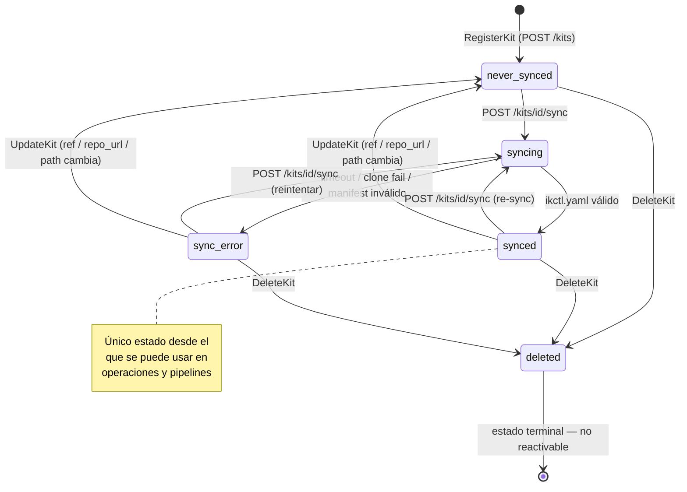
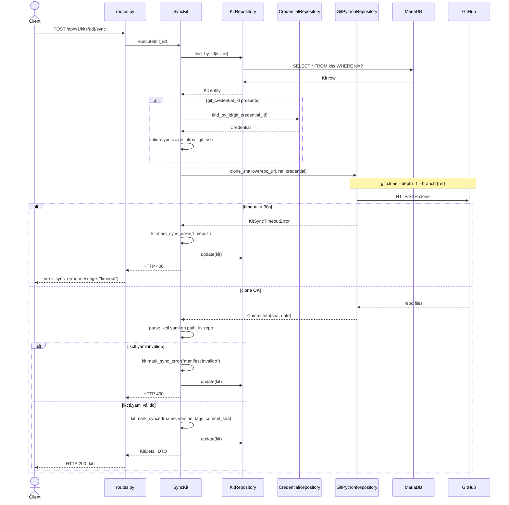

# Arquitectura del Módulo Kits v2

## Visión General

El módulo `kits` introduce **dos entidades**: `Repository` y `Kit`. Sigue el modelo Helm (registro de repositorios) + Kustomize (`ikctl.yaml` declarativo): Git es la fuente de verdad; la DB es un índice derivado que el sync mantiene actualizado.

Los ficheros del kit **no se almacenan** — se descargan en runtime mediante shallow clone al ejecutar una operación. El módulo solo persiste metadatos.

```
app/v1/kits/
├── domain/
│   ├── entities/          # Repository, Kit
│   ├── value_objects/     # SyncStatus, KitManifest, RepositoryIndex
│   └── exceptions/        # RepositoryNotFoundError, KitNotFoundError, InvalidManifestError, MissingRootManifestError
├── application/
│   ├── commands/          # RegisterRepository, UpdateRepository, DeleteRepository, SyncRepository
│   ├── queries/           # GetRepository, ListRepositories, GetKit, ListKits
│   ├── dtos/              # RepositoryResult, KitResult, RepositorySyncResult, ...
│   ├── interfaces/        # RepositoryRepository, KitRepository, GitClient (ABCs)
│   └── exceptions.py      # UseCaseException, RepositoryInUseError, InvalidGitCredentialTypeError, ...
└── infrastructure/
    ├── persistence/       # SQLAlchemy models
    ├── repositories/      # SQLAlchemyRepositoryRepository, SQLAlchemyKitRepository
    ├── adapters/          # GitPythonClient
    └── presentation/      # FastAPI routers, schemas, deps, exception_handlers
```

---

## Capa Domain

### Entity: `Repository`

Representa un repositorio Git registrado. Es la puerta de entrada para obtener kits. La credencial es compartida por todos los kits del repo (RN-23).

| Campo | Tipo | Descripción |
|-------|------|-------------|
| `id` | str | Identidad |
| `user_id` | str | Propietario |
| `url` | str | URL del repositorio Git |
| `ref` | str | Branch o tag |
| `credential_id` | str \| None | NULL si repo público; tipo `git_https` o `git_ssh` (RN-23) |
| `sync_status` | `SyncStatus` (VO) | `never_synced` \| `synced` \| `sync_error` |
| `last_synced_at` | datetime \| None | — |
| `last_commit_sha` | str \| None | SHA-40 del último commit sincronizado |
| `sync_error_message` | str \| None | Detalle del error si `sync_error` |
| `is_deleted` | bool | Borrado lógico (solo antes de borrado físico) |
| `created_at` | datetime | — |
| `updated_at` | datetime | — |

**Comandos:**

```python
def update(self, url: str, ref: str, credential_id: str | None) -> None:
    # Si cambia url o ref → resetea sync_status a never_synced

def mark_synced(self, commit_sha: str) -> None:
    # sync_status = synced, last_commit_sha = commit_sha, last_synced_at = now

def mark_sync_error(self, message: str) -> None:
    # sync_status = sync_error, sync_error_message = message

def delete(self) -> None:
    # is_deleted = True
```

**Queries:**

```python
def is_synced(self) -> bool    # sync_status == synced
```

**Identidad:** `__eq__` por `id`.

---

### Entity: `Kit`

Representa un kit descubierto dentro de un repositorio durante el sync. Sus metadatos los lee la app del `ikctl.yaml` del subdirectorio. No contiene `url` ni `credential_id` propios — los hereda del `Repository` (RN-23).

| Campo | Tipo | Descripción |
|-------|------|-------------|
| `id` | str | Identidad |
| `user_id` | str | Propietario |
| `repository_id` | str | FK a `Repository.id` |
| `path_in_repo` | str | Carpeta del kit en el repo |
| `name` | str \| None | Leído del `ikctl.yaml` tras sync |
| `description` | str \| None | Leído del `ikctl.yaml` |
| `version` | str \| None | Leído del `ikctl.yaml` |
| `tags` | list[str] | Leído del `ikctl.yaml` |
| `values` | dict | Valores por defecto para templates Jinja2 |
| `debug_level` | str | `none` \| `errors` \| `full` |
| `sync_status` | `SyncStatus` (VO) | `never_synced` \| `synced` \| `sync_error` |
| `last_synced_at` | datetime \| None | — |
| `last_commit_sha` | str \| None | SHA-40 del commit sincronizado |
| `sync_error_message` | str \| None | Detalle del error si `sync_error` |
| `is_deleted` | bool | Soft delete tras ser eliminado del índice |
| `created_at` | datetime | — |
| `updated_at` | datetime | — |

**Comandos:**

```python
def mark_synced(self, manifest: KitManifest, commit_sha: str) -> None:
    # Actualiza todos los metadatos del manifiesto y sync_status = synced

def mark_sync_error(self, message: str) -> None:
    # sync_status = sync_error, sync_error_message = message

def soft_delete(self) -> None:
    # is_deleted = True
```

**Queries:**

```python
def is_usable(self) -> bool    # sync_status == synced AND NOT is_deleted
```

**Identidad:** `__eq__` por `id`.

---

### Value Objects

| VO | Descripción | Validaciones |
|----|-------------|-------------|
| `SyncStatus` | Estado de sincronización | enum `never_synced` \| `synced` \| `sync_error` |
| `KitManifest` | Parsea y valida `ikctl.yaml` de subdirectorio | Todos los `pipeline_files[]` deben estar en `upload_files[]` (RN-21). Expone: `name`, `description`, `version`, `tags`, `values`, `debug_level`, `upload_files`, `pipeline_files`, `backup_files`. Lanza `InvalidManifestError` si falla |
| `RepositoryIndex` | Parsea y valida `ikctl.yaml` raíz | Expone `kit_paths: list[str]`. Lanza `MissingRootManifestError` si no hay sección `kits:` o está vacío |

---

### Domain Exceptions

```
domain/exceptions/repository.py:
    RepositoryNotFoundError    → Repositorio no existe o no pertenece al usuario

domain/exceptions/kit.py:
    KitNotFoundError           → Kit no existe o no pertenece al usuario
    InvalidManifestError       → ikctl.yaml del kit inválido (RN-21 u otros)
    MissingRootManifestError   → ikctl.yaml raíz no existe o no declara kits
```

---

## Capa Application

### CQRS: Commands

| Command | Descripción |
|---------|-------------|
| `RegisterRepository` | Crea `Repository` con `sync_status: never_synced`. Valida tipo de credencial (RN-23). Sin llamada a Git |
| `UpdateRepository` | Actualiza `url`, `ref`, `credential_id`. Si cambia `url` o `ref` → `sync_status` vuelve a `never_synced`. Valida ownership (RN-01) |
| `DeleteRepository` | Valida ownership (RN-01). Comprueba referencias en pipelines/operaciones (RN-30). Borrado físico de repo + todos sus kits |
| `SyncRepository` | Shallow clone via `GitClient`. Parsea `RepositoryIndex`. Para cada path: parsea `KitManifest`, reconcilia kits en DB (CREATE/UPDATE/soft_delete). Notificación si kit con referencias pasa a `is_deleted` (RN-29). Siempre devuelve 200 — errores como `sync_error` |

### CQRS: Queries

| Query | Descripción |
|-------|-------------|
| `GetRepository` | Detalle de repositorio. Valida ownership (RN-01). Solo no eliminados |
| `ListRepositories` | Lista paginada. Solo repositorios del usuario, no eliminados |
| `GetKit` | Detalle de kit. Valida ownership (RN-01). Solo `is_deleted: false` |
| `ListKits` | Lista paginada. Filtros: `tags`, `repository_id`. Solo `is_deleted: false` |

### DTOs

| DTO | Descripción |
|-----|-------------|
| `RepositoryResult` | Todos los campos de `Repository` excepto `is_deleted` |
| `RepositoryListResult` | Lista paginada de `RepositoryResult` |
| `RepositorySyncResult` | `sync_status`, `last_commit_sha`, `kits_created`, `kits_updated`, `kits_deleted` |
| `KitResult` | Todos los campos de `Kit` excepto `is_deleted` |
| `KitListResult` | Lista paginada de `KitResult` |

### Interfaces (Ports) — `application/interfaces/`

```python
# repository_repository.py
class RepositoryRepository(ABC):
    async def save(self, repo: Repository) -> None
    async def find_by_id(self, id: str, user_id: str) -> Repository | None
    async def find_all_by_user(self, user_id: str, page: int, per_page: int) -> list[Repository]
    async def update(self, repo: Repository) -> None
    async def delete(self, id: str) -> None
    async def has_kits_with_references(self, repository_id: str) -> bool

# kit_repository.py
class KitRepository(ABC):
    async def save(self, kit: Kit) -> None
    async def find_by_id(self, id: str, user_id: str) -> Kit | None
    async def find_by_id_internal(self, kit_id: str) -> Kit | None   # sin filtro de user_id — solo para sync interno
    async def find_by_repository_id(self, repository_id: str) -> list[Kit]
    async def find_all_by_user(self, user_id: str, page: int, per_page: int,
                                tags_filter: list[str] | None,
                                repository_id_filter: str | None) -> list[Kit]
    async def update(self, kit: Kit) -> None

# git_client.py
class GitClient(ABC):
    async def clone_shallow(self, url: str, ref: str, dest_path: str,
                             credential) -> str   # retorna commit_sha
    async def read_file(self, dest_path: str, relative_path: str) -> str
    # Timeout 30s (RNF-12). Shallow depth=1 (RNF-14). Limpia temp dir siempre (RNF-15)
```

### Application Exceptions — `application/exceptions.py`

```
UseCaseException (base)
├── RepositoryInUseError          → repositorio con kits referenciados en pipelines (RN-30) → 409
├── RepositoryNotFoundError       → repositorio no existe (espeja domain) → 404
├── KitNotFoundError              → kit no existe (espeja domain) → 404
├── KitNotSyncedError             → kit no usable (never_synced o sync_error)
├── KitNotUsableError             → kit eliminado o no sincronizado → 422
├── InvalidGitCredentialTypeError → credencial de tipo incorrecto (RN-23) → 422
└── MissingRootManifestError      → ikctl.yaml raíz ausente (espeja domain) → 422
```

---

## Capa Infrastructure

### Persistence Models — `infrastructure/persistence/models.py`

Modelos SQLAlchemy para tablas `repositories` y `kits` (ver schema completo en `requirements.md`).

### Repositories

| Puerto | Implementación | Tabla |
|--------|---------------|-------|
| `RepositoryRepository` | `SQLAlchemyRepositoryRepository` | `repositories` |
| `KitRepository` | `SQLAlchemyKitRepository` | `kits` |

`SQLAlchemyKitRepository` filtra `is_deleted = false` automáticamente en todas las queries de lectura salvo `find_by_id_internal`. Soporta campos `tags` y `values` como JSON.

`SQLAlchemyRepositoryRepository.has_kits_with_references` hace join con `kits`, `pipelines` y `operations` para verificar referencias activas (RN-30).

### Adapters

| Puerto | Implementación | Tecnología |
|--------|---------------|------------|
| `GitClient` | `GitPythonClient` | `gitpython` + `asyncio.wait_for` + `tempfile` |

`GitPythonClient` garantiza:
- Shallow clone `depth=1` (RNF-14)
- Timeout 30s via `asyncio.wait_for` (RNF-12)
- Limpieza del directorio temporal en `try/finally` (RNF-15)
- Nunca loguea PAT ni clave privada SSH (RNF-09)
- Soporte credentials: `None` (público), `git_https` (PAT en URL), `git_ssh` (clave privada en archivo temporal)

### Sync Periódico

`PeriodicSyncRepositories` ejecuta `SyncRepository` para todos los repositorios activos cada `KIT_SYNC_INTERVAL_MINUTES` minutos (default: 30). Los errores se persisten como `sync_error` — nunca propaga excepciones al exterior.

### Presentation

```
infrastructure/presentation/
├── router.py             # 8 endpoints: /repositories (CRUD + sync) + /kits (GET, LIST)
├── schemas.py            # Pydantic: RegisterRepositoryRequest, UpdateRepositoryRequest,
│                         #           RepositoryResponse, RepositorySyncResponse,
│                         #           KitResponse, KitListResponse
├── deps.py               # get_current_user_id, get_db_session, factories de use cases
└── exception_handlers.py # RepositoryNotFoundError → 404, KitNotFoundError → 404,
                          # RepositoryInUseError → 409, KitNotUsableError → 422,
                          # InvalidGitCredentialTypeError → 422, MissingRootManifestError → 422
```

---

## Flujo de Sync (SyncRepository)

```
POST /repositories/{id}/sync
         │
         ▼
  Valida ownership (RN-01)
         │
         ▼
  GitClient.clone_shallow(url, ref, dest_path, credential)
  [depth=1, timeout 30s, temp dir]
         │
    ┌────┴────┐
  Error      OK → commit_sha
    │              │
    ▼              ▼
  repo.mark_sync_error()   GitClient.read_file(dest_path, "ikctl.yaml")
  persiste                       │
  return 200              RepositoryIndex.parse(content)
  sync_status: sync_error        │
                         ┌───────┴───────┐
                       Error            OK → kit_paths[]
                         │                   │
                         ▼              Para cada path:
                 repo.mark_sync_error()  GitClient.read_file(path + "/ikctl.yaml")
                 persiste                KitManifest.parse(content)
                 return 200              Reconcilia con DB:
                                           - path nuevo    → Kit.save()
                                           - path existente → Kit.update() via mark_synced()
                                           - path eliminado → kit.soft_delete() → notif si refs (RN-29)
                                              │
                                         repo.mark_synced(commit_sha)
                                         return 200, RepositorySyncResult
```

---

## Relación entre Entidades

```
User (auth)
 └── Repository (1..N)
       └── Kit (1..N)   ← descubiertos por sync, nunca registrados manualmente
```

- Un `Repository` puede tener N `Kit`s
- Un `Kit` pertenece a exactamente un `Repository`
- La credencial Git se define **una vez** en el `Repository` — no se repite por kit (RN-23)
- Los kits no tienen endpoint `POST` — son gestionados exclusivamente por el sync (RF-35)

**`GitPythonRepository.clone_shallow()`:**
1. Crea directorio temporal `/tmp/ikctl/sync/{kit_id}/`
2. `git clone --depth=1 --branch {ref} {repo_url} {dest}` (con credenciales si aplica)
3. Devuelve `CommitInfo(sha, message, author, date)`
4. Timeout 30s — lanza `KitSyncTimeoutError` si se supera
5. Limpia el directorio temporal al finalizar (éxito o fallo)

**Soporte de credenciales en el clone:**
- `git_https`: inyecta `username:password` en la URL (nunca se loguea)
- `git_ssh`: usa `GIT_SSH_COMMAND` con la clave privada en fichero temporal de permisos 600

### Presentation (FastAPI)

**`routes/kits.py`**:

| Método | Path | Use Case |
|--------|------|----------|
| POST | `/api/v1/kits` | `RegisterKit` |
| GET | `/api/v1/kits` | `ListKits` |
| GET | `/api/v1/kits/{id}` | `GetKit` |
| PUT | `/api/v1/kits/{id}` | `UpdateKit` |
| DELETE | `/api/v1/kits/{id}` | `DeleteKit` |
| POST | `/api/v1/kits/{id}/sync` | `SyncKit` |

---

## Composition Root (`main.py`)

```python
# Singleton
git_repository = GitPythonRepository(timeout_seconds=30)

# Scoped por request
async def get_kit_repository(session=Depends(get_db_session)):
    return SQLAlchemyKitRepository(session)

# Use cases — comandos
async def get_sync_kit(
    kit_repo=Depends(get_kit_repository),
    cred_repo=Depends(get_credential_repository),  # cross-module
    event_bus=Depends(get_event_bus),
):
    return SyncKit(kit_repo, git_repository, cred_repo, event_bus)
```

---

## Flujo de Sincronización (`POST /api/v1/kits/{id}/sync`)

```
HTTP Request
    │
    ▼
routes/kits.py::sync_kit()
    │
    ▼
SyncKit().execute(kit_id)           ← Command (application)
    │
    ├─ kit_repository.find_by_id()  ← verifica ownership y que no esté eliminado
    │
    ├─ [si git_credential_id]
    │   credential_repository.find_by_id()  ← cross-module read
    │   Valida type == git_https | git_ssh
    │
    ├─ git_repository.clone_shallow(
    │       repo_url=kit.repo_url,
    │       ref=kit.ref,
    │       credential=credential  ← None si repo público
    │   )                          ← GitPythonRepository → /tmp/ikctl/sync/{kit_id}/
    │
    ├─ parse ikctl.yaml en path_in_repo
    │   Valida campos requeridos (name, files.uploads, files.pipeline)
    │   Valida que files.pipeline ⊆ files.uploads
    │
    ├─ kit.mark_synced(name, description, version, tags, values, commit_sha, now)
    ├─ kit_repository.update()
    ├─ event_bus.publish(KitSynced)
    │
    ▼
KitDetail DTO → Pydantic schema → JSON HTTP 200

[En caso de error:]
    ├─ kit.mark_sync_error(error_message)
    ├─ kit_repository.update()
    ├─ event_bus.publish(KitSyncFailed)
    ▼
Error DTO → JSON HTTP 400
```

---

## Decisiones de Diseño (ADRs)

| ADR | Decisión |
|-----|---------|
| [ADR-002](../adrs/002-mariadb-primary-database.md) | MariaDB — `ikctl_kits` |
| [ADR-009](../adrs/009-git-as-kit-source.md) | Git como fuente de kits — sin almacenamiento de ficheros |
| [ADR-010](../adrs/010-credential-types.md) | Validación de tipo de credencial para repos privados |
| [ADR-014](../adrs/014-soft-delete-kits.md) | Soft delete — `is_deleted` boolean, estado terminal |

---

## Diagramas

### Ciclo de vida de un kit



### Flujo de sincronización (POST /kits/{id}/sync)


