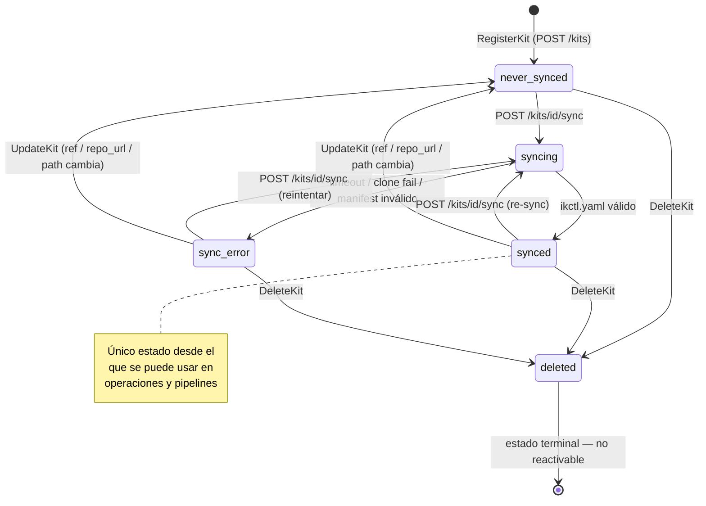
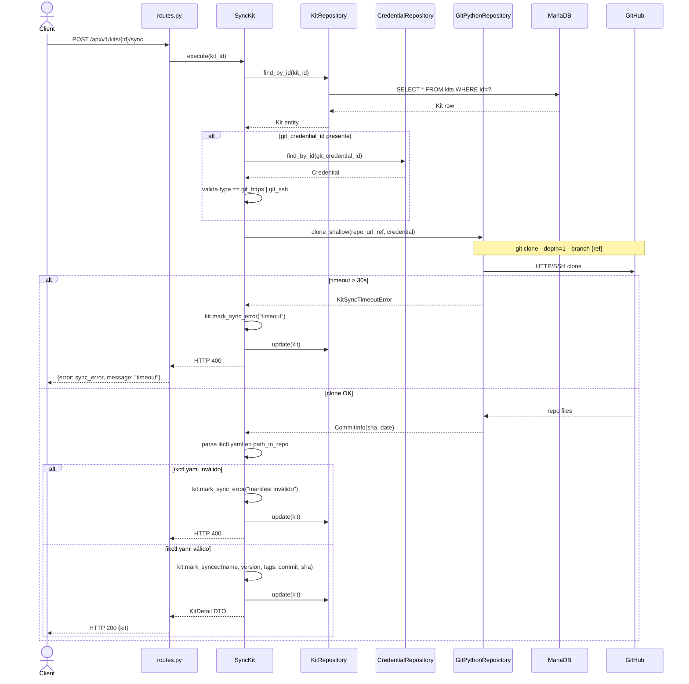

# Arquitectura del Módulo Kits v1

## Visión General

El módulo `kits` gestiona los metadatos de los kits de instalación. Los ficheros del kit **no se almacenan** en la API: se descargan desde un repositorio Git en runtime. La única responsabilidad de persistencia del módulo es guardar el registro Git (repo_url, ref, path, credentials) y los metadatos extraídos del `ikctl.yaml` tras sincronizar.

```
app/v1/kits/
├── domain/          # Entity Kit, Events, Exceptions
├── application/     # Use Cases (CQRS), DTOs, Interfaces (Ports)
└── infrastructure/  # Repository, GitPythonRepository, Presentation
```

---

## Capa Domain

**Responsabilidad:** Modelar el ciclo de vida de un kit (registro → sync → uso → soft delete).

### Entity: `Kit`

| Campo | Tipo | Descripción |
|-------|------|-------------|
| `id` | str | Identidad |
| `user_id` | str | Propietario |
| `repo_url` | str | URL del repositorio Git |
| `ref` | str | Branch o tag |
| `path_in_repo` | str | Carpeta del kit en el monorepo |
| `git_credential_id` | str \| None | NULL si repo público; debe ser `git_https` o `git_ssh` |
| `sync_status` | `KitSyncStatus` (VO) | `never_synced` \| `synced` \| `sync_error` |
| `name` | str \| None | Extraído del `ikctl.yaml` — NULL hasta que sync sea exitoso |
| `description` | str \| None | Extraído del `ikctl.yaml` |
| `version` | str \| None | Extraído del `ikctl.yaml` |
| `tags` | list[str] | Extraído del `ikctl.yaml` |
| `values` | dict | Valores por defecto del kit |
| `debug_level` | str | `none` \| `errors` \| `full` |
| `last_synced_at` | datetime \| None | — |
| `last_commit_sha` | str \| None | SHA-40 del commit sincronizado |
| `sync_error_message` | str \| None | Detalle del error si sync_error |
| `is_deleted` | bool | Soft delete — estado terminal |

**Comandos (métodos que mutan estado):**

```python
def update(self, repo_url, ref, path_in_repo, git_credential_id) -> None:
    # Si cambia repo_url, ref o path_in_repo → resetea sync_status a never_synced

def mark_synced(self, name, description, version, tags, values, debug_level,
                commit_sha, synced_at) -> None:
    # Actualiza metadatos y sync_status = synced

def mark_sync_error(self, error_message: str) -> None:
    # sync_status = sync_error

def delete(self) -> None:
    # is_deleted = True — estado terminal

def ensure_not_deleted(self) -> None:
    # raise KitDeletedError si is_deleted
```

**Queries (sin mutación):**

```python
def is_synced(self) -> bool
def is_usable(self) -> bool    # synced AND NOT is_deleted
```

### Value Objects

| VO | Validaciones |
|----|-------------|
| `KitSyncStatus` | enum `never_synced` \| `synced` \| `sync_error` |

### Domain Events

| Evento | Publisher | Payload |
|--------|-----------|---------|
| `KitRegistered` | `RegisterKit` | `{kit_id, user_id, repo_url, ref}` |
| `KitSynced` | `SyncKit` | `{kit_id, commit_sha, name}` |
| `KitSyncFailed` | `SyncKit` | `{kit_id, error_message}` |
| `KitDeleted` | `DeleteKit` | `{kit_id, user_id}` |

### Domain Exceptions

```
KitNotFoundError           → Kit no existe o no pertenece al usuario
KitNotSyncedError          → Kit con never_synced o sync_error intentado en operación
KitDeletedError            → Kit eliminado (is_deleted=True) operación no permitida
KitSyncTimeoutError        → Shallow clone superó 30s
InvalidKitManifestError    → ikctl.yaml inválido o incompleto
InvalidGitCredentialError  → git_credential_id referencia una credencial de tipo ssh
```

---

## Capa Application

### CQRS: Commands vs Queries

**Commands** (`application/commands/`):

| Command | Descripción | Evento publicado |
|---------|-------------|-----------------|
| `RegisterKit` | Crea kit con sync_status never_synced. Sin llamada a Git | `KitRegistered` |
| `UpdateKit` | Actualiza campos. Delega a `kit.update()` — resetea sync si procede | — |
| `DeleteKit` | Soft delete via `kit.delete()`. Valida ownership | `KitDeleted` |
| `SyncKit` | Shallow clone + parse ikctl.yaml + update metadatos | `KitSynced` / `KitSyncFailed` |

**Queries** (`application/queries/`):

| Query | Descripción |
|-------|-------------|
| `GetKit` | Obtiene detalle de kit por id. Solo kits propios |
| `ListKits` | Lista paginada, filtrada por tags y/o sync_status. Solo no eliminados |

### DTOs

```
KitDetail     → todos los campos del kit EXCEPTO is_deleted
KitSummary    → id, name, version, tags, sync_status, last_synced_at (para listados)
```

### Interfaces (Ports)

```
KitRepository    → save, find_by_id, find_all_by_user (filtra is_deleted),
                    update, soft_delete
GitRepository    → clone_shallow(repo_url, ref, dest_path,
                                  credential?)  → CommitInfo
                   (ver ADR-009 — implementado por GitPythonRepository)
EventBus (shared) → publish, subscribe
```

---

## Capa Infrastructure

### Repositories

| Puerto | Implementación | Tabla | DB |
|--------|---------------|-------|----|
| `KitRepository` | `SQLAlchemyKitRepository` | `kits` | `ikctl_kits` |

### Adapters

| Puerto | Implementación | Tecnología |
|--------|---------------|------------|
| `GitRepository` | `GitPythonRepository` | GitPython + temp dir |

**`GitPythonRepository.clone_shallow()`:**
1. Crea directorio temporal `/tmp/ikctl/sync/{kit_id}/`
2. `git clone --depth=1 --branch {ref} {repo_url} {dest}` (con credenciales si aplica)
3. Devuelve `CommitInfo(sha, message, author, date)`
4. Timeout 30s — lanza `KitSyncTimeoutError` si se supera
5. Limpia el directorio temporal al finalizar (éxito o fallo)

**Soporte de credenciales en el clone:**
- `git_https`: inyecta `username:password` en la URL (nunca se loguea)
- `git_ssh`: usa `GIT_SSH_COMMAND` con la clave privada en fichero temporal de permisos 600

### Presentation (FastAPI)

**`routes/kits.py`**:

| Método | Path | Use Case |
|--------|------|----------|
| POST | `/api/v1/kits` | `RegisterKit` |
| GET | `/api/v1/kits` | `ListKits` |
| GET | `/api/v1/kits/{id}` | `GetKit` |
| PUT | `/api/v1/kits/{id}` | `UpdateKit` |
| DELETE | `/api/v1/kits/{id}` | `DeleteKit` |
| POST | `/api/v1/kits/{id}/sync` | `SyncKit` |

---

## Composition Root (`main.py`)

```python
# Singleton
git_repository = GitPythonRepository(timeout_seconds=30)

# Scoped por request
async def get_kit_repository(session=Depends(get_db_session)):
    return SQLAlchemyKitRepository(session)

# Use cases — comandos
async def get_sync_kit(
    kit_repo=Depends(get_kit_repository),
    cred_repo=Depends(get_credential_repository),  # cross-module
    event_bus=Depends(get_event_bus),
):
    return SyncKit(kit_repo, git_repository, cred_repo, event_bus)
```

---

## Flujo de Sincronización (`POST /api/v1/kits/{id}/sync`)

```
HTTP Request
    │
    ▼
routes/kits.py::sync_kit()
    │
    ▼
SyncKit().execute(kit_id)           ← Command (application)
    │
    ├─ kit_repository.find_by_id()  ← verifica ownership y que no esté eliminado
    │
    ├─ [si git_credential_id]
    │   credential_repository.find_by_id()  ← cross-module read
    │   Valida type == git_https | git_ssh
    │
    ├─ git_repository.clone_shallow(
    │       repo_url=kit.repo_url,
    │       ref=kit.ref,
    │       credential=credential  ← None si repo público
    │   )                          ← GitPythonRepository → /tmp/ikctl/sync/{kit_id}/
    │
    ├─ parse ikctl.yaml en path_in_repo
    │   Valida campos requeridos (name, files.uploads, files.pipeline)
    │   Valida que files.pipeline ⊆ files.uploads
    │
    ├─ kit.mark_synced(name, description, version, tags, values, commit_sha, now)
    ├─ kit_repository.update()
    ├─ event_bus.publish(KitSynced)
    │
    ▼
KitDetail DTO → Pydantic schema → JSON HTTP 200

[En caso de error:]
    ├─ kit.mark_sync_error(error_message)
    ├─ kit_repository.update()
    ├─ event_bus.publish(KitSyncFailed)
    ▼
Error DTO → JSON HTTP 400
```

---

## Decisiones de Diseño (ADRs)

| ADR | Decisión |
|-----|---------|
| [ADR-002](../adrs/002-mariadb-primary-database.md) | MariaDB — `ikctl_kits` |
| [ADR-009](../adrs/009-git-as-kit-source.md) | Git como fuente de kits — sin almacenamiento de ficheros |
| [ADR-010](../adrs/010-credential-types.md) | Validación de tipo de credencial para repos privados |
| [ADR-014](../adrs/014-soft-delete-kits.md) | Soft delete — `is_deleted` boolean, estado terminal |

---

## Diagramas

### Ciclo de vida de un kit



### Flujo de sincronización (POST /kits/{id}/sync)


