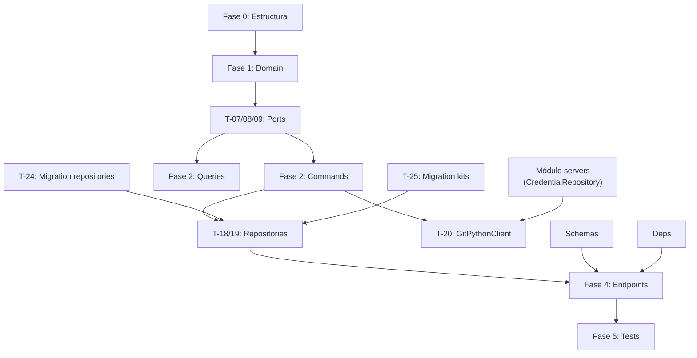
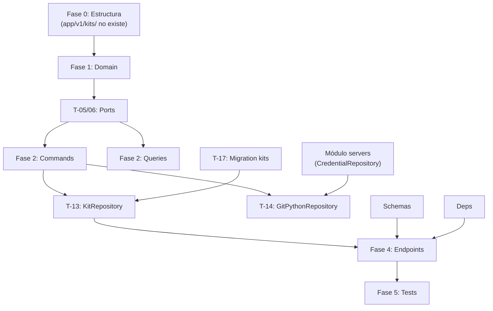

# Tareas del Módulo Kits v2.0.0

**Estado:** 0 tests — ⏳ PENDIENTE DE IMPLEMENTACIÓN

> Módulo que gestiona repositorios Git y los kits que contienen.
> Inspirado en Helm (registro de repos) + Kustomize (`ikctl.yaml` declarativo).
> Git es la fuente de verdad. Los ficheros nunca se almacenan — shallow clone en runtime.
> Introduce dos entidades: `Repository` y `Kit`.
> Dependencia crítica de `operations` y `pipelines`.

## Fase 0: Estructura Clean Architecture

**DEBE EJECUTARSE PRIMERO** — El módulo `app/v1/kits/` no existe aún; hay que crearlo desde cero

- [ ] **T-00.1**: Crear `app/v1/kits/` con `__init__.py` y estructura `domain/` (`entities/`, `value_objects/`, `exceptions/`) con sus `__init__.py`
- [ ] **T-00.2**: Crear `application/` con subcarpetas `commands/`, `queries/`, `dtos/`, `interfaces/` y sus `__init__.py`
- [ ] **T-00.3**: Crear `application/exceptions.py` — `UseCaseException`, `KitNotSyncedError`, `KitNotUsableError`, `InvalidGitCredentialTypeError`, `ManifestValidationError`, `RepositoryInUseError`, `RepositoryNotFoundError`, `MissingRootManifestError`
- [ ] **T-00.4**: Crear `infrastructure/` con subcarpetas `persistence/`, `repositories/`, `adapters/`, `presentation/` y sus `__init__.py`
- [ ] **T-00.5**: Crear tests directory `tests/v1/kits/` con subcarpetas `test_domain/`, `test_use_cases/`, `test_infrastructure/`, `test_presentation/` y sus `__init__.py`

  **FASE 0 PENDIENTE: 5 tareas — bloquea todo el módulo**

## Fase 1: Entidades y Value Objects (Domain Layer)

- [ ] **T-01**: Value Object `SyncStatus` (`never_synced` | `synced` | `sync_error`) — inmutable, validación de enum, reutilizable por `Repository` y `Kit` — 4 tests
- [ ] **T-02**: Value Object `KitManifest` — inmutable, parsea y valida `ikctl.yaml` de subdirectorio como `dict`. Expone: `name`, `description`, `version`, `tags`, `values`, `debug_level`, `upload_files`, `pipeline_files`, `backup_files`. Validación en `__post_init__`: todos los `pipeline_files[]` deben estar en `upload_files[]` (RN-21). Si falla lanza `InvalidManifestError` — 8 tests
- [ ] **T-03**: Value Object `RepositoryIndex` — inmutable, parsea y valida `ikctl.yaml` raíz. Expone `kit_paths: list[str]`. Si no contiene sección `kits:` o está vacío lanza `MissingRootManifestError` — 4 tests
- [ ] **T-04**: Entity `Repository` — campos: `id`, `user_id`, `url`, `ref`, `credential_id` (opt), `sync_status: SyncStatus`, `last_synced_at` (opt), `last_commit_sha` (opt), `sync_error_message` (opt), `is_deleted: bool`, `created_at`, `updated_at`. Comandos: `update(url, ref, credential_id)` → si cambia `url` o `ref` resetea `sync_status: never_synced`, `mark_synced(commit_sha)`, `mark_sync_error(message)`, `delete()`. Queries: `is_synced()`. `__eq__` por `id` — 10 tests
- [ ] **T-05**: Entity `Kit` — campos: `id`, `user_id`, `repository_id`, `path_in_repo`, `name`, `description`, `version`, `tags: list[str]`, `values: dict`, `debug_level`, `sync_status: SyncStatus`, `last_synced_at` (opt), `last_commit_sha` (opt), `sync_error_message` (opt), `is_deleted: bool`, `created_at`, `updated_at`. Comandos: `mark_synced(manifest, commit_sha)`, `mark_sync_error(message)`, `soft_delete()`. Queries: `is_usable()` (synced AND not deleted). `__eq__` por `id` — 10 tests
- [ ] **T-06**: Domain Exceptions en `domain/exceptions/` — `RepositoryNotFoundError`, `KitNotFoundError`, `InvalidManifestError`, `MissingRootManifestError` — tests implícitos en T-04/T-05

  **FASE 1 PENDIENTE: ~36 tests**

## Fase 2: Use Cases (Application Layer) — CQRS

### Ports (Interfaces)

- [ ] **T-07**: Port `RepositoryRepository` ABC en `application/interfaces/repository_repository.py` — métodos: `save(repo)`, `find_by_id(id, user_id)`, `find_all_by_user(user_id, page, per_page)`, `update(repo)`, `delete(id)`, `has_kits_with_references(repository_id)` — 0 tests
- [ ] **T-08**: Port `KitRepository` ABC en `application/interfaces/kit_repository.py` — métodos: `save(kit)`, `find_by_id(id, user_id)`, `find_by_repository_id(repository_id)`, `find_all_by_user(user_id, page, per_page, tags_filter, repository_id_filter)`, `update(kit)`, `find_by_id_internal(kit_id)` — 0 tests
- [ ] **T-09**: Port `GitClient` ABC en `application/interfaces/git_client.py` — métodos: `clone_shallow(url, ref, dest_path, credential)` → retorna `commit_sha: str`. `read_file(dest_path, relative_path)` → retorna `str`. Timeout 30s (RNF-12). Credential puede ser `None`, `git_https` o `git_ssh` — 0 tests

### Commands — Repository

- [ ] **T-10**: Command `RegisterRepository(user_id, url, ref, credential_id?)` → devuelve `RepositoryResult` DTO — valida que `credential_id` si se proporciona es de tipo `git_https` o `git_ssh` (RN-23), crea con `sync_status: never_synced`, persiste — 4 tests
- [ ] **T-11**: Command `UpdateRepository(user_id, repository_id, url, ref, credential_id?)` → devuelve `RepositoryResult` — valida ownership (RN-01), llama `repo.update(...)`, persiste — 4 tests
- [ ] **T-12**: Command `DeleteRepository(user_id, repository_id)` → `None` — valida ownership (RN-01), comprueba que no hay kits del repo con referencias en pipelines/operaciones (RN-30), si hay referencias → lanza `RepositoryInUseError`, si no → borrado físico de repo + todos sus kits — 5 tests
- [ ] **T-13**: Command `SyncRepository(user_id, repository_id)` → devuelve `RepositorySyncResult` — valida ownership (RN-01), hace shallow clone via `GitClient`, lee y parsea `ikctl.yaml` raíz via `RepositoryIndex`. Si no existe → `repo.mark_sync_error("No se encontró ikctl.yaml en la raíz")`, persiste, devuelve 200. Por cada path en el índice: lee `ikctl.yaml` del subdirectorio, parsea via `KitManifest`. Reconcilia con DB (CREATE/UPDATE/soft_delete). Si kit pasa a `is_deleted: true` y tiene referencias → genera notificación (RN-29). Actualiza `repo.mark_synced(commit_sha)` — 10 tests

### Queries — Repository

- [ ] **T-14**: Query `GetRepository(user_id, repository_id)` → devuelve `RepositoryResult` — valida ownership, no eliminados — 3 tests
- [ ] **T-15**: Query `ListRepositories(user_id, page, per_page)` → devuelve `RepositoryListResult` paginado — solo no eliminados — 2 tests

### Queries — Kit

- [ ] **T-16**: Query `GetKit(user_id, kit_id)` → devuelve `KitResult` — valida ownership (RN-01), solo kits no eliminados — 3 tests
- [ ] **T-17**: Query `ListKits(user_id, page, per_page, tags_filter, repository_id_filter)` → devuelve `KitListResult` paginado — solo no eliminados — 3 tests

### DTOs

- [ ] **T-17.1**: Crear DTOs en `application/dtos/`: `RepositoryResult`, `RepositoryListResult`, `RepositorySyncResult`, `KitResult`, `KitListResult` — sin tests directos

  **FASE 2 PENDIENTE: ~34 tests**

## Fase 3: Infrastructure (Repositories y Adapters)

### Repositories

- [ ] **T-18**: `SQLAlchemyRepositoryRepository` — implementa `RepositoryRepository` port. `has_kits_with_references` hace join con kits, pipelines y operaciones. Filtra `is_deleted = false` en lecturas — 6 tests
- [ ] **T-19**: `SQLAlchemyKitRepository` — implementa `KitRepository` port. Filtra automáticamente `is_deleted = false` en queries de lectura. Soporte JSON para `tags` y `values`. Soporta filtro por `repository_id` en `find_all_by_user` — 7 tests

### Adapters

- [ ] **T-20**: `GitPythonClient` — implementa `GitClient` port usando `gitpython`. Shallow clone (`depth=1`, RNF-14). Soporte credentials: `None` (público), `git_https` (usuario + PAT en URL), `git_ssh` (clave privada en archivo temporal). Timeout 30s via `asyncio.wait_for` (RNF-12). Limpia directorio temporal siempre (RNF-15). Nunca loguea PAT ni clave privada (RNF-09) — 8 tests

### Sync Periódico

- [ ] **T-21**: Background task `PeriodicSyncRepositories` — ejecuta `SyncRepository` para todos los repositorios activos cada `KIT_SYNC_INTERVAL_MINUTES` minutos (default: 30, configurable en `.env`). Usa Celery o asyncio scheduler. No lanza excepciones al exterior — errores se persisten como `sync_error` — 3 tests

### Composition Root

- [ ] **T-22**: Extender `main.py` con adaptadores del módulo kits — `SQLAlchemyRepositoryRepository`, `SQLAlchemyKitRepository`, `GitPythonClient`. Inyectar en todos los use cases. Registrar `PeriodicSyncRepositories`

### Persistence Models

- [ ] **T-23**: Modelos SQLAlchemy en `infrastructure/persistence/models.py` — tablas `repositories` y `kits` (ver schema en requirements.md)

### Database Migrations (Alembic)

- [ ] **T-24**: Alembic migration: tabla `repositories` — todos los campos del schema. Índices: `user_id`. Migración con `down()` funcional
- [ ] **T-25**: Alembic migration: tabla `kits` — todos los campos del schema, FK a `repositories`. Índices: `user_id`, `repository_id`, `sync_status`, `is_deleted`. Migración con `down()` funcional

### Presentation

- [ ] **T-26**: Schemas Pydantic en `schemas.py` — `RegisterRepositoryRequest`, `UpdateRepositoryRequest`, `RepositoryResponse`, `RepositorySyncResponse`, `KitResponse`, `KitListResponse`
- [ ] **T-27**: `deps.py` — dependencias FastAPI: `get_current_user_id(token)`, `get_db_session()`, factories de use cases
- [ ] **T-28**: Exception handlers en `exception_handlers.py` — `RepositoryNotFoundError` → 404, `KitNotFoundError` → 404, `RepositoryInUseError` → 409, `KitNotUsableError` → 422, `InvalidGitCredentialTypeError` → 422, `MissingRootManifestError` → 422

  **FASE 3 PENDIENTE: ~24 tests**

## Fase 4: Presentation (FastAPI Endpoints)

### Repositories

- [ ] **T-29**: `POST /api/v1/repositories` — registrar repositorio. Body: `RegisterRepositoryRequest`. Response 201: `RepositoryResponse`
- [ ] **T-30**: `GET /api/v1/repositories` — listar repositorios paginados. Response 200: lista `RepositoryResponse`
- [ ] **T-31**: `GET /api/v1/repositories/{id}` — obtener repositorio. Response 200: `RepositoryResponse` o 404
- [ ] **T-32**: `PUT /api/v1/repositories/{id}` — actualizar repositorio. Response 200: `RepositoryResponse` o 404/403
- [ ] **T-33**: `DELETE /api/v1/repositories/{id}` — eliminar repositorio y sus kits. Response 204 o 404/403/409 (en uso)
- [ ] **T-34**: `POST /api/v1/repositories/{id}/sync` — sincronizar repositorio desde Git. Response 200: `RepositorySyncResponse` con `sync_status`, `last_commit_sha`, `kits_created`, `kits_updated`, `kits_deleted`. Si falla devuelve 200 con `sync_status: sync_error` — no 500

### Kits (solo lectura — gestionados por sync)

- [ ] **T-35**: `GET /api/v1/kits` — listar kits paginados. Query params: `page`, `per_page`, `tags` (multi-valor), `repository_id`. Response 200: lista `KitResponse`
- [ ] **T-36**: `GET /api/v1/kits/{id}` — obtener kit. Response 200: `KitResponse` o 404

  **FASE 4 PENDIENTE: 8 endpoints**

## Fase 5: Tests

### Tests de Presentación

- [ ] **T-37**: Tests endpoints repositories — registrar OK (201), sync exitoso (200), sync sin ikctl.yaml raíz devuelve `sync_error` (200), repo en uso → 409, credencial tipo `ssh` → 422 — 6 tests
- [ ] **T-38**: Tests endpoints kits — listar OK, filtrar por repository_id, obtener detalle — 3 tests

### Tests de Integración

- [ ] **T-39**: Tests de integración `GitPythonClient` — clone público OK, clone privado git_https OK, clone privado git_ssh OK, clone timeout → error, `ikctl.yaml` inválido → error — 5 tests

### Contract Tests

- [ ] **T-40**: Contract tests `GitClient` port — verifica que `GitPythonClient` implementa el contrato: retorna `commit_sha`, maneja timeout, limpia archivos temporales, nunca escribe credentials en disco permanentemente — 4 tests

  **FASE 5 PENDIENTE: ~18 tests**

---

## 📊 Resumen de Progreso

| Fase | Estado | Tests | Completitud |
|------|--------|-------|-------------|
| Fase 0 - Estructura | ⏳ **PENDIENTE** | — | 0% — **bloquea todo** |
| Fase 1 - Domain Layer | ⏳ **PENDIENTE** | — | 0% |
| Fase 2 - Use Cases (CQRS) | ⏳ **PENDIENTE** | — | 0% |
| Fase 3 - Infrastructure | ⏳ **PENDIENTE** | — | 0% |
| Fase 4 - Presentation | ⏳ **PENDIENTE** | — | 0% |
| Fase 5 - Tests | ⏳ **PENDIENTE** | — | 0% |
| Fase 6 - Documentación | ⏳ **PENDIENTE** | — | 0% |

**TOTAL ESTIMADO: ~112 tests**

## Fase 6: Documentación y Ajustes

- [ ] **T-41**: Validación de requisitos vs implementación (todos los RF y RN)
- [ ] **T-42**: Review y refactoring de código
- [ ] **T-43**: API_GUIDE.md con ejemplos curl para todos los endpoints

### Próximos Pasos

1. 🔴 **CRÍTICO**: Ejecutar Fase 0 (crear carpeta `app/v1/kits/` con estructura completa)
2. ⏳ Implementar Domain (`Repository`, `Kit` entities, `KitManifest`, `RepositoryIndex`, `SyncStatus` VOs)
3. ⏳ Implementar Ports (`RepositoryRepository`, `KitRepository`, `GitClient` ABCs)
4. ⏳ Implementar Use Cases con TDD
5. ⏳ Implementar `GitPythonClient` (shallow clone con credentials, timeout 30s)
6. ⏳ Crear migrations Alembic (`repositories`, `kits`)
7. ⏳ Crear 8 endpoints FastAPI
8. ⏳ Tests de integración y contract tests

## Dependencias de Tareas

**Dependencias críticas:**

- **T-00.X** → Todo el módulo (EL DIRECTORIO NO EXISTE — bloquea todo)
- **T-02 (KitManifest), T-03 (RepositoryIndex)** → T-13 (SyncRepository los usa)
- **T-04 (Repository entity)** → T-10, T-11, T-12, T-13
- **T-05 (Kit entity)** → T-13, T-16, T-17
- **T-20 (GitPythonClient)** → depende de `CredentialRepository` del módulo `servers`
- **T-24, T-25 (Migrations)** → T-18, T-19 (repositories necesitan tablas creadas)

## Estadísticas

- **Total de tareas**: 43 tareas explícitas
- **Fases**: 7 (incluyendo Fase 0 de setup)
- **Tests estimados**: ~112 total
- **Endpoints**: 8 (6 repositories + 2 kits read-only)
- **Entidades**: 2 (Repository, Kit)
- **Value Objects**: 3 (SyncStatus, KitManifest, RepositoryIndex)
- **Use Cases**: 8 (4 commands + 4 queries)
- **Adapters**: 1 (GitPythonClient)
- **Migrations Alembic**: 2 (repositories, kits)

## Cobertura de Reglas de Negocio

| RN | Descripción | Tareas | Estado |
|----|-------------|--------|--------|
| RN-01 | Ownership — solo repos/kits propios | T-10 a T-17 | ⏳ Pendiente |
| RN-03 | Borrado suave de kits via sync | T-13, T-19 | ⏳ Pendiente |
| RN-09 | Kit no sincronizado/eliminado → no usar en ops | T-05 `is_usable()` | ⏳ Pendiente |
| RN-10 | Kit eliminado → estado terminal | T-05 `soft_delete()` | ⏳ Pendiente |
| RN-21 | `pipeline[]` ⊆ `uploads[]` en manifest | T-02 (KitManifest) | ⏳ Pendiente |
| RN-23 | credential_id solo tipo `git_https`/`git_ssh` | T-10, T-11 | ⏳ Pendiente |
| RN-28 | Validar kits usables antes de lanzar op/pipeline | T-05 `is_usable()`, consumido por operations | ⏳ Pendiente |
| RN-29 | Notificación frontend si kit → is_deleted con refs pipelines | T-13 | ⏳ Pendiente |
| RN-30 | Repo con kits referenciados → 409 al borrar | T-12, T-07 | ⏳ Pendiente |
| RN-31 | Repo no accesible en runtime → error controlado | T-13, T-20 | ⏳ Pendiente |

**Estado RN: 0 implementadas, 10 pendientes**

## Fase 0: Estructura Clean Architecture

**DEBE EJECUTARSE PRIMERO** — El módulo `app/v1/kits/` no existe aún; hay que crearlo desde cero

- [ ] **T-00.1**: Crear `app/v1/kits/` con `__init__.py` y estructura `domain/` (`entities/`, `value_objects/`, `exceptions/`) con sus `__init__.py`
- [ ] **T-00.2**: Crear `application/` con subcarpetas `commands/`, `queries/`, `dtos/`, `interfaces/` y sus `__init__.py`
- [ ] **T-00.3**: Crear `application/exceptions.py` (UseCaseException, KitNotSyncedError, KitAlreadyDeletedError, InvalidGitCredentialTypeError, ManifestValidationError)
- [ ] **T-00.4**: Crear `infrastructure/` con subcarpetas `persistence/`, `repositories/`, `adapters/`, `presentation/` y sus `__init__.py`
- [ ] **T-00.5**: Crear tests directory `tests/v1/kits/` con subcarpetas `test_domain/`, `test_use_cases/`, `test_infrastructure/`, `test_presentation/` y sus `__init__.py`

  **FASE 0 PENDIENTE: 5 tareas — bloquea todo el módulo**

## Fase 1: Entidades y Value Objects (Domain Layer)

- [ ] **T-01**: Value Object `KitSyncStatus` (`never_synced` | `synced` | `sync_error`) — inmutable, validación de enum, sin dependencias externas — 4 tests
- [ ] **T-02**: Value Object `KitManifest` — inmutable, parsea y valida `ikctl.yaml` como `dict`. Expone: `name`, `description`, `version`, `tags`, `values`, `debug_level`, `upload_files`, `pipeline_files`, `backup_files`. Validación en `__post_init__`: todos los `pipeline_files[]` deben estar en `uploads_files[]` (RN-21). Si falla lanza `InvalidManifestError` — 8 tests
- [ ] **T-03**: Entity `Kit` — campos: `id`, `user_id`, `name`, `description`, `version`, `tags: list[str]`, `values: dict`, `debug_level`, `repo_url`, `ref`, `path_in_repo`, `git_credential_id` (opt), `sync_status: KitSyncStatus`, `last_synced_at` (opt), `last_commit_sha` (opt), `sync_error_message` (opt), `is_deleted: bool`, `created_at`, `updated_at`. Comandos: `update(repo_url, ref, path_in_repo, git_credential_id)` → si cambia repo fuente, resetea `sync_status` a `never_synced` (RF-12), `mark_synced(manifest, commit_sha)` → actualiza campos del manifest, `mark_sync_error(error_message)`, `delete()` → `is_deleted = True` (RN-10), `ensure_not_deleted()` → lanza `KitAlreadyDeletedError` si `is_deleted`. Queries: `is_synced()`, `is_usable()` (synced AND not deleted). `__eq__` por `id` — 12 tests
- [ ] **T-04**: Domain Exceptions en `domain/exceptions/` — `KitNotFoundError`, `InvalidManifestError` — con mensajes descriptivos — tests implícitos en T-03

  **FASE 1 PENDIENTE: ~24 tests**

## Fase 2: Use Cases (Application Layer) — CQRS

### Ports (Interfaces)

- [ ] **T-05**: Port `KitRepository` ABC en `application/interfaces/kit_repository.py` — métodos: `save(kit)`, `find_by_id(id, user_id)`, `find_all_by_user(user_id, page, per_page, tags_filter)`, `update(kit)` — 0 tests (probados via contract tests)
- [ ] **T-06**: Port `GitRepository` ABC en `application/interfaces/git_repository.py` — método: `clone_shallow(repo_url, ref, path_in_repo, dest_path, credential)` → descarga los ficheros del kit en `dest_path`. Timeout 30s (RNF-12). Credential puede ser `None` (repo público), `git_https` o `git_ssh`. Retorna `commit_sha: str` del HEAD clonado — 0 tests

### Commands

- [ ] **T-07**: Command `RegisterKit(user_id, repo_url, ref, path_in_repo, git_credential_id)` → devuelve `KitResult` DTO — crea kit con `sync_status: never_synced`, valida que `git_credential_id` existe y es de tipo `git_https` o `git_ssh` si se proporciona (RN-23), persiste — 4 tests
- [ ] **T-08**: Command `UpdateKit(user_id, kit_id, repo_url, ref, path_in_repo, git_credential_id)` → devuelve `KitResult` — valida ownership (RN-01), valida kit no eliminado (RN-10), si cambia fuente resetea `sync_status`, persiste — 4 tests
- [ ] **T-09**: Command `DeleteKit(user_id, kit_id)` → `None` — valida ownership (RN-01), valida kit no eliminado aún (RN-10), llama `kit.delete()`, persiste (borrado suave, RN-03) — 4 tests
- [ ] **T-10**: Command `SyncKit(user_id, kit_id)` → devuelve `KitSyncResult` — valida ownership (RN-01), valida kit no eliminado (RN-10), hace shallow clone via `GitRepository`, lee y valida `ikctl.yaml`, llama `kit.mark_synced(...)` o `kit.mark_sync_error(...)`, persiste. Si falla, persiste `sync_error` en vez de lanzar excepción — 6 tests

### Queries

- [ ] **T-11**: Query `GetKit(user_id, kit_id)` → devuelve `KitResult` — valida ownership (RN-01), solo devuelve kits no eliminados — 3 tests
- [ ] **T-12**: Query `ListKits(user_id, page, per_page, tags_filter)` → devuelve `KitListResult` paginado — solo kits no eliminados (RN-03) — 2 tests

### DTOs

- [ ] **T-12.1**: Crear DTOs en `application/dtos/`: `KitResult`, `KitListResult`, `KitSyncResult` — sin tests directos

  **FASE 2 PENDIENTE: ~23 tests**

## Fase 3: Infrastructure (Repositories y Adapters)

### Repository

- [ ] **T-13**: `SQLAlchemyKitRepository` — implementa `KitRepository` port. Filtra automáticamente `is_deleted = false` en todas las queries de lectura (nunca devuelve kits eliminados a menos que sea para lecturas internas del historial). Soporte JSON para `tags` y `values` — 6 tests

### Adapters

- [ ] **T-14**: `GitPythonRepository` — implementa `GitRepository` port usando `gitpython`. Shallow clone (`depth=1`, RNF-14). Soporte de credentials: `None` (público), `git_https` (usuario + PAT en URL), `git_ssh` (clave privada en archivo temporal). Timeout de 30s via `asyncio.wait_for` (RNF-12). Limpia el directorio temporal tras la operación. Nunca loguea el PAT ni la clave privada (RNF-09) — 8 tests

### Composition Root

- [ ] **T-15**: Extender `main.py` (Composition Root) con adaptadores del módulo kits — `SQLAlchemyKitRepository`, `GitPythonRepository`. Inyectar en `RegisterKit`, `UpdateKit`, `DeleteKit`, `SyncKit`, `GetKit`, `ListKits`

### Persistence Models

- [ ] **T-16**: Modelos SQLAlchemy en `infrastructure/persistence/models.py` — tabla `kits`

### Database Migrations (Alembic)

- [ ] **T-17**: Alembic migration: tabla `kits` — todos los campos del schema (ver requirements.md). Índices: `user_id`, `sync_status`, `is_deleted`. Migración con `down()` funcional

### Presentation

- [ ] **T-18**: Schemas Pydantic en `schemas.py` — `RegisterKitRequest`, `UpdateKitRequest`, `KitResponse`, `KitSyncResponse`
- [ ] **T-19**: `deps.py` — dependencias FastAPI: `get_current_user_id(token)` (JWT auth), `get_db_session()`, factories de use cases
- [ ] **T-20**: Exception handlers en `exception_handlers.py` — `KitNotFoundError` → 404, `KitAlreadyDeletedError` → 409, `KitNotSyncedError` → 422, `InvalidGitCredentialTypeError` → 422

  **FASE 3 PENDIENTE: ~14 tests**

## Fase 4: Presentation (FastAPI Endpoints)

- [ ] **T-21**: `POST /api/v1/kits` — registrar kit. Body: `RegisterKitRequest`. Response 201: `KitResponse`
- [ ] **T-22**: `GET /api/v1/kits` — listar kits paginados. Query params: `page`, `per_page`, `tags` (multi-valor). Response 200: lista `KitResponse`
- [ ] **T-23**: `GET /api/v1/kits/{id}` — obtener kit. Response 200: `KitResponse` o 404
- [ ] **T-24**: `PUT /api/v1/kits/{id}` — actualizar kit. Response 200: `KitResponse` o 404/403
- [ ] **T-25**: `DELETE /api/v1/kits/{id}` — eliminar kit (soft delete). Response 204 o 404/403
- [ ] **T-26**: `POST /api/v1/kits/{id}/sync` — sincronizar kit desde Git. Response 200: `KitSyncResponse` con `sync_status`, `last_commit_sha`. Si falla, devuelve 200 con `sync_status: sync_error` y `sync_error_message` (no 500 — el error es de negocio, no de infraestructura)

  **FASE 4 PENDIENTE: 6 endpoints**

## Fase 5: Tests (TDD)

### Tests de Integración FastAPI

- [ ] **T-27**: Tests de presentación kits — flujos: registrar OK (201), sync exitoso (200), sync con error Git devuelve `sync_error` (200), kit eliminado → 409, credencial tipo `ssh` en kit → 422 — 5 tests
- [ ] **T-28**: Tests de integración `GitPythonRepository` — con repo real o mock: clone público OK, clone privado git_https OK, clone timeout → `sync_error`, `ikctl.yaml` inválido → `sync_error` — 4 tests

### Contract Tests

- [ ] **T-29**: Contract tests `GitRepository` port — verifica que `GitPythonRepository` implementa correctamente el contrato: retorna `commit_sha`, maneja timeout, limpia archivos temporales, no escribe credentials en disco permanentemente — 4 tests

  **FASE 5 PENDIENTE: ~13 tests**

---

## 📊 Resumen de Progreso

| Fase | Estado | Tests | Completitud |
|------|--------|-------|-------------|
| Fase 0 - Estructura | ⏳ **PENDIENTE** | — | 0% — **bloquea todo** |
| Fase 1 - Domain Layer | ⏳ **PENDIENTE** | — | 0% |
| Fase 2 - Use Cases (CQRS) | ⏳ **PENDIENTE** | — | 0% |
| Fase 3 - Infrastructure | ⏳ **PENDIENTE** | — | 0% |
| Fase 4 - Presentation | ⏳ **PENDIENTE** | — | 0% |
| Fase 5 - Tests | ⏳ **PENDIENTE** | — | 0% |
| Fase 6 - Documentación | ⏳ **PENDIENTE** | — | 0% |

**TOTAL ESTIMADO: ~74 tests**

## Fase 6: Documentación y Ajustes

- [ ] **T-30**: Documentación técnica → [ARCHITECTURE.md](../ARCHITECTURE.md) ya creado ✅ — verificar coverage
- [ ] **T-31**: Validación de requisitos vs implementación (todos los RF y RN)
- [ ] **T-32**: Review y refactoring de código
- [ ] **T-33**: API_GUIDE.md con ejemplos curl para todos los endpoints

### Próximos Pasos

1. 🔴 **CRÍTICO**: Ejecutar Fase 0 (crear carpeta `app/v1/kits/` con estructura completa)
2. ⏳ Implementar Domain (Kit entity, KitManifest VO, KitSyncStatus VO)
3. ⏳ Implementar Ports (KitRepository, GitRepository ABCs)
4. ⏳ Implementar Use Cases con TDD (RegisterKit, UpdateKit, DeleteKit, SyncKit, GetKit, ListKits)
5. ⏳ Implementar GitPythonRepository (shallow clone con credentials, timeout 30s)
6. ⏳ Crear migration Alembic `kits`
7. ⏳ Crear 6 endpoints FastAPI
8. ⏳ Tests de integración y contract tests

## Dependencias de Tareas

**Dependencias críticas:**

- **T-00.X** → Todo el módulo (EL DIRECTORIO NO EXISTE — bloquea todo)
- **T-01 (KitManifest)** → T-10 (SyncKit parsea el manifest)
- **T-02 (Kit entity)** → T-07, T-08, T-09, T-10 (todos los commands)
- **T-14 (GitPythonRepository)** → depende de `CredentialRepository` del módulo `servers` para obtener las credenciales Git
- **T-17 (Migration)** → T-13 (repository necesita tabla creada)

## Estadísticas

- **Total de tareas**: 33 tareas explícitas
- **Fases**: 7 (incluyendo Fase 0 de setup)
- **Tests estimados**: ~74 total
- **Endpoints**: 6 (CRUD + sync)
- **Entidades**: 1 (Kit)
- **Value Objects**: 2 (KitSyncStatus, KitManifest)
- **Use Cases**: 6 (4 commands + 2 queries)
- **Adapters**: 1 (GitPythonRepository)
- **Migrations Alembic**: 1 (kits)

## Cobertura de Reglas de Negocio

| RN | Descripción | Tareas | Estado |
|----|-------------|--------|--------|
| RN-01 | Ownership — solo kits propios | T-07, T-08, T-09, T-10, T-11, T-12 | ⏳ Pendiente |
| RN-03 | Borrado suave — `is_deleted: true` | T-09, T-13 | ⏳ Pendiente |
| RN-09 | Kit no sincronizado → no usar en ops | T-03 `is_usable()`, consumido por operations | ⏳ Pendiente |
| RN-10 | Kit eliminado → estado terminal | T-03 `ensure_not_deleted()`, T-08, T-09 | ⏳ Pendiente |
| RN-21 | `pipeline[]` ⊆ `uploads[]` en manifest | T-02 (KitManifest `__post_init__`) | ⏳ Pendiente |
| RN-22 | Kit eliminado → no usar en nuevas ops | T-03 `is_usable()`, consumido por operations | ⏳ Pendiente |
| RN-23 | `git_credential_id` solo tipo `git_https`/`git_ssh` | T-07, T-08 | ⏳ Pendiente |

**Estado RN: 0 implementadas, 7 pendientes**
