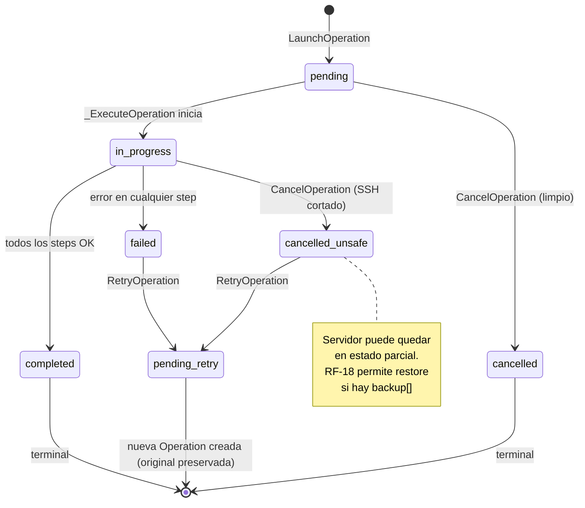
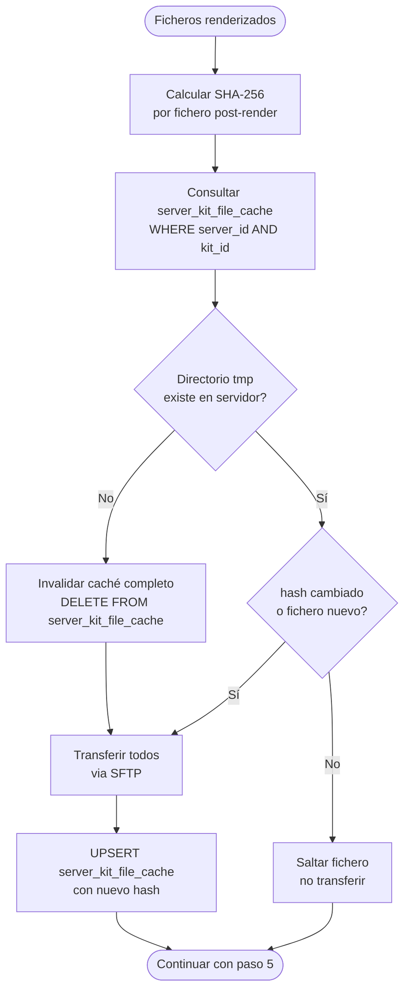

# Arquitectura del Módulo Operations v1

## Visión General

El módulo `operations` orquesta la ejecución de un kit en un servidor. Es el módulo más complejo: coordina snapshot de backup, descarga Git, renderizado Jinja2, transferencia diferencial SFTP (SHA-256), ejecución SSH y limpieza. Todo de forma asíncrona.

```
app/v1/operations/
├── domain/          # Entity Operation, Events, Exceptions, estados
├── application/     # Use Cases (CQRS), DTOs, Interfaces (Ports)
└── infrastructure/  # Repository, Presentation
```

Los adaptadores de ejecución (`Connection`, `GitRepository`, `TaskQueue`) viven en `shared/infrastructure/` porque son compartidos con `pipelines`.

---

## Capa Domain

### Entity: `Operation`

| Campo | Tipo | Descripción |
|-------|------|-------------|
| `id` | str | Identidad |
| `user_id` | str | Propietario |
| `server_id` | str | Servidor target |
| `kit_id` | str | Kit a ejecutar |
| `values` | dict | Valores efectivos (defaults del kit + overrides del usuario) |
| `sudo` | bool | Ejecutar scripts con sudo |
| `debug_level` | str | `none` \| `errors` \| `full` |
| `status` | `OperationStatus` (VO) | Estado actual |
| `output` | str \| None | stdout/stderr acumulado (solo si debug_level ≠ none) |
| `error` | str \| None | Mensaje de error si failed |
| `started_at` | datetime \| None | — |
| `finished_at` | datetime \| None | — |
| `created_at` | datetime | — |

**Comandos (transiciones de estado):**

```python
def start(self) -> None:
    # pending → in_progress. Lanza InvalidOperationTransitionError si no es pending

def complete(self) -> None:
    # in_progress → completed

def fail(self, error: str) -> None:
    # in_progress → failed

def cancel(self) -> None:
    # pending → cancelled (limpio)
    # in_progress → cancelled_unsafe

def append_output(self, chunk: str) -> None:
    # Acumula output en tiempo real (solo si debug_level ≠ none)
```

**Queries:**

```python
def is_terminal(self) -> bool   # completed | failed | cancelled | cancelled_unsafe
def is_retriable(self) -> bool  # failed | cancelled_unsafe
def is_restorable(self) -> bool # failed | cancelled_unsafe
```

### Value Objects

| VO | Valores |
|----|---------|
| `OperationStatus` | `pending` \| `in_progress` \| `completed` \| `failed` \| `cancelled` \| `cancelled_unsafe` |
| `DebugLevel` | `none` \| `errors` \| `full` |

### Domain Events

| Evento | Publisher | Payload |
|--------|-----------|---------|
| `OperationLaunched` | `LaunchOperation` | `{op_id, server_id, kit_id, user_id}` |
| `OperationCompleted` | `_ExecuteOperation` (task) | `{op_id, duration_ms}` |
| `OperationFailed` | `_ExecuteOperation` (task) | `{op_id, error, duration_ms}` |
| `OperationCancelled` | `CancelOperation` | `{op_id, was_unsafe}` |

### Domain Exceptions

```
OperationNotFoundError            → Operación no existe o no pertenece al usuario
InvalidOperationTransitionError   → Transición de estado no permitida (RN-02)
OperationNotRetriableError        → Intentando retry en estado no retriable
OperationNotRestorableError       → Sin backup disponible o ficheros .bak.ikctl ausentes
ServerInactiveError               → Servidor en estado inactive (RN-04)
KitNotUsableError                 → Kit con sync_status != synced o is_deleted (RN-09)
```

---

## Capa Application

### CQRS: Commands vs Queries

**Commands** (`application/commands/`):

| Command | Descripción | Evento publicado |
|---------|-------------|-----------------|
| `LaunchOperation` | Valida servidor + kit, crea op en pending, encola tarea asíncrona | `OperationLaunched` |
| `CancelOperation` | Transición pending→cancelled o in_progress→cancelled_unsafe | `OperationCancelled` |
| `RestoreOperationBackup` | Ejecuta `cp {path}.bak.ikctl {path}` por cada fichero en backup[] | — |
| `RetryOperation` | Crea nueva operación con los mismos parámetros. Original queda en historial | `OperationLaunched` |

**`_ExecuteOperation`** (tarea asíncrona — no es un endpoint, es el trabajo encolado):

Ejecuta los 6 pasos de la operación y actualiza el estado en DB:

```
1. Snapshot      → si backup[], cp {path} {path}.bak.ikctl en servidor
2. Git clone     → shallow clone del kit (depth=1) a /tmp/ikctl/sync/{kit_id}/
3. Jinja2 render → renderiza .j2 con values combinados
4. SFTP diff     → SHA-256 post-render vs server_kit_file_cache → solo transfiere cambiados
5. Execute       → scripts de files.pipeline[] en orden desde /tmp/ikctl/kits/{kit_id}/
6. Cleanup       → rm -rf /tmp/ikctl/kits/{kit_id}/ en servidor
```

**Queries** (`application/queries/`):

| Query | Descripción |
|-------|-------------|
| `GetOperation` | Estado + output según debug_level. Solo operaciones propias |
| `ListOperations` | Lista paginada, filtrable por server_id, kit_id, status |

### DTOs

```
OperationDetail   → id, user_id, server_id, kit_id, values, sudo, debug_level,
                    status, output (si aplica), error, started_at, finished_at, created_at
OperationSummary  → id, server_id, kit_id, status, created_at (para listados)
```

### Interfaces (Ports)

```
OperationRepository   → save, find_by_id, find_all_by_user, update, append_output
FileCacheRepository   → find_by_server_kit, upsert, delete_by_server_kit
                         (tabla server_kit_file_cache — ver ADR-013)

# Ports compartidos (shared/application/interfaces/)
Connection            → execute, upload_file, file_exists
GitRepository         → clone_shallow
TaskQueue             → enqueue
EventBus              → publish, subscribe

# Queries cross-module (read-only, sin mutación)
ServerRepository      → find_by_id   (verificar que existe y está active)
KitRepository         → find_by_id   (verificar sync_status y obtener manifest)
CredentialRepository  → find_by_id   (para git clone de repos privados)
```

---

## Capa Infrastructure

### Repositories

| Puerto | Implementación | Tabla | DB |
|--------|---------------|-------|----|
| `OperationRepository` | `SQLAlchemyOperationRepository` | `operations` | `ikctl_operations` |
| `FileCacheRepository` | `SQLAlchemyFileCacheRepository` | `server_kit_file_cache` | `ikctl_operations` |

### Adapters (en `shared/infrastructure/`)

| Puerto | Implementación | Tecnología |
|--------|---------------|------------|
| `TaskQueue` (v1) | `FastAPITaskQueue` | BackgroundTasks (InMemory) |
| `TaskQueue` (v2) | `ARQTaskQueue` | ARQ + Valkey |
| `Connection` (SSH) | `SSHConnectionAdapter` | asyncssh + pool |
| `Connection` (local) | `LocalConnectionAdapter` | asyncio.subprocess |
| `GitRepository` | `GitPythonRepository` | GitPython |

### Presentation (FastAPI)

**`routes/operations.py`**:

| Método | Path | Use Case | Status |
|--------|------|----------|--------|
| POST | `/api/v1/operations` | `LaunchOperation` | 202 |
| GET | `/api/v1/operations` | `ListOperations` | 200 |
| GET | `/api/v1/operations/{id}` | `GetOperation` | 200 |
| POST | `/api/v1/operations/{id}/cancel` | `CancelOperation` | 200 |
| POST | `/api/v1/operations/{id}/restore` | `RestoreOperationBackup` | 200 |
| POST | `/api/v1/operations/{id}/retry` | `RetryOperation` | 202 |

---

## Caché de Archivos SHA-256 (ADR-013)

```sql
CREATE TABLE server_kit_file_cache (
    server_id     VARCHAR(36) NOT NULL,
    kit_id        VARCHAR(36) NOT NULL,
    filename      VARCHAR(512) NOT NULL,
    content_hash  CHAR(64) NOT NULL,     -- SHA-256 hex post-render
    uploaded_at   DATETIME NOT NULL,
    PRIMARY KEY (server_id, kit_id, filename)
);
```

**Algoritmo diferencial (paso 4 de la ejecución):**

1. Calcular SHA-256 de cada fichero renderizado (post-Jinja2)
2. Consultar `server_kit_file_cache` para `(server_id, kit_id)`
3. Verificar que los ficheros del caché existen físicamente en `/tmp/ikctl/kits/{kit_id}/` del servidor (auto-repair via `file_exists()`)
4. Transferir solo los ficheros cuyo hash haya cambiado o no existan en caché
5. Actualizar `server_kit_file_cache` con los nuevos hashes

**Auto-repair:** si el directorio `tmp/ikctl/kits/{kit_id}/` no existe en el servidor, se invalidan todas las entradas de caché para ese `(server_id, kit_id)` y se re-transfieren todos los ficheros.

---

## Flujo de Ejecución Completo

```
POST /api/v1/operations
    │
    ▼
LaunchOperation().execute()
    │
    ├─ server_repository.find_by_id()    → verifica ownership y is_active
    ├─ kit_repository.find_by_id()       → verifica sync_status == synced
    ├─ operation = Operation(status=pending)
    ├─ operation_repository.save()
    ├─ task_queue.enqueue(_ExecuteOperation, op_id)
    ├─ event_bus.publish(OperationLaunched)
    │
    ▼
OperationDetail DTO → HTTP 202

[En background — _ExecuteOperation:]
    │
    ├─ operation.start()                 → in_progress
    ├─ [si backup[]] connection.execute("cp {p} {p}.bak.ikctl")  ← PASO 1
    ├─ git_repository.clone_shallow()    ← PASO 2
    ├─ jinja2.render(templates, values)  ← PASO 3
    ├─ sha256_diff_transfer()            ← PASO 4 — FileCacheRepository
    ├─ for script in pipeline[]:
    │     connection.execute("bash script.sh")   ← PASO 5
    ├─ connection.execute("rm -rf /tmp/...")     ← PASO 6
    ├─ operation.complete()
    ├─ operation_repository.update()
    ├─ event_bus.publish(OperationCompleted)
    │
    [Si error en cualquier paso:]
    ├─ operation.fail(error_message)
    ├─ operation_repository.update()
    └─ event_bus.publish(OperationFailed)
```

---

## Composition Root (`main.py`)

```python
# Singletons
task_queue = FastAPITaskQueue()          # v1 (BackgroundTasks)
# task_queue = ARQTaskQueue(valkey)      # v2

git_repository = GitPythonRepository(timeout_seconds=30)
connection_factory = ServerConnectionFactory(...)

# Scoped
async def get_operation_repository(session=Depends(get_db_session)):
    return SQLAlchemyOperationRepository(session)

async def get_file_cache_repository(session=Depends(get_db_session)):
    return SQLAlchemyFileCacheRepository(session)
```

---

## Decisiones de Diseño (ADRs)

| ADR | Decisión |
|-----|---------|
| [ADR-002](../adrs/002-mariadb-primary-database.md) | MariaDB — `ikctl_operations` |
| [ADR-003](../adrs/003-ssh-connection-pooling.md) | asyncssh con connection pooling |
| [ADR-005](../adrs/005-idempotency-resilience.md) | Idempotencia con operation_id y SHA-256 file cache |
| [ADR-009](../adrs/009-git-as-kit-source.md) | Git clone en runtime — sin almacenamiento de ficheros |
| [ADR-011](../adrs/011-task-queue-strategy.md) | Puerto `TaskQueue` — BackgroundTasks v1, ARQ v2 |
| [ADR-012](../adrs/012-local-connection-adapter.md) | Puerto `Connection` compartido SSH y local |
| [ADR-013](../adrs/013-sftp-sha256-file-cache.md) | Transferencia diferencial por SHA-256 post-render |

---

## Diagramas

### Ciclo de vida de una operación



### Los 6 pasos de ejecución

```mermaid
flowchart TD
    A([Operation: in_progress]) --> B{kit.backup[]\ndeclarado?}

    B -- Sí --> C["PASO 1 — Snapshot\ncp {path} {path}.bak.ikctl\npor cada fichero en backup[]"]
    B -- No --> D
    C --> D

    D["PASO 2 — Git clone\ngit clone --depth=1\n/tmp/ikctl/sync/{kit_id}/"]
    D --> E["PASO 3 — Render Jinja2\n.j2 templates + values combinados"]
    E --> F["PASO 4 — SHA-256 diff\ncomparar hashes vs server_kit_file_cache\nSFTP solo ficheros cambiados"]
    F --> G["PASO 5 — Ejecución\nscripts de files.pipeline[] en orden\ndesde /tmp/ikctl/kits/{kit_id}/"]
    G --> H["PASO 6 — Limpieza\nrm -rf /tmp/ikctl/kits/{kit_id}/"]

    H --> I{exit_code == 0\npara todos?}
    I -- Sí --> J([operation.complete → completed])
    I -- No --> K([operation.fail → failed])

    style C fill:#fff3cd
    style D fill:#d1ecf1
    style E fill:#d4edda
    style F fill:#d4edda
    style G fill:#d4edda
    style H fill:#f8d7da
```

### Transferencia diferencial SHA-256 (paso 4)


