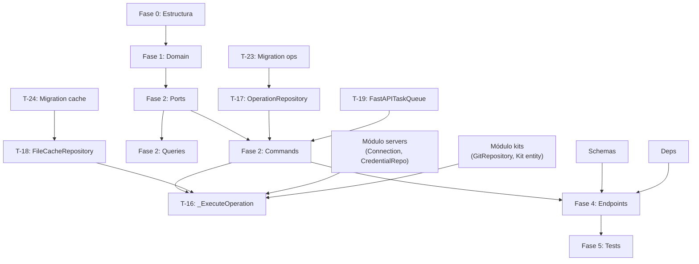

# Tareas del Módulo Operations v1.0.0

**Estado:** 0 tests — ⏳ PENDIENTE DE IMPLEMENTACIÓN

> Módulo que lanza y gestiona operaciones SSH/locales asíncronas — ejecución de kits en servidores.
> El flujo de ejecución tiene 6 pasos: snapshot → git clone → render Jinja2 → transferencia SFTP
> con caché SHA-256 → ejecución pipeline → limpieza.
> Depende de `servers` (Connection port) y `kits` (GitRepository port).

## Fase 0: Estructura Clean Architecture

**DEBE EJECUTARSE PRIMERO** — El módulo `app/v1/operations/` existe pero está vacío

- [ ] **T-00.1**: Crear estructura `domain/` con subcarpetas `entities/`, `value_objects/`, `exceptions/` y sus `__init__.py`
- [ ] **T-00.2**: Crear `application/` con subcarpetas `commands/`, `queries/`, `tasks/`, `dtos/`, `interfaces/` y sus `__init__.py`
- [ ] **T-00.3**: Crear `application/exceptions.py` (UseCaseException, InvalidOperationTransitionError, OperationNotRetriableError, OperationNotRestorableError)
- [ ] **T-00.4**: Crear `infrastructure/` con subcarpetas `persistence/`, `repositories/`, `adapters/`, `presentation/` y sus `__init__.py`
- [ ] **T-00.5**: Crear tests directory `tests/v1/operations/` con subcarpetas `test_domain/`, `test_use_cases/`, `test_infrastructure/`, `test_presentation/` y sus `__init__.py`

  **FASE 0 PENDIENTE: 5 tareas — bloquea todo el módulo**

## Fase 1: Entidades y Value Objects (Domain Layer)

- [ ] **T-01**: Value Object `OperationStatus` (`pending` | `in_progress` | `completed` | `failed` | `cancelled` | `cancelled_unsafe`) — inmutable, validación de enum, método de clase `terminal_states()` retornando frozenset, `is_terminal() -> bool`, `is_retriable() -> bool` (solo `failed` y `cancelled_unsafe`) — 8 tests
- [ ] **T-02**: Entity `Operation` — campos: `id`, `user_id`, `server_id`, `kit_id`, `status: OperationStatus`, `values: dict`, `sudo: bool`, `debug_level: str` (`none`|`errors`|`full`), `output: str` (acumulado), `error: str` (opt), `backup_files: list[str]` (del manifest del kit), `started_at` (opt), `finished_at` (opt), `created_at`, `updated_at`. Comandos con validación de transición (RN-02): `start()` → `in_progress`, `complete()` → `completed`, `fail(error)` → `failed`, `cancel()` → `cancelled` (solo desde `pending`), `cancel_unsafe()` → `cancelled_unsafe` (solo desde `in_progress`), `append_output(line)`. Queries: `is_terminal()`, `is_retriable()` (RN-12), `is_restorable()` (RN-11 — `failed`/`cancelled_unsafe` AND tiene `backup_files`), `output_visible()` (según `debug_level`). `__eq__` por `id` — 15 tests
- [ ] **T-03**: Domain Exceptions en `domain/exceptions/` — `OperationNotFoundError`, `InvalidOperationTransitionError` (con mensaje especificando transición inválida) — tests implícitos en T-02

  **FASE 1 PENDIENTE: ~23 tests**

## Fase 2: Use Cases (Application Layer) — CQRS

### Ports (Interfaces)

- [ ] **T-04**: Port `OperationRepository` ABC en `application/interfaces/operation_repository.py` — métodos: `save(operation)`, `find_by_id(id, user_id)`, `find_all_by_user(user_id, page, per_page, server_id_filter, kit_id_filter, status_filter)`, `update(operation)`, `find_by_id_no_ownership(id)` (para task interna) — 0 tests
- [ ] **T-05**: Port `FileCacheRepository` ABC en `application/interfaces/file_cache_repository.py` — métodos: `find_hash(server_id, kit_id, filename)`, `upsert(server_id, kit_id, filename, content_hash)`, `invalidate_server_kit(server_id, kit_id)` — 0 tests
- [ ] **T-06**: Port `TaskQueue` ABC en `application/interfaces/task_queue.py` — método: `enqueue(task_fn, *args, **kwargs)` — permite intercambiar `FastAPITaskQueue` (v1) por `ARQTaskQueue` (v2) sin cambiar use cases — 0 tests
- [ ] **T-07**: Port `ServerRepository` (read-only, cross-module) en `application/interfaces/server_repository.py` — métodos: `find_by_id_internal(server_id)` (sin filtro ownership, devuelve Server o None) — 0 tests (cross-module port)
- [ ] **T-08**: Port `KitRepository` (read-only, cross-module) en `application/interfaces/kit_repository.py` — método: `find_by_id_internal(kit_id)` — 0 tests
- [ ] **T-09**: Port `CredentialRepository` (read-only, cross-module) en `application/interfaces/credential_repository.py` — método: `find_by_id_internal(credential_id)` — 0 tests

### Commands

- [ ] **T-10**: Command `LaunchOperation(user_id, server_id, kit_id, values, sudo, debug_level)` → devuelve `OperationResult` — valida que el server pertenece al usuario (RN-01), que el server está activo (RN-04), que el kit es usable (RN-09 via `kit.is_usable()`), hereda `debug_level` del manifest si no se especifica (RN-13), crea operation `pending`, persiste, encola tarea async `_ExecuteOperation` — 6 tests
- [ ] **T-11**: Command `CancelOperation(user_id, operation_id)` → devuelve `OperationResult` — valida ownership (RN-01), `pending` → `cancelled` limpio, `in_progress` → `cancelled_unsafe`. No puede cancelar en estado terminal (RN-02) — 5 tests
- [ ] **T-12**: Command `RestoreOperationBackup(user_id, operation_id)` → devuelve `RestoreResult` — valida ownership (RN-01), valida `operation.is_restorable()` (RN-11), usa `ConnectionFactory` para ejecutar `cp {path}.bak.ikctl {path}` por cada fichero en `backup_files`. Si algún `.bak.ikctl` no existe, lanza `OperationNotRestorableError` — 5 tests
- [ ] **T-13**: Command `RetryOperation(user_id, operation_id)` → devuelve `OperationResult` — valida ownership (RN-01), valida `operation.is_retriable()` (RN-12), crea nueva operation con mismos params, conserva original en historial, encola nueva tarea async — 4 tests

### Queries

- [ ] **T-14**: Query `GetOperation(user_id, operation_id)` → devuelve `OperationResult` — valida ownership (RN-01), el campo `output` solo se incluye si `debug_level` es `errors` o `full` — 3 tests
- [ ] **T-15**: Query `ListOperations(user_id, page, per_page, server_id, kit_id, status)` → devuelve `OperationListResult` paginado con filtros opcionales — 3 tests

### Async Task (Application Layer)

- [ ] **T-16**: Async task `_ExecuteOperation(operation_id)` en `application/tasks/execute_operation.py` — orquesta los 6 pasos de ejecución:
  1. **Snapshot** — si `manifest.backup_files`, ejecuta `cp {path} {path}.bak.ikctl` via Connection para cada fichero (RN-05)
  2. **Git clone** — shallow clone del kit via `GitRepository`, descarga ficheros a directorio temporal en memoria/disco local
  3. **Render Jinja2** — renderiza todos los `.j2` de `manifest.upload_files` con `values` fusionados (default_values del kit + values de la operation)
  4. **Transferencia SFTP con caché** — calcula SHA-256 de cada fichero renderizado, compara con `FileCacheRepository`, transfiere solo los que cambiaron o no están en `/tmp/ikctl/kits/{kit_id}/` del servidor (RNF-15: auto-repair si directorio no existe), actualiza cache
  5. **Ejecución** — ejecuta scripts de `manifest.pipeline_files` uno a uno via Connection. Si `sudo: true`, `sudo bash script.sh`. Captura output según `debug_level`
  6. **Limpieza** — elimina `/tmp/ikctl/kits/{kit_id}/` del servidor via Connection
  
  Si cualquier paso falla: `operation.fail(error)` + persiste. Si se cancela externamente (cancelled_unsafe detectado): sale del loop. Al terminar éxito: `operation.complete()` + persiste — 12 tests

### DTOs

- [ ] **T-16.1**: Crear DTOs: `OperationResult`, `OperationListResult`, `RestoreResult` — sin tests directos

  **FASE 2 PENDIENTE: ~38 tests**

## Fase 3: Infrastructure (Repositories y Adapters)

### Repositories

- [ ] **T-17**: `SQLAlchemyOperationRepository` — implementa `OperationRepository` port. Acumula `output` con append (no sobreescribe — el field crece con `append_output`). Soporta filtros opcionales en `find_all_by_user` — 6 tests
- [ ] **T-18**: `SQLAlchemyFileCacheRepository` — implementa `FileCacheRepository` port. Tabla `server_kit_file_cache`. Upsert via INSERT ... ON DUPLICATE KEY UPDATE — 5 tests

### Adapters de TaskQueue

- [ ] **T-19**: `FastAPITaskQueue` — implementa `TaskQueue` port usando `FastAPI BackgroundTasks`. Para v1 (InMemory, RNF-02). Encola la tarea async `_ExecuteOperation` en el background task runner de FastAPI — 3 tests
- [ ] **T-20**: `ARQTaskQueue` (placeholder v2) — stub que implementa el port `TaskQueue` pero lanza `NotImplementedError`. Preparado para cuando se migre a ARQ + Valkey (RNF-02). Sin tests funcionales — 1 test (verifica que implementa el ABC)

### Composition Root

- [ ] **T-21**: Extender `main.py` con adaptadores del módulo operations — `SQLAlchemyOperationRepository`, `SQLAlchemyFileCacheRepository`, `FastAPITaskQueue` (singleton), `ConnectionFactory` (del módulo servers, reutilizado). Inyectar en todos los use cases y en la tarea `_ExecuteOperation`. Nota: `_ExecuteOperation` necesita `OperationRepository`, `FileCacheRepository`, `GitRepository`, `ConnectionFactory`, `CredentialRepository` (para resolver credential del servidor/kit)

### Persistence Models

- [ ] **T-22**: Modelos SQLAlchemy en `infrastructure/persistence/models.py` — tablas `operations` y `server_kit_file_cache`

### Database Migrations (Alembic)

- [ ] **T-23**: Alembic migration: tabla `operations` — campos: `id`, `user_id`, `server_id` (no FK — cross-DB), `kit_id` (no FK), `status`, `values` (JSON), `sudo`, `debug_level`, `output` (TEXT, acumulado), `error`, `backup_files` (JSON), `started_at`, `finished_at`, `created_at`, `updated_at`. Índices: `user_id`, `server_id`, `kit_id`, `status`. Sin FKs inter-módulo (bases de datos separadas)
- [ ] **T-24**: Alembic migration: tabla `server_kit_file_cache` — campos: `server_id`, `kit_id`, `filename`, `content_hash` (SHA-256, 64 chars), `uploaded_at`. PK compuesta `(server_id, kit_id, filename)`. Índice: `(server_id, kit_id)`

### Presentation

- [ ] **T-25**: Schemas Pydantic en `schemas.py` — `LaunchOperationRequest`, `CancelOperationRequest`, `AdHocCommandRequest`, `OperationResponse`, `OperationListResponse`, `RestoreResponse`
- [ ] **T-26**: `deps.py` — dependencias FastAPI: `get_current_user_id(token)`, `get_db_session()`, `get_background_tasks()`, factories de use cases
- [ ] **T-27**: Exception handlers en `exception_handlers.py` — `OperationNotFoundError` → 404, `InvalidOperationTransitionError` → 409, `OperationNotRestorableError` → 422, `OperationNotRetriableError` → 422

  **FASE 3 PENDIENTE: ~15 tests**

## Fase 4: Presentation (FastAPI Endpoints)

- [ ] **T-28**: `POST /api/v1/operations` — lanzar operación. Body: `LaunchOperationRequest`. Response 201: `OperationResponse` (estado `pending`). Rate limiting: 20/hora (RNF-07)
- [ ] **T-29**: `GET /api/v1/operations` — listar operaciones paginadas. Query params: `page`, `per_page`, `server_id`, `kit_id`, `status`. Response 200: `OperationListResponse`
- [ ] **T-30**: `GET /api/v1/operations/{id}` — consultar estado. Response 200: `OperationResponse` (con `output` solo si `debug_level != none`) o 404
- [ ] **T-31**: `POST /api/v1/operations/{id}/cancel` — cancelar operación. Response 200: `OperationResponse` con nuevo estado (`cancelled` o `cancelled_unsafe`) o 404/409
- [ ] **T-32**: `POST /api/v1/operations/{id}/restore` — restaurar backup. Response 200: `RestoreResponse` o 404/422 (no restorable)
- [ ] **T-33**: `POST /api/v1/operations/{id}/retry` — reintentar. Response 201: `OperationResponse` nueva operation `pending` o 404/422 (no retriable)

  **FASE 4 PENDIENTE: 6 endpoints**

## Fase 5: Tests (TDD)

### Tests de Integración FastAPI

- [ ] **T-34**: Tests de presentación operations — flujos: lanzar OK (201 + pending), consultar estado (200), cancelar pending (200 + cancelled), cancelar terminal → 409, servidor inactivo → 422, kit no sincronizado → 422 — 6 tests
- [ ] **T-35**: Tests del flujo de ejecución completo `_ExecuteOperation` — mock de `Connection`, `GitRepository`, `FileCacheRepository`: snapshot creado, ficheros cacheados correctamente, script ejecutado con sudo, output acumulado — 5 tests
- [ ] **T-36**: Tests de caché SHA-256 — fichero no cambiado no se re-transfiere, fichero cambiado (hash distinto) sí se transfiere, auto-repair si directorio remoto no existe (RNF-15) — 3 tests

### Performance & SLO Validation

- [ ] **T-37**: Benchmark endpoints de consulta — p99 baseline < 200ms (RNF-01) — 1 test

### Contract Tests

- [ ] **T-38**: Contract tests `TaskQueue` port — verifica que `FastAPITaskQueue` implementa el contrato: encola y ejecuta la task, retorna sin bloquear el request — 2 tests

  **FASE 5 PENDIENTE: ~17 tests**

---

## 📊 Resumen de Progreso

| Fase | Estado | Tests | Completitud |
|------|--------|-------|-------------|
| Fase 0 - Estructura | ⏳ **PENDIENTE** | — | 0% — **bloquea todo** |
| Fase 1 - Domain Layer | ⏳ **PENDIENTE** | — | 0% |
| Fase 2 - Use Cases (CQRS) | ⏳ **PENDIENTE** | — | 0% |
| Fase 3 - Infrastructure | ⏳ **PENDIENTE** | — | 0% |
| Fase 4 - Presentation | ⏳ **PENDIENTE** | — | 0% |
| Fase 5 - Tests | ⏳ **PENDIENTE** | — | 0% |
| Fase 6 - Documentación | ⏳ **PENDIENTE** | — | 0% |

**TOTAL ESTIMADO: ~93 tests**

## Fase 6: Documentación y Ajustes

- [ ] **T-39**: Documentación técnica → [ARCHITECTURE.md](../ARCHITECTURE.md) ya creado ✅ — verificar coverage
- [ ] **T-40**: Validación de requisitos vs implementación (todos los RF y RN)
- [ ] **T-41**: Review y refactoring de código
- [ ] **T-42**: API_GUIDE.md con ejemplos curl para todos los endpoints

### Próximos Pasos

1. 🔴 **CRÍTICO**: Ejecutar Fase 0 (crear estructura de carpetas en `app/v1/operations/`)
2. ⏳ Implementar Domain (Operation entity, OperationStatus VO con state machine)
3. ⏳ Implementar Ports (6 interfaces ABC — incluyendo cross-module)
4. ⏳ Implementar Commands/Queries con TDD
5. ⏳ Implementar `_ExecuteOperation` async task (los 6 pasos)
6. ⏳ Implementar Infrastructure (2 repos, 2 task queues)
7. ⏳ Crear migrations Alembic (operations + server_kit_file_cache)
8. ⏳ Crear 6 endpoints FastAPI

## Dependencias de Tareas

**Dependencias críticas:**

- **T-00.X** → Todo el módulo (BLOQUEA TODO)
- **Módulo `servers`** → T-10 (LaunchOperation necesita Connection port), T-16 (task necesita ConnectionFactory + CredentialRepository)
- **Módulo `kits`** → T-10 (valida `kit.is_usable()`), T-16 (task clona el kit via GitRepository)
- **T-02 (Operation entity)** → T-10, T-11, T-12, T-13 (todos los commands)
- **T-16 (`_ExecuteOperation`)** → T-18 (FileCacheRepository), T-19 (TaskQueue); bloquea toda la ejecución real
- **T-23, T-24 (Migrations)** → T-17, T-18 (repositories necesitan tablas)

## Estadísticas

- **Total de tareas**: 42 tareas explícitas
- **Fases**: 7 (incluyendo Fase 0 de setup)
- **Tests estimados**: ~93 total
- **Endpoints**: 6
- **Entidades**: 1 (Operation)
- **Value Objects**: 1 (OperationStatus con state machine)
- **Use Cases**: 6 (4 commands + 2 queries) + 1 async task
- **Ports cross-module**: 3 (ServerRepository, KitRepository, CredentialRepository — read-only)
- **Adapters**: 2 (FastAPITaskQueue, ARQTaskQueue placeholder)
- **Repositories**: 2 (SQLAlchemyOperationRepository, SQLAlchemyFileCacheRepository)
- **Migrations Alembic**: 2 (operations, server_kit_file_cache)

## Cobertura de Reglas de Negocio

| RN | Descripción | Tareas | Estado |
|----|-------------|--------|--------|
| RN-01 | Ownership — solo ops propias | T-10, T-11, T-12, T-13, T-14, T-15 | ⏳ Pendiente |
| RN-02 | Transiciones de estado válidas | T-02 (entity state machine) | ⏳ Pendiente |
| RN-04 | Server inactivo → no lanzar op | T-10 | ⏳ Pendiente |
| RN-05 | Snapshot solo si `backup[]` declarado | T-16 (step 1) | ⏳ Pendiente |
| RN-11 | Restore disponible si `failed`/`cancelled_unsafe` + backup files | T-02 `is_restorable()`, T-12 | ⏳ Pendiente |
| RN-12 | Retry solo para `failed`/`cancelled_unsafe` | T-02 `is_retriable()`, T-13 | ⏳ Pendiente |
| RN-13 | Herencia `debug_level`: op > manifest > default `none` | T-10 | ⏳ Pendiente |

**Estado RN: 0 implementadas, 7 pendientes**
