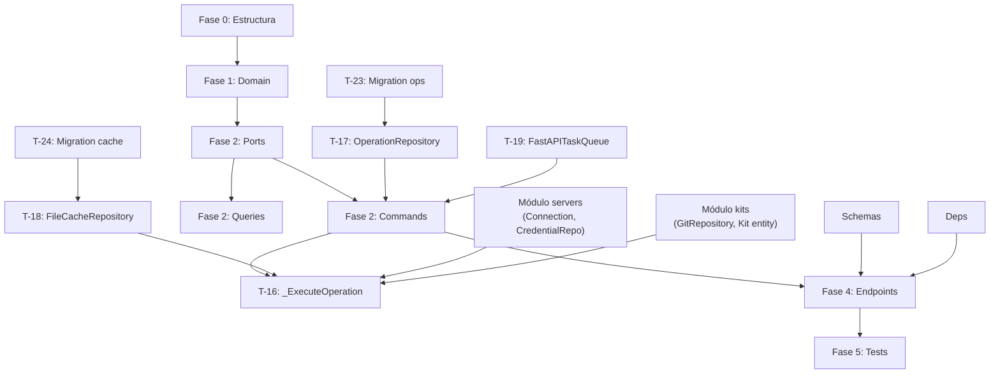

# Tareas del Módulo Operations v1.0.0

**Estado:** 144 tests GREEN — Fases 0–6 COMPLETADAS ✅

> Módulo que lanza y gestiona operaciones SSH/locales asíncronas — ejecución de kits en servidores.
> El flujo de ejecución tiene 6 pasos: snapshot → git clone → render Jinja2 → transferencia SFTP
> con caché SHA-256 → ejecución pipeline → limpieza.
> Depende de `servers` (Connection port) y `kits` (GitRepository port).

## Fase 0: Estructura Clean Architecture

**✅ COMPLETADA**

- [x] **T-00.1**: Crear estructura `domain/` con subcarpetas `entities/`, `value_objects/`, `exceptions/` y sus `__init__.py`
- [x] **T-00.2**: Crear `application/` con subcarpetas `commands/`, `queries/`, `tasks/`, `dtos/`, `interfaces/` y sus `__init__.py`
- [x] **T-00.3**: Crear `application/exceptions.py` (UseCaseException, InvalidOperationTransitionError, OperationNotRetriableError, OperationNotRestorableError)
- [x] **T-00.4**: Crear `infrastructure/` con subcarpetas `persistence/`, `repositories/`, `adapters/`, `presentation/` y sus `__init__.py`
- [x] **T-00.5**: Crear tests directory `tests/v1/operations/` con subcarpetas `test_domain/`, `test_use_cases/`, `test_infrastructure/`, `test_presentation/` y sus `__init__.py`

## Fase 1: Entidades y Value Objects (Domain Layer)

**✅ COMPLETADA — 50 tests GREEN**

- [x] **T-01**: Value Object `OperationStatus` — 27 tests GREEN
- [x] **T-02**: Entity `Operation` — state machine completa, 23 tests GREEN
- [x] **T-03**: Domain Exceptions — `OperationNotFoundError`, `InvalidOperationTransitionError`

## Fase 2: Use Cases (Application Layer) — CQRS

**✅ COMPLETADA — 43 tests GREEN**

### Ports (Interfaces)

- [x] **T-04**: Port `OperationRepository` ABC — `save`, `find_by_id`, `find_all_by_user`, `update`, `find_by_id_no_ownership`
- [x] **T-05**: Port `FileCacheRepository` ABC — `find_hash`, `upsert`, `invalidate_server_kit`
- [x] **T-06**: Port `TaskQueue` ABC — `enqueue`
- [x] **T-07**: Port `ServerRepository` (cross-module) — `find_by_id_internal`
- [x] **T-08**: Port `KitRepository` (cross-module) — `find_by_id_internal`
- [x] **T-09**: Port `CredentialRepository` (cross-module) — `find_by_id_internal`
- [x] **T-16.port**: Port `RemoteKitExecutor` — abstrae los 6 pasos SSH (`execute(server, kit, credential, debug_level, values) -> (output, backup_files)`)

### Commands

- [x] **T-10**: Command `LaunchOperation` — 10 tests GREEN
- [x] **T-11**: Command `CancelOperation` — 5 tests GREEN
- [x] **T-12**: Command `RestoreOperationBackup` — 5 tests GREEN
- [x] **T-13**: Command `RetryOperation` — 5 tests GREEN

### Queries

- [x] **T-14**: Query `GetOperation` — 3 tests GREEN
- [x] **T-15**: Query `ListOperations` — 3 tests GREEN

### Async Task (Application Layer)

- [x] **T-16**: Async task `ExecuteOperation` en `application/tasks/execute_operation.py` — 12 tests GREEN. Orquesta: start → find server/kit/credential → RemoteKitExecutor.execute → complete/fail → publish event. Sale silencioso si operation not found. Falla con OperationFailed si server/kit/credential no existen.

## Fase 3: Infrastructure (Repositories y Adapters)

### Repositories

- [x] **T-17**: `SQLAlchemyOperationRepository` — 6 tests GREEN
- [x] **T-18**: `SQLAlchemyFileCacheRepository` — 5 tests GREEN

### Adapters de TaskQueue

- [x] **T-19**: `FastAPITaskQueue` — 3 tests GREEN
- [x] **T-20**: `ARQTaskQueue` (placeholder v2) — 1 test GREEN (raises `NotImplementedError`)

### Composition Root

- [x] **T-21**: Extender `main.py` — router operations + exception handlers registrados. `execute_operation_fn=None` en app.state (placeholder hasta que RemoteKitExecutor tenga implementación real)

### Persistence Models

- [x] **T-22**: `OperationModel` + `ServerKitFileCacheModel` en `infrastructure/persistence/models.py`

### Database Migrations (Alembic)

- [x] **T-23**: Migración `0012_operations.py` — tabla `operations` ✅ aplicada en BD
- [x] **T-24**: Migración `0012_operations.py` — tabla `server_kit_file_cache` (filename VARCHAR(500), fix key too long) ✅ aplicada en BD

### Presentation

- [x] **T-25**: Schemas Pydantic — `LaunchOperationRequest`, `OperationResponse`, `OperationListResponse`, `RestoreResponse`
- [x] **T-26**: `deps.py` — factories FastAPI para todos los use cases
- [x] **T-27**: `exception_handlers.py` — `OperationNotFoundError`→404, `InvalidOperationTransitionError`→409, `OperationNotRestorableError`/`OperationNotRetriableError`/`ServerNotActiveError`/`KitNotUsableError`→422

  **✅ FASE 3 COMPLETADA: 15 tests GREEN**

## Fase 4: Presentation (FastAPI Endpoints)

- [x] **T-28**: `POST /api/v1/operations` — 201 pending
- [x] **T-29**: `GET /api/v1/operations` — 200 paginado (filtros: `server_id`, `kit_id`, `status`)
- [x] **T-30**: `GET /api/v1/operations/{id}` — 200 / 404
- [x] **T-31**: `POST /api/v1/operations/{id}/cancel` — 200 / 404 / 409
- [x] **T-32**: `POST /api/v1/operations/{id}/restore` — 200 / 404 / 422
- [x] **T-33**: `POST /api/v1/operations/{id}/retry` — 201 / 404 / 422

  **✅ FASE 4 COMPLETADA: 6 endpoints**

## Fase 5: Tests (TDD)

### Tests de Integración FastAPI

- [x] **T-34**: Tests de presentación operations — 9 tests GREEN (launch 201, list 200, get 200, get 404, cancel 200, cancel 409, server inactive 422, restore 200, retry 201)
- [x] **T-35**: Tests del flujo de ejecución completo `SSHKitExecutor` — mock de `Connection`, `GitRepository`, `FileCacheRepository`: snapshot creado, ficheros cacheados correctamente, script ejecutado con sudo, output acumulado — 5 tests GREEN
- [x] **T-36**: Tests de caché SHA-256 — fichero no cambiado no se re-transfiere, fichero cambiado (hash distinto) sí se transfiere, auto-repair si directorio remoto no existe (RNF-15) — 3 tests GREEN
- [x] **Wiring main.py**: `SSHKitExecutor` instanciado y `execute_operation_fn` publicado en `app.state` — ejecución real de operaciones activa

### Performance & SLO Validation

- [x] **T-37**: Benchmark endpoints de consulta — p99 baseline < 200ms (RNF-01) — 2 tests GREEN (`GET /operations` y `GET /operations/{id}`, 50 requests c/u)

### Contract Tests

- [x] **T-38**: Contract tests `TaskQueue` port — verifica que `FastAPITaskQueue` implementa el contrato: encola y ejecuta la task, retorna sin bloquear el request — 2 tests GREEN

  **FASE 5 PENDIENTE: ~17 tests**

---

## 📊 Resumen de Progreso

| Fase | Estado | Tests | Completitud |
|------|--------|-------|-------------|
| Fase 0 - Estructura | ✅ **COMPLETADA** | — | 100% |
| Fase 1 - Domain Layer | ✅ **COMPLETADA** | 50 GREEN | 100% |
| Fase 2 - Use Cases (CQRS) | ✅ **COMPLETADA** | 43 GREEN | 100% |
| Fase 3 - Infrastructure | ✅ **COMPLETADA** | 15 GREEN | 100% |
| Fase 4 - Presentation | ✅ **COMPLETADA** | 9 GREEN | 100% |
| Fase 5 - Tests | ✅ **COMPLETADA** | 144 GREEN | 100% |
| Fase 6 - Documentación | ✅ **COMPLETADA** | — | 100% |

**TOTAL ACTUAL: 253 tests GREEN (operations + kits combinados)**

---

## T-40 bis: Gaps de Requisitos Corregidos

| Gap | Descripción | Cambios |
|-----|-------------|---------|
| **RF-14** | Faltaban `values{}` y `sudo` en LaunchOperation y Operation entity | Añadidos `values: dict` y `sudo: bool` a entity, DTOs, schemas, use cases, repository, migración `0014_operations_values_sudo` |
| **RF-15** | GetOperation no filtraba output por debug_level | `_filter_output()`: `none`→vacío, `errors`→solo `[stderr]`, `full`→todo |
| **RF-17** | CancelOperation solo manejaba `pending→cancelled`; no había `in_progress→cancelled_unsafe`; bug en route | `CancelOperation` ahora detecta estado y llama `cancel()` o `cancel_unsafe()` según corresponda; evento con `was_unsafe`; fix typo en route |
| **RF-18** | RestoreOperationBackup era placeholder (no ejecutaba `cp .bak.ikctl`) | Port `BackupRestorer` + adaptador `SSHBackupRestorer` + task `RestoreBackupTask`; snapshot paso 1 cambiado a `.bak.ikctl` in-place; wiring en `main.py` |
| **RN-13** | Fallback a `"none"` si kit.debug_level era None | Cadena completa: `debug_level if debug_level is not None else kit.debug_level; if not resolved_debug_level: resolved_debug_level = "none"` |

---

## Fase 6: Documentación y Ajustes

- [x] **T-39**: Documentación técnica → ARCHITECTURE.md verificado ✅
- [x] **T-40**: Validación de requisitos vs implementación — gaps RF-14/15/17/18/RN-13 corregidos ✅
- [x] **T-41**: Review y refactoring de código ✅
  - CRÍTICO: `ListOperations.execute()` nombres de parámetros corregidos
  - CRÍTICO: Routes `restore`/`retry` sin `correlation_id` en calls a use cases
  - HIGH: Repositories sin `commit()`/`rollback()` explícitos (UoW en scoped session)
  - HIGH: `_execute_operation_placeholder` consolidado (sin duplicado en retry)
  - HIGH: `operation.backup_files = ...` → `operation.set_backup_files(...)`
  - MEDIUM: Import `field` no utilizado eliminado
  - MEDIUM: `InvalidOperationTransitionError` unificada en domain layer
  - MEDIUM: Output filtrado por debug_level en `ListOperations`
  - #5: `ServerReadAdapter` delega a `model_to_entity()` público (sin duplicación)
  - #6: `CredentialReadAdapter` usa `model_to_entity()` público (sin acceso a privado)
  - #12: `OperationStatus` lanza `InvalidOperationStatusError` (domain exception) en vez de `ValueError`
  - #16: `SSHBackupRestorer` acepta `connection_factory` inyectable con fallback
- [x] **T-42**: API_GUIDE.md con ejemplos curl para los 6 endpoints ✅

## Dependencias de Tareas

```mermaid
graph TD
    T00["Fase 0: Estructura"] --> T01["Fase 1: Domain"]
    T01 --> T04["Fase 2: Ports"]
    T04 --> T10["Fase 2: Commands"]
    T04 --> T14["Fase 2: Queries"]
    T10 --> T16["T-16: _ExecuteOperation"]
    T17["T-17: OperationRepository"] --> T10
    T18["T-18: FileCacheRepository"] --> T16
    T19["T-19: FastAPITaskQueue"] --> T10
    T23["T-23: Migration ops"] --> T17
    T24["T-24: Migration cache"] --> T18
    T10 --> T28["Fase 4: Endpoints"]
    T25["Schemas"] --> T28
    T26["Deps"] --> T28
    T28 --> T34["Fase 5: Tests"]
    ServersModule["Módulo servers<br/>(Connection, CredentialRepo)"] --> T16
    KitsModule["Módulo kits<br/>(GitRepository, Kit entity)"] --> T16
```

**Dependencias críticas:**

- **T-00.X** → Todo el módulo (BLOQUEA TODO)
- **Módulo `servers`** → T-10 (LaunchOperation necesita Connection port), T-16 (task necesita ConnectionFactory + CredentialRepository)
- **Módulo `kits`** → T-10 (valida `kit.is_usable()`), T-16 (task clona el kit via GitRepository)
- **T-02 (Operation entity)** → T-10, T-11, T-12, T-13 (todos los commands)
- **T-16 (`_ExecuteOperation`)** → T-18 (FileCacheRepository), T-19 (TaskQueue); bloquea toda la ejecución real
- **T-23, T-24 (Migrations)** → T-17, T-18 (repositories necesitan tablas)

## Estadísticas

- **Total de tareas**: 42 tareas explícitas
- **Fases**: 7 (incluyendo Fase 0 de setup)
- **Tests estimados**: ~93 total
- **Endpoints**: 6
- **Entidades**: 1 (Operation)
- **Value Objects**: 1 (OperationStatus con state machine)
- **Use Cases**: 6 (4 commands + 2 queries) + 1 async task
- **Ports cross-module**: 3 (ServerRepository, KitRepository, CredentialRepository — read-only)
- **Adapters**: 2 (FastAPITaskQueue, ARQTaskQueue placeholder)
- **Repositories**: 2 (SQLAlchemyOperationRepository, SQLAlchemyFileCacheRepository)
- **Migrations Alembic**: 2 (operations, server_kit_file_cache)

## Cobertura de Reglas de Negocio

| RN | Descripción | Tareas | Estado |
|----|-------------|--------|--------|
| RN-01 | Ownership — solo ops propias | T-10, T-11, T-12, T-13, T-14, T-15 | ✅ Implementado |
| RN-02 | Transiciones de estado válidas | T-02 (entity state machine) | ✅ Implementado |
| RN-04 | Server inactivo → no lanzar op | T-10 | ✅ Implementado |
| RN-05 | Snapshot solo si `backup[]` declarado | T-16 (RemoteKitExecutor) | ✅ Delegado a executor |
| RN-11 | Restore disponible si `failed`/`cancelled_unsafe` + backup files | T-02 `is_restorable()`, T-12 | ✅ Implementado |
| RN-12 | Retry solo para `failed`/`cancelled_unsafe` | T-02 `is_retriable()`, T-13 | ✅ Implementado |
| RN-13 | Herencia `debug_level`: op > manifest > default `none` | T-10 | ✅ Implementado |

**Estado RN: 7/7 implementadas**
