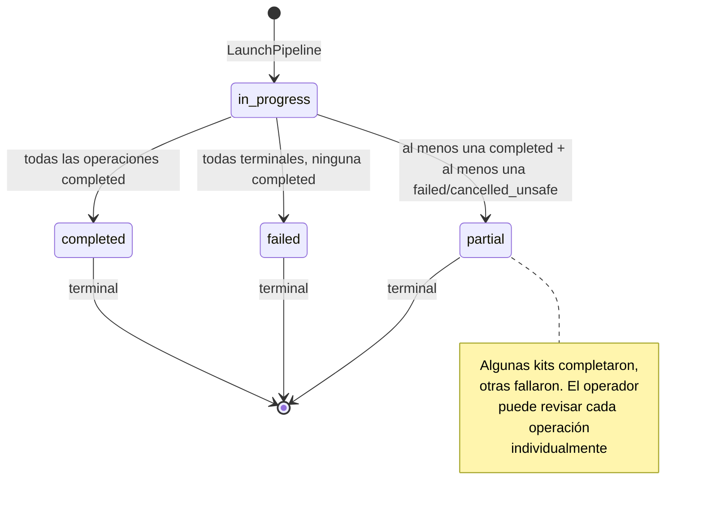
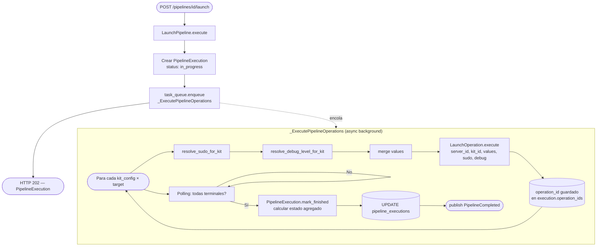
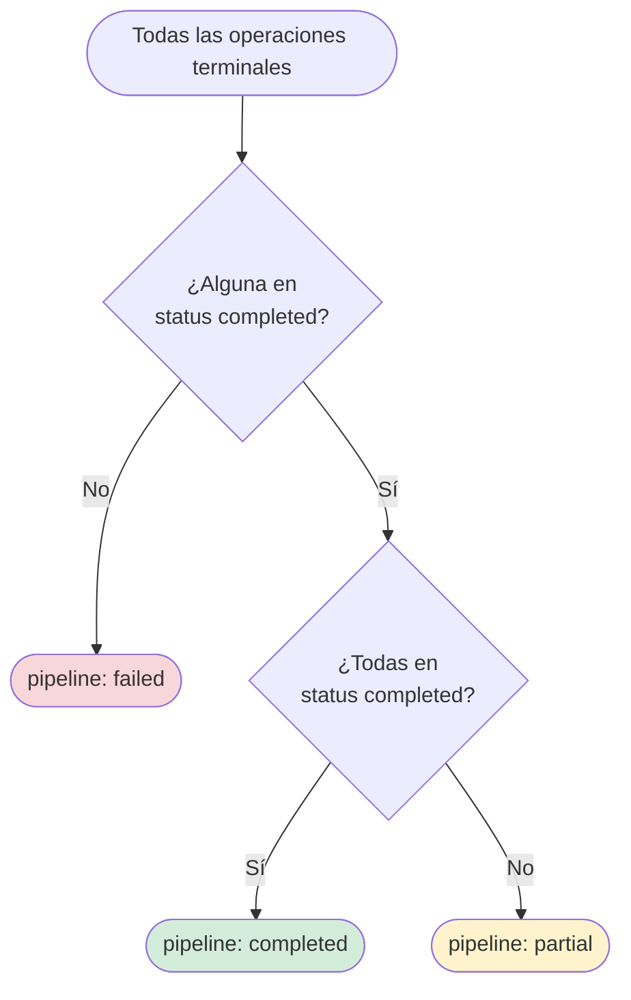

# Arquitectura del Módulo Pipelines v1

## Visión General

El módulo `pipelines` orquesta la ejecución de múltiples kits en múltiples servidores de forma paralela. Un pipeline define una combinación de `targets[]` (servidores) y `kits[]`. Al lanzarlo, genera una operación por cada combinación `kit × servidor` y las ejecuta todas en paralelo, delegando la ejecución individual al módulo `operations`.

```
app/v1/pipelines/
├── domain/          # Entities Pipeline + PipelineExecution, Events, Exceptions
├── application/     # Use Cases (CQRS), DTOs, Interfaces (Ports)
└── infrastructure/  # Repositories, Presentation
```

---

## Capa Domain

### Entity: `Pipeline`

Define la configuración reutilizable de un pipeline. No contiene estado de ejecución.

| Campo | Tipo | Descripción |
|-------|------|-------------|
| `id` | str | Identidad |
| `user_id` | str | Propietario |
| `name` | str | Nombre descriptivo |
| `description` | str \| None | — |
| `targets` | list[PipelineTarget] | Servidores donde ejecutar. No puede incluir servidor local (RN-17) |
| `kits` | list[PipelineKitConfig] | Kits a ejecutar con su configuración de sudo/debug_level/values |
| `sudo` | bool | Default global para kits que no especifiquen sudo |
| `debug_level` | str | Default global (`none` \| `errors` \| `full`) |
| `created_at` | datetime | — |
| `updated_at` | datetime | — |

**Value Objects embebidos:**

```python
@dataclass(frozen=True)
class PipelineTarget:
    server_id: str

@dataclass(frozen=True)
class PipelineKitConfig:
    kit_id: str
    sudo: bool | None           # None → hereda global
    debug_level: str | None     # None → hereda global
    values: dict                # override de values del kit
```

**Comandos:**

```python
def update(self, name, description, targets, kits, sudo, debug_level) -> None:
    # Raises PipelineHasActiveExecutionsError si hay ejecuciones in_progress

def resolve_sudo_for_kit(self, kit_config: PipelineKitConfig) -> bool:
    # Devuelve sudo efectivo: kit override > global

def resolve_debug_level_for_kit(self, kit_config: PipelineKitConfig) -> str:
    # Devuelve debug_level efectivo: kit override > global > 'none'
```

**Queries:**

```python
def operation_count(self) -> int    # len(targets) * len(kits)
```

### Entity: `PipelineExecution`

Representa una ejecución concreta del pipeline. Hay una por cada vez que se lanza.

| Campo | Tipo | Descripción |
|-------|------|-------------|
| `id` | str | Identidad |
| `pipeline_id` | str | Pipeline que originó esta ejecución |
| `user_id` | str | Propietario |
| `operation_ids` | list[str] | IDs de las operaciones generadas |
| `status` | `PipelineStatus` (VO) | Estado agregado calculado |
| `launched_at` | datetime | — |
| `finished_at` | datetime \| None | — |

**Comandos:**

```python
def mark_finished(self, operation_statuses: list[str]) -> None:
    # Calcula status agregado según RN-20:
    # completed → todas completed
    # failed    → todas terminales, ninguna completed
    # partial   → al menos una completed Y al menos una failed/cancelled_unsafe
```

### Value Objects

| VO | Valores |
|----|---------|
| `PipelineStatus` | `pending` \| `in_progress` \| `completed` \| `failed` \| `partial` |

### Domain Events

| Evento | Publisher | Payload |
|--------|-----------|---------|
| `PipelineLaunched` | `LaunchPipeline` | `{pipeline_id, execution_id, user_id, operation_count}` |
| `PipelineCompleted` | `_MonitorPipelineExecution` | `{pipeline_id, execution_id, status}` |

### Domain Exceptions

```
PipelineNotFoundError              → Pipeline no existe o no pertenece al usuario
PipelineExecutionNotFoundError     → Ejecución no encontrada
PipelineHasActiveExecutionsError   → No se puede actualizar/eliminar con ejecuciones in_progress (RN-16)
LocalServerInPipelineError         → Target incluye servidor local (RN-17)
```

---

## Capa Application

### CQRS: Commands vs Queries

**Commands** (`application/commands/`):

| Command | Descripción | Evento publicado |
|---------|-------------|-----------------|
| `CreatePipeline` | Valida targets (no local) y kits (todos synced). Persiste | — |
| `LaunchPipeline` | Crea PipelineExecution, genera una operación por kit×servidor, encola ejecución | `PipelineLaunched` |
| `UpdatePipeline` | Valida no hay ejecuciones in_progress. Delega a `pipeline.update()` | — |
| `DeletePipeline` | Solo si no hay ejecuciones in_progress | — |

**`_ExecutePipelineOperations`** (tarea asíncrona):

```
Para cada (kit, servidor) en pipeline:
    1. Construir parámetros efectivos (sudo, debug_level, values) via resolve_*
    2. Lanzar LaunchOperation (cross-module)
    3. Registrar operation_id en PipelineExecution.operation_ids
Monitorear hasta que todas las operaciones sean terminales
Calcular estado agregado → PipelineExecution.mark_finished()
```

**Queries** (`application/queries/`):

| Query | Descripción |
|-------|-------------|
| `GetPipeline` | Detalle de pipeline con configuración |
| `ListPipelines` | Lista paginada de pipelines del usuario |
| `GetPipelineStatus` | Estado de la última ejecución + lista de operaciones con estado |
| `GetPipelineHistory` | Historial de ejecuciones paginado |

### DTOs

```
PipelineDetail         → id, name, description, targets[], kits[], sudo, debug_level, timestamps
PipelineSummary        → id, name, created_at (para listados)
PipelineExecutionDetail → id, pipeline_id, status, operations[{op_id, server_id, kit_id, status}],
                          launched_at, finished_at
PipelineExecutionSummary → id, status, total_operations, completed_operations,
                            failed_operations, launched_at, finished_at
```

### Interfaces (Ports)

```
PipelineRepository          → save, find_by_id, find_all_by_user, update, delete,
                               has_active_executions
PipelineExecutionRepository → save, find_by_id, find_last_by_pipeline,
                               find_all_by_pipeline, update

# Ports compartidos (shared/application/interfaces/)
TaskQueue                    → enqueue
EventBus                     → publish, subscribe

# Cross-module (read-only o delegación)
ServerRepository             → find_by_id  (verificar que no es local y está active)
KitRepository                → find_by_id  (verificar que todos están synced)
LaunchOperation (use case)   → delegado directamente al use case del módulo operations
```

---

## Capa Infrastructure

### Repositories

| Puerto | Implementación | Tabla | DB |
|--------|---------------|-------|----|
| `PipelineRepository` | `SQLAlchemyPipelineRepository` | `pipelines`, `pipeline_targets`, `pipeline_kits` | `ikctl_pipelines` |
| `PipelineExecutionRepository` | `SQLAlchemyPipelineExecutionRepository` | `pipeline_executions`, `pipeline_execution_operations` | `ikctl_pipelines` |

### Adapters

El módulo `pipelines` no define adaptadores propios. Reutiliza `TaskQueue` de `shared/infrastructure/`.

### Presentation (FastAPI)

**`routes/pipelines.py`**:

| Método | Path | Use Case | Status |
|--------|------|----------|--------|
| POST | `/api/v1/pipelines` | `CreatePipeline` | 201 |
| GET | `/api/v1/pipelines` | `ListPipelines` | 200 |
| GET | `/api/v1/pipelines/{id}` | `GetPipeline` | 200 |
| PUT | `/api/v1/pipelines/{id}` | `UpdatePipeline` | 200 |
| DELETE | `/api/v1/pipelines/{id}` | `DeletePipeline` | 204 |
| POST | `/api/v1/pipelines/{id}/launch` | `LaunchPipeline` | 202 |
| GET | `/api/v1/pipelines/{id}/status` | `GetPipelineStatus` | 200 |
| GET | `/api/v1/pipelines/{id}/history` | `GetPipelineHistory` | 200 |

---

## Flujo de Lanzamiento de Pipeline

```
POST /api/v1/pipelines/{id}/launch
    │
    ▼
LaunchPipeline().execute(pipeline_id)
    │
    ├─ pipeline_repository.find_by_id()         → verifica ownership
    ├─ [para cada target] server_repository.find_by_id()
    │     Verifica is_active AND NOT is_local
    ├─ [para cada kit] kit_repository.find_by_id()
    │     Verifica is_usable (synced AND NOT deleted)
    │
    ├─ execution = PipelineExecution(status=in_progress)
    ├─ pipeline_execution_repository.save()
    │
    ├─ task_queue.enqueue(_ExecutePipelineOperations, execution_id)
    ├─ event_bus.publish(PipelineLaunched)
    │
    ▼
PipelineExecutionDetail DTO → HTTP 202

[En background — _ExecutePipelineOperations:]
    │
    ├─ Para cada (kit_config, target) en pipeline.kits × pipeline.targets:
    │     sudo_eff = pipeline.resolve_sudo_for_kit(kit_config)
    │     debug_eff = pipeline.resolve_debug_level_for_kit(kit_config)
    │     values_eff = merge(kit.values_defaults, kit_config.values)
    │     op = await launch_operation.execute(
    │         server_id=target.server_id,
    │         kit_id=kit_config.kit_id,
    │         values=values_eff, sudo=sudo_eff, debug_level=debug_eff
    │     )
    │     execution.operation_ids.append(op.id)
    │
    ├─ Polling hasta que todas las operaciones sean terminales
    ├─ execution.mark_finished(operation_statuses)
    ├─ pipeline_execution_repository.update()
    └─ event_bus.publish(PipelineCompleted)
```

---

## Estado Agregado del Pipeline (RN-20)

```
Todas completed                          → completed
Todas terminales, ninguna completed      → failed
Al menos una completed + una no-completed terminal → partial
```

Los estados terminales de operación son: `completed`, `failed`, `cancelled`, `cancelled_unsafe`.

---

## Composition Root (`main.py`)

```python
# Singletons
task_queue = FastAPITaskQueue()  # v1

# Scoped
async def get_pipeline_repository(session=Depends(get_db_session)):
    return SQLAlchemyPipelineRepository(session)

async def get_pipeline_execution_repository(session=Depends(get_db_session)):
    return SQLAlchemyPipelineExecutionRepository(session)

# LaunchPipeline necesita acceder a LaunchOperation (cross-module use case)
async def get_launch_pipeline(
    pipeline_repo=Depends(get_pipeline_repository),
    execution_repo=Depends(get_pipeline_execution_repository),
    server_repo=Depends(get_server_repository),    # cross-module
    kit_repo=Depends(get_kit_repository),          # cross-module
    launch_operation=Depends(get_launch_operation), # cross-module use case
    task_queue=Depends(get_task_queue),
    event_bus=Depends(get_event_bus),
):
    return LaunchPipeline(
        pipeline_repo, execution_repo,
        server_repo, kit_repo,
        launch_operation, task_queue, event_bus,
    )
```

---

## Decisiones de Diseño (ADRs)

| ADR | Decisión |
|-----|---------|
| [ADR-002](../adrs/002-mariadb-primary-database.md) | MariaDB — `ikctl_pipelines` |
| [ADR-003](../adrs/003-ssh-connection-pooling.md) | Conexiones SSH compartidas con operations |
| [ADR-005](../adrs/005-idempotency-resilience.md) | Idempotencia — cada kit×servidor tiene su operation_id único |
| [ADR-007](../adrs/007-clean-architecture.md) | LaunchOperation reutilizado como use case cross-module |
| [ADR-011](../adrs/011-task-queue-strategy.md) | Puerto `TaskQueue` — BackgroundTasks v1, ARQ v2 |

---

## Diagramas

### Ciclo de vida de una ejecución de pipeline



### Ejecución en matriz kit × servidor



### Cálculo del estado agregado (RN-20)


