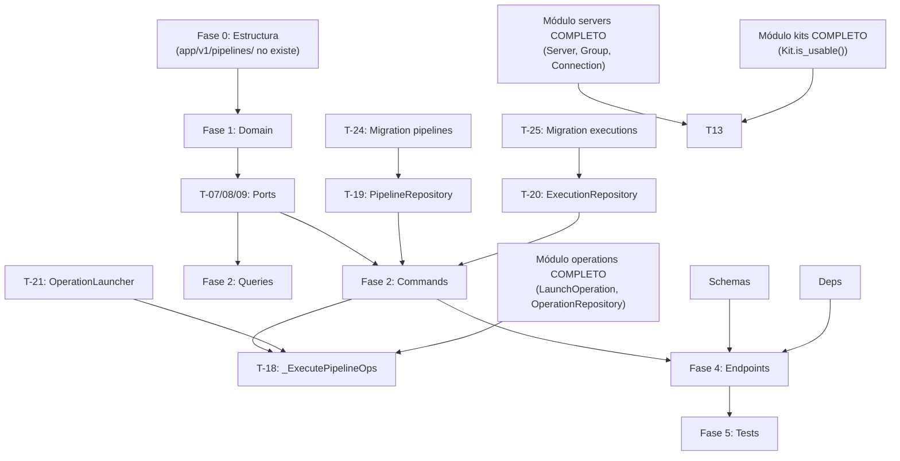

# Tareas del Módulo Pipelines v1.0.0

**Estado:** 0 tests — ⏳ PENDIENTE DE IMPLEMENTACIÓN

> Módulo que gestiona pipelines de configuración — ejecuciones de N kits × M servidores (o grupos)
> en paralelo. Un pipeline genera automáticamente N×M operaciones individuales y agrega su estado.
> Depende completamente de `operations` (LaunchOperation), `servers` (Server/Group), `kits` (Kit).

## Fase 0: Estructura Clean Architecture

**DEBE EJECUTARSE PRIMERO** — El módulo `app/v1/pipelines/` no existe aún

- [ ] **T-00.1**: Crear `app/v1/pipelines/` con `__init__.py` y estructura `domain/` (`entities/`, `value_objects/`, `exceptions/`) con sus `__init__.py`
- [ ] **T-00.2**: Crear `application/` con subcarpetas `commands/`, `queries/`, `tasks/`, `dtos/`, `interfaces/` y sus `__init__.py`
- [ ] **T-00.3**: Crear `application/exceptions.py` (UseCaseException, PipelineInProgressError, LocalServerInPipelineError, PipelineNotLaunchableError)
- [ ] **T-00.4**: Crear `infrastructure/` con subcarpetas `persistence/`, `repositories/`, `presentation/` y sus `__init__.py`
- [ ] **T-00.5**: Crear tests directory `tests/v1/pipelines/` con subcarpetas `test_domain/`, `test_use_cases/`, `test_infrastructure/`, `test_presentation/` y sus `__init__.py`

  **FASE 0 PENDIENTE: 5 tareas — bloquea todo el módulo**

## Fase 1: Entidades y Value Objects (Domain Layer)

- [ ] **T-01**: Value Object `PipelineTarget` — inmutable, campos: `server_id: str`. Validación: `server_id` no vacío. `__eq__` por valor — 3 tests
- [ ] **T-02**: Value Object `PipelineKitConfig` — inmutable, campos: `kit_id: str`, `sudo: bool | None` (opt — hereda global si None), `debug_level: str | None` (opt). `__eq__` por valor — 3 tests
- [ ] **T-03**: Value Object `PipelineStatus` (`pending` | `in_progress` | `completed` | `failed` | `partial`) — inmutable, validación de enum, `is_terminal() -> bool` — 5 tests
- [ ] **T-04**: Entity `Pipeline` — campos: `id`, `user_id`, `name`, `description` (opt), `targets: list[PipelineTarget]`, `kits: list[PipelineKitConfig]`, `values: dict` (por kit_id), `sudo: bool` (global default), `debug_level: str` (global default `none`), `created_at`, `updated_at`. Comandos: `update(name, description, targets, kits, values, sudo, debug_level)`. Queries: `resolved_sudo_for(kit_id) -> bool` (RN-14: kit config prioridad sobre global), `resolved_debug_level_for(kit_id) -> str` (RN-15), `has_local_server(server_ids: list[str]) -> bool`. `__eq__` por `id` — 8 tests
- [ ] **T-05**: Entity `PipelineExecution` — campos: `id`, `pipeline_id`, `user_id`, `status: PipelineStatus`, `operation_ids: list[str]` (IDs de las ops generadas), `snapshot: dict` (copia de targets+kits+values en el momento del lanzamiento — RN-21), `started_at`, `finished_at` (opt), `created_at`. Comandos: `start()` → `in_progress`, `mark_finished(operation_statuses: list[str])` → calcula estado agregado (RN-20): `completed` si TODAS son `completed`; `failed` si TODAS son terminales sin ninguna `completed`; `partial` si al menos una `completed` y al menos una `failed`/`cancelled_unsafe`. `__eq__` por `id` — 10 tests
- [ ] **T-06**: Domain Exceptions en `domain/exceptions/` — `PipelineNotFoundError`, `PipelineExecutionNotFoundError` — tests implícitos en T-04/T-05

  **FASE 1 PENDIENTE: ~29 tests**

## Fase 2: Use Cases (Application Layer) — CQRS

### Ports (Interfaces)

- [ ] **T-07**: Port `PipelineRepository` ABC en `application/interfaces/pipeline_repository.py` — métodos: `save(pipeline)`, `find_by_id(id, user_id)`, `find_all_by_user(user_id, page, per_page)`, `update(pipeline)`, `delete(id)`, `has_active_executions(pipeline_id)` — 0 tests
- [ ] **T-08**: Port `PipelineExecutionRepository` ABC en `application/interfaces/pipeline_execution_repository.py` — métodos: `save(execution)`, `find_by_id(id)`, `find_by_pipeline_id(pipeline_id, page, per_page)`, `update(execution)`, `find_latest_by_pipeline(pipeline_id)` — 0 tests
- [ ] **T-09**: Port `OperationLauncher` ABC en `application/interfaces/operation_launcher.py` — método: `launch(user_id, server_id, kit_id, values, sudo, debug_level)` → devuelve `operation_id: str`. Wrapper de `LaunchOperation` del módulo operations. Permite desacoplar pipelines de la implementación concreta de operations — 0 tests
- [ ] **T-09.1**: Port `ServerRepository` (read-only, cross-module) en `application/interfaces/server_repository.py` — método: `find_by_id_internal(server_id)` y `find_servers_by_group(group_id)` — 0 tests
- [ ] **T-09.2**: Port `OperationRepository` (read-only, cross-module) en `application/interfaces/operation_repository.py` — método: `find_by_id_internal(operation_id)` para polling del estado en `_ExecutePipelineOperations` — 0 tests

### Commands

- [ ] **T-10**: Command `CreatePipeline(user_id, name, description, targets, kits, values, sudo, debug_level)` → devuelve `PipelineResult` — valida que ningún target es servidor `local` (RN-17), persiste Pipeline — 5 tests
- [ ] **T-11**: Command `UpdatePipeline(user_id, pipeline_id, name, description, targets, kits, values, sudo, debug_level)` → devuelve `PipelineResult` — valida ownership (RN-01), valida sin ejecuciones activas (RN-16), valida no servidor local en targets (RN-17), persiste — 5 tests
- [ ] **T-12**: Command `DeletePipeline(user_id, pipeline_id)` → `None` — valida ownership (RN-01), valida sin ejecuciones activas (RN-16 implícito), elimina — 4 tests
- [ ] **T-13**: Command `LaunchPipeline(user_id, pipeline_id)` → devuelve `PipelineExecutionResult` — valida ownership (RN-01), expande targets (servers directos + servers de grupos), valida todos los kits usables (RN-09), crea `PipelineExecution pending`, persiste, encola `_ExecutePipelineOperations` async. Si algún kit del pipeline no está sincronizado, falla antes de encolar — 6 tests

### Queries

- [ ] **T-14**: Query `GetPipeline(user_id, pipeline_id)` → devuelve `PipelineResult` — valida ownership — 2 tests
- [ ] **T-15**: Query `ListPipelines(user_id, page, per_page)` → devuelve `PipelineListResult` paginado — 2 tests
- [ ] **T-16**: Query `GetPipelineExecutions(user_id, pipeline_id, page, per_page)` → valida ownership, devuelve `PipelineExecutionListResult` paginado con resumen por ejecución (status, launched_at, finished_at, ops total/completadas/falladas) — 2 tests
- [ ] **T-17**: Query `GetPipelineExecutionDetail(user_id, pipeline_id, execution_id)` → valida ownership del pipeline, devuelve `PipelineExecutionDetailResult` con snapshot + lista completa de operaciones individuales (server_id, kit_id, status, error) — 3 tests

### Async Task (Application Layer)

- [ ] **T-18**: Async task `_ExecutePipelineOperations(execution_id)` en `application/tasks/execute_pipeline_operations.py` — orquesta la ejecución del pipeline:
  1. Carga el pipeline y la execution via repositorios
  2. Expande targets: servers directos + todos los servers de grupos (via `ServerRepository.find_servers_by_group`)
  3. Para cada combinación (kit, server) → llama `OperationLauncher.launch(...)` (resolviendo `sudo` y `debug_level` via `pipeline.resolved_sudo_for(kit_id)` y `pipeline.resolved_debug_level_for(kit_id)`). Guarda todos los `operation_id` generados en `execution.operation_ids`
  4. Llama `execution.start()` + persiste
  5. Polling hasta que todas las ops sean terminales (polling cada 5s, timeout global 30min RNF-08)
  6. Llama `execution.mark_finished(operation_statuses)` con los estados finales de todas las ops (RN-20)
  7. Persiste `execution` con estado final — 10 tests

### DTOs

- [ ] **T-18.1**: Crear DTOs: `PipelineResult`, `PipelineListResult`, `PipelineExecutionResult`, `PipelineExecutionListResult`, `PipelineExecutionDetailResult` — sin tests directos

  **FASE 2 PENDIENTE: ~39 tests**

## Fase 3: Infrastructure (Repositories y Adapters)

### Repositories

- [ ] **T-19**: `SQLAlchemyPipelineRepository` — implementa `PipelineRepository` port. Serializa `targets` (list de PipelineTarget) y `kits` (list de PipelineKitConfig) como JSON. Soporta relaciones con tablas `pipeline_targets` y `pipeline_kits` o JSON directo en columna — 6 tests
- [ ] **T-20**: `SQLAlchemyPipelineExecutionRepository` — implementa `PipelineExecutionRepository` port. Serializa `operation_ids` como JSON — 5 tests

### Adapter OperationLauncher

- [ ] **T-21**: `OperationLauncherAdapter` — implementa `OperationLauncher` port. Instancia y llama directamente al use case `LaunchOperation` del módulo operations. No hace llamadas HTTP — es un adapter en proceso que reutiliza el application layer de operations — 3 tests

### Composition Root

- [ ] **T-22**: Extender `main.py` con adaptadores del módulo pipelines — `SQLAlchemyPipelineRepository`, `SQLAlchemyPipelineExecutionRepository`, `OperationLauncherAdapter` (que envuelve el `LaunchOperation` ya instanciado), `SQLAlchemyServerRepository` (read-only, del módulo servers, reutilizado), `SQLAlchemyOperationRepository` (read-only, reutilizado). Inyectar en todos los use cases y en la tarea `_ExecutePipelineOperations`

### Persistence Models

- [ ] **T-23**: Modelos SQLAlchemy en `infrastructure/persistence/models.py` — tablas `pipelines`, `pipeline_executions`. Schema simplificado: `targets` y `kits` como JSON directamente en `pipelines` (YAGNI — sin tablas relacionales adicionales en v1)

### Database Migrations (Alembic)

- [ ] **T-24**: Alembic migration: tabla `pipelines` — campos: `id`, `user_id`, `name`, `description`, `targets` (JSON), `kits` (JSON), `values` (JSON), `sudo`, `debug_level`, `created_at`, `updated_at`. Índices: `user_id`
- [ ] **T-25**: Alembic migration: tabla `pipeline_executions` — campos: `id`, `pipeline_id` (no FK cross-DB, VARCHAR), `user_id`, `status`, `operation_ids` (JSON), `snapshot` (JSON — copia de targets+kits+values del momento del lanzamiento), `started_at`, `finished_at` (nullable), `created_at`. Índices: `pipeline_id`, `user_id`, `status`

### Presentation

- [ ] **T-26**: Schemas Pydantic en `schemas.py` — `CreatePipelineRequest`, `UpdatePipelineRequest`, `PipelineResponse`, `PipelineExecutionResponse` (incluye `snapshot`), `PipelineExecutionDetailResponse` (con lista de operaciones individuales), `PipelineExecutionListResponse` (lista paginada con resumen)
- [ ] **T-27**: `deps.py` — dependencias FastAPI: `get_current_user_id(token)`, `get_db_session()`, `get_background_tasks()`, factories de use cases
- [ ] **T-28**: Exception handlers en `exception_handlers.py` — `PipelineNotFoundError` → 404, `PipelineInProgressError` → 409, `LocalServerInPipelineError` → 422, `PipelineNotLaunchableError` → 422

  **FASE 3 PENDIENTE: ~14 tests**

## Fase 4: Presentation (FastAPI Endpoints)

- [ ] **T-29**: `POST /api/v1/pipelines` — crear pipeline. Body: `CreatePipelineRequest`. Response 201: `PipelineResponse`
- [ ] **T-30**: `GET /api/v1/pipelines` — listar pipelines paginados. Response 200: lista `PipelineResponse`
- [ ] **T-31**: `GET /api/v1/pipelines/{id}` — obtener pipeline. Response 200: `PipelineResponse` o 404
- [ ] **T-32**: `PUT /api/v1/pipelines/{id}` — actualizar pipeline. Response 200: `PipelineResponse` o 404/403/409 (en progreso)
- [ ] **T-33**: `DELETE /api/v1/pipelines/{id}` — eliminar pipeline. Response 204 o 404/403/409 (en progreso)
- [ ] **T-34**: `POST /api/v1/pipelines/{id}/executions` — lanzar pipeline. Captura `snapshot` de la config actual. Response 201: `PipelineExecutionResponse` con `status: pending`. Rate limiting: 20/hora (RNF-07)
- [ ] **T-35**: `GET /api/v1/pipelines/{id}/executions` — historial de ejecuciones paginado. Cada entrada: `execution_id`, `launched_at`, `finished_at`, `status`, resumen ops (total/completadas/falladas). Response 200: `PipelineExecutionListResponse`
- [ ] **T-35.1**: `GET /api/v1/pipelines/{id}/executions/{exec_id}` — detalle de una ejecución concreta: `status`, `snapshot`, `started_at`, `finished_at` + lista de operaciones individuales con `server_id`, `kit_id`, `status`, `error`. Response 200: `PipelineExecutionDetailResponse` o 404

  **FASE 4 PENDIENTE: 8 endpoints**

## Fase 5: Tests (TDD)

### Tests de Integración FastAPI

- [ ] **T-37**: Tests de presentación pipelines — flujos: crear OK (201), `POST /executions` lanza OK (201 + pending execution + snapshot guardado), actualizar con ejecución activa → 409, servidor local en targets → 422, kit no sincronizado → 422, `GET /executions` lista paginada, `GET /executions/{exec_id}` detalle con ops — 7 tests
- [ ] **T-38**: Tests del flujo `_ExecutePipelineOperations` — mock de `OperationLauncher` y `OperationRepository`: N×M operations lanzadas, estado `completed` propagado correctamente, estado `partial` cuando algunas fallan (RN-20), timeout global — 6 tests
- [ ] **T-39**: Tests de estado agregado `mark_finished()` — todas completed → `completed`, todas failed → `failed`, mixto → `partial` (RN-20) — 4 tests (probados en T-05, reforzados aquí)

### Contract Tests

- [ ] **T-40**: Contract tests `OperationLauncher` port — verifica que `OperationLauncherAdapter` implementa el contrato: retorna `operation_id` válido, propagación de errors correcta — 3 tests

  **FASE 5 PENDIENTE: ~18 tests**

---

## 📊 Resumen de Progreso

| Fase | Estado | Tests | Completitud |
|------|--------|-------|-------------|
| Fase 0 - Estructura | ⏳ **PENDIENTE** | — | 0% — **bloquea todo** |
| Fase 1 - Domain Layer | ⏳ **PENDIENTE** | — | 0% |
| Fase 2 - Use Cases (CQRS) | ⏳ **PENDIENTE** | — | 0% |
| Fase 3 - Infrastructure | ⏳ **PENDIENTE** | — | 0% |
| Fase 4 - Presentation | ⏳ **PENDIENTE** | — | 0% |
| Fase 5 - Tests | ⏳ **PENDIENTE** | — | 0% |
| Fase 6 - Documentación | ⏳ **PENDIENTE** | — | 0% |

**TOTAL ESTIMADO: ~100 tests**

## Fase 6: Documentación y Ajustes

- [ ] **T-41**: Documentación técnica → [ARCHITECTURE.md](../ARCHITECTURE.md) ya creado ✅ — verificar coverage
- [ ] **T-42**: Validación de requisitos vs implementación (todos los RF y RN)
- [ ] **T-43**: Review y refactoring de código
- [ ] **T-44**: API_GUIDE.md con ejemplos curl para todos los endpoints

### Próximos Pasos

1. 🔴 **CRÍTICO**: Módulos `servers`, `kits` y `operations` deben estar 100% implementados antes de empezar pipelines
2. ⏳ Ejecutar Fase 0 (crear carpeta `app/v1/pipelines/`)
3. ⏳ Implementar Domain (Pipeline, PipelineExecution entities + VOs + RN-20 aggregation)
4. ⏳ Implementar Ports (5 interfaces — 3 cross-module)
5. ⏳ Implementar Commands/Queries con TDD
6. ⏳ Implementar `_ExecutePipelineOperations` async task
7. ⏳ Implementar `OperationLauncherAdapter` (wrapper de LaunchOperation)
8. ⏳ Crear 2 migrations Alembic
9. ⏳ Crear 8 endpoints FastAPI

## Dependencias de Tareas

**Dependencias críticas:**

- **T-00.X** → Todo el módulo (EL DIRECTORIO NO EXISTE)
- **Módulo `servers` COMPLETO** → T-10 (CreatePipeline valida no servidor local), T-13 (LaunchPipeline expande grupos), T-18 (task necesita server info)
- **Módulo `kits` COMPLETO** → T-13 (LaunchPipeline valida `kit.is_usable()`)
- **Módulo `operations` COMPLETO** → T-13 y T-18 (`OperationLauncher` envuelve `LaunchOperation`, T-18 hace polling de `OperationRepository`)
- **T-05 (PipelineExecution + mark_finished)** → T-18 (la tarea async llama `mark_finished` para RN-20)
- **T-21 (OperationLauncherAdapter)** → T-18 (la tarea usa el launcher)

## Estadísticas

- **Total de tareas**: 44 tareas explícitas
- **Fases**: 7 (incluyendo Fase 0 de setup)
- **Tests estimados**: ~100 total
- **Endpoints**: 8 (CRUD + launch + status + history)
- **Entidades**: 2 (Pipeline, PipelineExecution)
- **Value Objects**: 3 (PipelineTarget, PipelineKitConfig, PipelineStatus)
- **Use Cases**: 8 (4 commands + 4 queries) + 1 async task
- **Ports cross-module**: 3 (ServerRepository, OperationRepository, OperationLauncher)
- **Adapters**: 1 (OperationLauncherAdapter)
- **Repositories**: 2 (SQLAlchemyPipelineRepository, SQLAlchemyPipelineExecutionRepository)
- **Migrations Alembic**: 2 (pipelines, pipeline_executions)
- **Bloqueo**: Último módulo a implementar — depende de `servers`, `kits` y `operations`

## Cobertura de Reglas de Negocio

| RN | Descripción | Tareas | Estado |
|----|-------------|--------|--------|
| RN-01 | Ownership — solo pipelines propios | T-10, T-11, T-12, T-13, T-14, T-15, T-16, T-17 | ⏳ Pendiente |
| RN-14 | `sudo` por kit prioridad sobre global | T-04 `resolved_sudo_for()`, T-18 | ⏳ Pendiente |
| RN-15 | `debug_level` por kit prioridad sobre global | T-04 `resolved_debug_level_for()`, T-18 | ⏳ Pendiente |
| RN-16 | No actualizar si hay ejecución activa | T-07 `has_active_executions()`, T-11 | ⏳ Pendiente |
| RN-17 | Servidor local → no permitir en pipeline | T-10, T-11 | ⏳ Pendiente |
| RN-20 | Estado agregado: all completed/failed/partial | T-05 `mark_finished()`, T-18 | ⏳ Pendiente |

**Estado RN: 0 implementadas, 6 pendientes**
