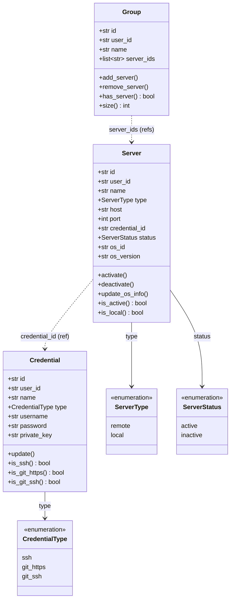
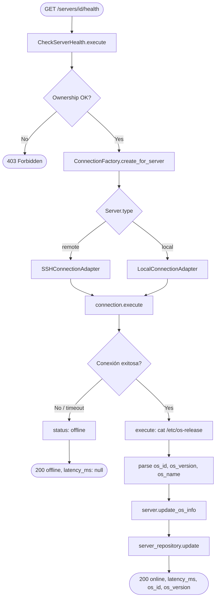
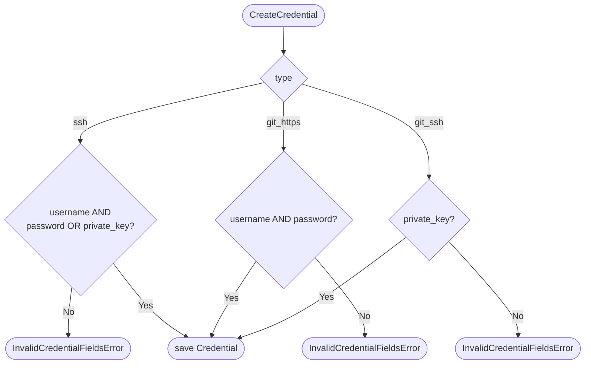

# Arquitectura del Módulo Servers v1

## Visión General

El módulo `servers` gestiona tres agregados del dominio: **Credential**, **Server** y **Group**. Sigue la misma Clean Architecture del módulo `auth` con capas domain → application → infrastructure.

```
app/v1/servers/
├── domain/          # Entities, Value Objects, Events, Exceptions
├── application/     # Use Cases (CQRS), DTOs, Interfaces (Ports)
└── infrastructure/  # Repositories, Adapters (SSH/Local), Presentation
```

---

## Capa Domain

**Responsabilidad:** Modelar los tres agregados sin dependencias externas.

### Entities

| Entity | Identidad | Campos principales | Comandos | Queries |
|--------|-----------|-------------------|---------|---------|
| `Credential` | `id` | user_id, name, type (VO), username, password (cifrado), private_key (cifrado) | `update()` | `is_ssh()`, `is_git_https()`, `is_git_ssh()` |
| `Server` | `id` | user_id, name, type (VO), host, port, credential_id, description, status, os_id, os_version, os_name | `activate()`, `deactivate()`, `update_os_info()`, `update()` | `is_active()`, `is_local()`, `is_remote()` |
| `Group` | `id` | user_id, name, description, server_ids[] | `add_server()`, `remove_server()`, `update()` | `has_server()`, `size()` |

### Value Objects

| VO | Validaciones | Comportamiento |
|----|-------------|----------------|
| `CredentialType` | enum `ssh` \| `git_https` \| `git_ssh` | — |
| `ServerType` | enum `remote` \| `local` | — |
| `ServerStatus` | enum `active` \| `inactive` | — |

La validación por tipo de credencial ocurre en `Credential.__post_init__` usando `match/case` (ver ADR-010):
- `ssh`: requiere `username` + (`password` o `private_key`)
- `git_https`: requiere `username` + `password` (PAT)
- `git_ssh`: requiere `private_key`

### Domain Events

| Evento | Publisher | Payload |
|--------|-----------|---------|
| `ServerRegistered` | `RegisterServer` | `{server_id, user_id, type}` |
| `ServerStatusChanged` | `ToggleServerStatus` | `{server_id, status}` |
| `CredentialCreated` | `CreateCredential` | `{credential_id, user_id, type}` |

### Domain Exceptions

```
CredentialNotFoundError         → Credencial no existe o no pertenece al usuario
ServerNotFoundError             → Servidor no existe o no pertenece al usuario
GroupNotFoundError              → Grupo no existe o no pertenece al usuario
InvalidCredentialFieldsError    → Campos incompletos o incorrectos para el type dado
CredentialInUseError            → No se puede eliminar — referenciada por un servidor
ServerHasActiveOperationsError  → No se puede eliminar — hay operaciones in_progress
GroupHasActivePipelinesError    → No se puede eliminar — hay pipelines in_progress
DuplicateLocalServerError       → Ya existe un servidor local para este usuario
InvalidServerTypeError          → type no válido
```

---

## Capa Application

**Responsabilidad:** Orquestar entities, puertos e interfaces. Nunca devuelve entities — siempre DTOs.

### CQRS: Commands vs Queries

**Commands** (`application/commands/`):

| Command | Descripción | Evento publicado |
|---------|-------------|-----------------|
| `CreateCredential` | Crea credencial con validación por tipo | `CredentialCreated` |
| `UpdateCredential` | Actualiza campos de la credencial | — |
| `DeleteCredential` | Elimina si no está referenciada por ningún servidor | — |
| `RegisterServer` | Registra servidor remoto, verifica que credential_id es tipo ssh | `ServerRegistered` |
| `RegisterLocalServer` | Registra servidor local, verifica unicidad por usuario | — |
| `UpdateServer` | Actualiza servidor (campos según type) | — |
| `DeleteServer` | Elimina si no hay operaciones in_progress | — |
| `ToggleServerStatus` | Alterna active ↔ inactive | `ServerStatusChanged` |
| `CreateGroup` | Crea grupo con lista de server_ids | — |
| `UpdateGroup` | Actualiza nombre, descripción y server_ids[] | — |
| `DeleteGroup` | Elimina si no hay pipelines in_progress que lo referencien | — |

**Queries** (`application/queries/`):

| Query | Descripción |
|-------|-------------|
| `GetCredential` | Obtiene credencial por id (sin exponer password/private_key) |
| `ListCredentials` | Lista paginada, filtrable por type |
| `GetServer` | Obtiene detalle de servidor (sin exponer credenciales) |
| `ListServers` | Lista paginada, filtrable por status y type |
| `CheckServerHealth` | Conecta via Connection port, devuelve online/offline + latencia + SO |
| `ExecuteAdHocCommand` | Ejecuta comando en el servidor, devuelve stdout/stderr/exit_code |
| `GetGroup` | Obtiene detalle de grupo con server_ids[] |
| `ListGroups` | Lista paginada de grupos del usuario |

### DTOs (retorno de use cases)

```
CredentialDetail    → id, user_id, name, type, username, created_at, updated_at
                      (NUNCA incluye password ni private_key)
ServerDetail        → id, user_id, name, type, host, port, credential_id,
                      description, status, os_id, os_version, os_name, timestamps
ServerHealthResult  → status (online|offline), latency_ms, os_id, os_version, os_name
CommandResult       → stdout, stderr, exit_code
GroupDetail         → id, user_id, name, description, server_ids[], timestamps
```

### Interfaces (Ports)

```
CredentialRepository  → save, find_by_id, find_all_by_user, update, delete, find_in_use_by_server
ServerRepository      → save, find_by_id, find_all_by_user, update, delete,
                         find_local_by_user, has_active_operations
GroupRepository       → save, find_by_id, find_all_by_user, update, delete,
                         has_active_pipelines
Connection            → execute, upload_file, file_exists   (shared — ver ADR-012)
ConnectionFactory     → create_for_server                   (shared — ver ADR-012)
EventBus (shared)     → publish, subscribe
```

---

## Capa Infrastructure

### Repositories (SQLAlchemy)

| Puerto | Implementación | Tabla | DB |
|--------|---------------|-------|----|
| `CredentialRepository` | `SQLAlchemyCredentialRepository` | `credentials` | `ikctl_servers` |
| `ServerRepository` | `SQLAlchemyServerRepository` | `servers` | `ikctl_servers` |
| `GroupRepository` | `SQLAlchemyGroupRepository` | `groups`, `group_members` | `ikctl_servers` |

### Adapters

| Puerto | Implementación | Tecnología |
|--------|---------------|------------|
| `Connection` (SSH) | `SSHConnectionAdapter` | asyncssh + connection pool |
| `Connection` (local) | `LocalConnectionAdapter` | asyncio.subprocess |
| `ConnectionFactory` | `ServerConnectionFactory` | instancia el adapter correcto según Server.type |

Los adaptadores `Connection` viven en `shared/infrastructure/adapters/` porque también los consume el módulo `operations`.

### Presentation (FastAPI)

**`routes/credentials.py`**:

| Método | Path | Use Case |
|--------|------|----------|
| POST | `/api/v1/credentials` | `CreateCredential` |
| GET | `/api/v1/credentials` | `ListCredentials` |
| GET | `/api/v1/credentials/{id}` | `GetCredential` |
| PUT | `/api/v1/credentials/{id}` | `UpdateCredential` |
| DELETE | `/api/v1/credentials/{id}` | `DeleteCredential` |

**`routes/servers.py`**:

| Método | Path | Use Case |
|--------|------|----------|
| POST | `/api/v1/servers` | `RegisterServer` / `RegisterLocalServer` (según type) |
| GET | `/api/v1/servers` | `ListServers` |
| GET | `/api/v1/servers/{id}` | `GetServer` |
| PUT | `/api/v1/servers/{id}` | `UpdateServer` |
| DELETE | `/api/v1/servers/{id}` | `DeleteServer` |
| PATCH | `/api/v1/servers/{id}/status` | `ToggleServerStatus` |
| GET | `/api/v1/servers/{id}/health` | `CheckServerHealth` |
| POST | `/api/v1/servers/{id}/exec` | `ExecuteAdHocCommand` |

**`routes/groups.py`**:

| Método | Path | Use Case |
|--------|------|----------|
| POST | `/api/v1/groups` | `CreateGroup` |
| GET | `/api/v1/groups` | `ListGroups` |
| GET | `/api/v1/groups/{id}` | `GetGroup` |
| PUT | `/api/v1/groups/{id}` | `UpdateGroup` |
| DELETE | `/api/v1/groups/{id}` | `DeleteGroup` |

**Seguridad:** `password` y `private_key` son write-only — los schemas Pydantic de respuesta nunca los incluyen. El cifrado AES-256 se aplica en el adapter de persistencia antes de escribir en DB (`CredentialEncryptionMixin`).

---

## Composition Root (`main.py`)

```python
# Singletons
connection_pool = SSHConnectionPool(settings)
connection_factory = ServerConnectionFactory(
    ssh_adapter=SSHConnectionAdapter(pool=connection_pool),
    local_adapter=LocalConnectionAdapter(),
)

# Scoped por request
async def get_credential_repository(session=Depends(get_db_session)):
    return SQLAlchemyCredentialRepository(session, encryption_key=settings.ENCRYPTION_KEY)

async def get_server_repository(session=Depends(get_db_session)):
    return SQLAlchemyServerRepository(session)
```

---

## Flujo de un Request Típico

Ejemplo: `PATCH /api/v1/servers/{id}/status`

```
HTTP Request
    │
    ▼
routes/servers.py::toggle_status()     ← FastAPI resuelve Depends()
    │
    ▼
ToggleServerStatus().execute()         ← Command (application layer)
    │
    ├─ server_repository.find_by_id()  ← verifica ownership
    ├─ server.activate() / deactivate() ← lógica en entity
    ├─ server_repository.update()
    ├─ event_bus.publish(ServerStatusChanged)
    │
    ▼
ServerDetail DTO → Pydantic schema → JSON HTTP 200
```

---

## Decisiones de Diseño (ADRs)

| ADR | Decisión |
|-----|---------|
| [ADR-002](../adrs/002-mariadb-primary-database.md) | MariaDB como DB principal — `ikctl_servers` |
| [ADR-003](../adrs/003-ssh-connection-pooling.md) | asyncssh con connection pooling |
| [ADR-010](../adrs/010-credential-types.md) | Entidad Credential unificada con campo `type` |
| [ADR-012](../adrs/012-local-connection-adapter.md) | Puerto `Connection` abc + `LocalConnectionAdapter` |

---

## Diagramas

### Modelo de dominio



### Flujo de health check (GET /servers/{id}/health)



### Validación de credencial por tipo


