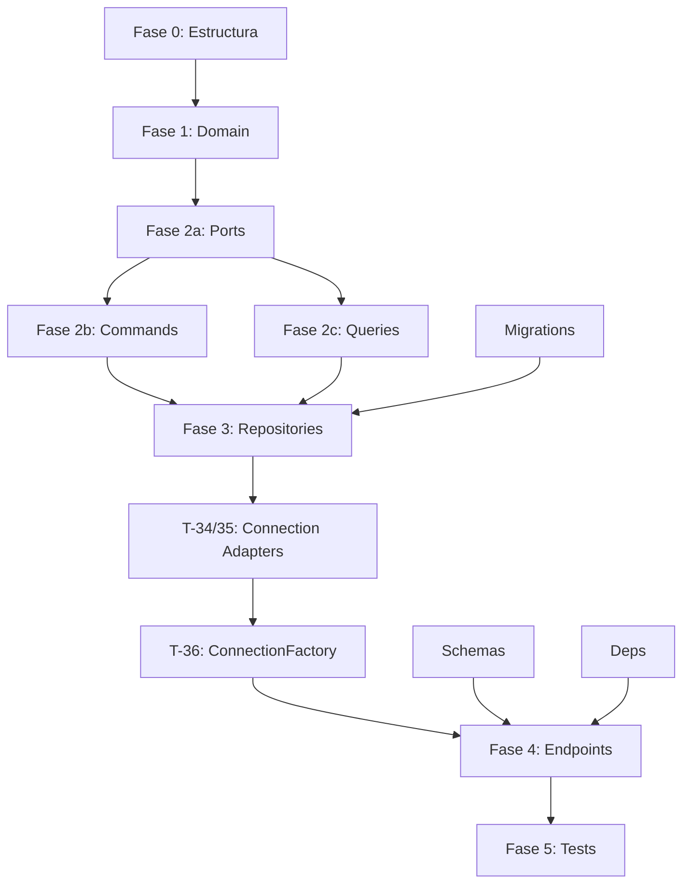

# Tareas del Módulo Servers v1.0.0

**Estado:** 85 tests — 🟡 EN PROGRESO (Fase 3)

> Módulo que gestiona credenciales SSH/Git, servidores remotos y locales, y grupos de servidores.
> Dependencia crítica de `operations` y `pipelines`.

## Fase 0: Estructura Clean Architecture

**DEBE EJECUTARSE PRIMERO** — Crear estructura de carpetas del módulo desde cero

- [x] **T-00.1**: Crear estructura `domain/` con subcarpetas `entities/`, `value_objects/`, `exceptions/` y sus `__init__.py`
- [x] **T-00.2**: Crear estructura `application/` con subcarpetas `commands/`, `queries/`, `dtos/`, `interfaces/`, `handlers/` y sus `__init__.py`
- [x] **T-00.3**: Crear `application/exceptions.py` (UseCaseException, CredentialInUseError, DuplicateLocalServerError, ServerInUseError, GroupInUseError)
- [x] **T-00.4**: Crear `infrastructure/` con subcarpetas `persistence/`, `repositories/`, `adapters/`, `presentation/` y sus `__init__.py`
- [x] **T-00.5**: Crear tests directory `tests/v1/servers/` con subcarpetas `test_domain/`, `test_use_cases/`, `test_infrastructure/`, `test_presentation/` y sus `__init__.py`

  **FASE 0 COMPLETADA ✅**

## Fase 1: Entidades y Value Objects (Domain Layer)

- [x] **T-01**: Value Object `CredentialType` (`ssh` | `git_https` | `git_ssh`) — inmutable, validación de enum, sin dependencias externas — 4 tests ✅ GREEN
- [x] **T-02**: Entity `Credential` — campos: `id`, `user_id`, `name`, `type: CredentialType`, `username`, `password` (opt), `private_key` (opt), `created_at`, `updated_at`. Validación de campos requeridos por tipo en `__post_init__` (RN-18). Comandos: `update(name, username, password, private_key)`. `__eq__` por `id` — 9 tests ✅ GREEN
- [x] **T-03**: Value Object `ServerType` (`remote` | `local`) — inmutable, validación de enum — 3 tests ✅ GREEN
- [x] **T-04**: Value Object `ServerStatus` (`active` | `inactive`) — inmutable, validación de enum — 3 tests ✅ GREEN
- [x] **T-05**: Entity `Server` — campos: `id`, `user_id`, `name`, `type: ServerType`, `status: ServerStatus`, `host` (opt), `port` (opt, default 22), `credential_id` (opt), `description` (opt), `os_id`, `os_version`, `os_name`, `created_at`, `updated_at`. Validación en `__post_init__`: remote requiere `host` y `credential_id`, local no tiene ni `host` ni `credential_id`. Comandos: `activate()`, `deactivate()`, `update_os_info(os_id, os_version, os_name)`. Queries: `is_active()`, `is_local()`, `is_remote()`. `__eq__` por `id` — 10 tests ✅ GREEN
- [x] **T-06**: Entity `Group` — campos: `id`, `user_id`, `name`, `description` (opt), `server_ids: list[str]`, `created_at`, `updated_at`. Comandos: `add_server(server_id)`, `remove_server(server_id)`, `update(name, description, server_ids)`. `__eq__` por `id` — 6 tests ✅ GREEN
- [x] **T-07**: Domain Exceptions — `domain/exceptions/credential.py`: `InvalidCredentialTypeError`, `InvalidCredentialConfigurationError`, `CredentialNotFoundError`. `domain/exceptions/server.py`: `InvalidServerTypeError`, `InvalidServerStatusError`, `InvalidServerConfigurationError`, `ServerNotFoundError`. `domain/exceptions/group.py`: `GroupNotFoundError` — cada una con docstring descriptivo — tests implícitos en T-02/T-05/T-06 ✅
- [x] **T-07.1**: Domain Events en `domain/events/` — `CredentialCreated`, `CredentialUpdated`, `CredentialDeleted`, `ServerRegistered`, `ServerUpdated`, `ServerDeleted`, `ServerStatusChanged`, `GroupCreated`, `GroupUpdated`, `GroupDeleted` — estructuras inmutables con `event_id`, `occurred_at`, `correlation_id` y campos específicos del evento — 0 tests directos (probados via use cases) ✅

  **FASE 1 PENDIENTE: ~34 tests**

## Fase 2: Use Cases (Application Layer) — CQRS

### Ports (Interfaces)

- [x] **T-08**: Port `CredentialRepository` ABC en `application/interfaces/credential_repository.py` — métodos: `save(credential)`, `find_by_id(id, user_id)`, `find_all_by_user(user_id, page, per_page)`, `update(credential)`, `delete(id)`, `is_used_by_server(credential_id)` — 0 tests (tests en contract tests) ✅
- [x] **T-09**: Port `ServerRepository` ABC en `application/interfaces/server_repository.py` — métodos: `save(server)`, `find_by_id(id, user_id)`, `find_all_by_user(user_id, page, per_page)`, `update(server)`, `delete(id)`, `find_local_by_user(user_id)`, `has_active_operations(server_id)` — 0 tests ✅
- [x] **T-10**: Port `GroupRepository` ABC en `application/interfaces/group_repository.py` — métodos: `save(group)`, `find_by_id(id, user_id)`, `find_all_by_user(user_id, page, per_page)`, `update(group)`, `delete(id)`, `has_active_pipeline_executions(group_id)` — 0 tests ✅
- [x] **T-11**: Port `Connection` ABC en `application/interfaces/connection.py` — métodos: `execute(command, sudo, timeout)`, `upload_file(local_path, remote_path)`, `file_exists(remote_path)`, `close()` — 0 tests ✅
- [x] **T-11.1**: Event Handlers en `application/handlers/` — `RemoveServerFromGroupsOnServerDeleted`: escucha `ServerDeleted` y elimina el server_id de todos los grupos del usuario que lo contenían — idempotente — 0 tests directos ✅

### Commands

- [x] **T-12**: Command `CreateCredential(user_id, name, type, username, password, private_key)` → devuelve `CredentialResult` DTO — valida CredentialType en entity, persiste, devuelve DTO sin `password`/`private_key` — 4 tests ✅ GREEN
- [x] **T-13**: Command `UpdateCredential(user_id, credential_id, name, username, password, private_key)` → devuelve `CredentialResult` — valida ownership (RN-01), persiste — 4 tests ✅ GREEN
- [x] **T-14**: Command `DeleteCredential(user_id, credential_id)` → `None` — valida ownership (RN-01), valida no está en uso (RN-06), elimina — 4 tests ✅ GREEN
- [x] **T-15**: Command `RegisterServer(user_id, name, host, port, credential_id, description)` → devuelve `ServerResult` — crea server `remote`, valida credencial existe, persiste — 3 tests ✅ GREEN
- [x] **T-16**: Command `RegisterLocalServer(user_id, name, description)` → devuelve `ServerResult` — crea server `local`, valida único por usuario (RN-07), valida que el usuario tiene rol `admin` (RNF-16), persiste — 5 tests ✅ GREEN
- [x] **T-17**: Command `UpdateServer(user_id, server_id, name, host, port, credential_id, description)` → devuelve `ServerResult` — valida ownership (RN-01), remote permite todos los campos, local solo `name`/`description`, persiste — 4 tests ✅ GREEN
- [x] **T-18**: Command `DeleteServer(user_id, server_id)` → `None` — valida ownership (RN-01), valida sin operaciones activas (RN-08), elimina — 4 tests ✅ GREEN
- [x] **T-19**: Command `ToggleServerStatus(user_id, server_id, active)` → devuelve `ServerResult` — valida ownership, activa/desactiva server, persiste — 4 tests ✅ GREEN
- [x] **T-20**: Command `CreateGroup(user_id, name, description, server_ids)` → devuelve `GroupResult` — valida que todos los `server_ids` sean propios del usuario, valida que ningún `server_id` sea de tipo `local` (RNF-16), persiste — 4 tests ✅ GREEN
- [x] **T-21**: Command `UpdateGroup(user_id, group_id, name, description, server_ids)` → devuelve `GroupResult` — valida ownership (RN-01), actualiza, persiste — 3 tests ✅ GREEN
- [x] **T-22**: Command `DeleteGroup(user_id, group_id)` → `None` — valida ownership (RN-01), valida sin pipelines activos (RN-19), elimina — 4 tests ✅ GREEN

### Queries

- [x] **T-23**: Query `GetCredential(user_id, credential_id)` → devuelve `CredentialResult` sin `password`/`private_key` — valida ownership — 2 tests ✅ GREEN
- [x] **T-24**: Query `ListCredentials(user_id, page, per_page)` → devuelve `CredentialListResult` paginado — 2 tests ✅ GREEN
- [x] **T-25**: Query `GetServer(user_id, server_id)` → devuelve `ServerResult` con `credential_id` pero sin datos de credencial — valida ownership — 2 tests ✅ GREEN
- [x] **T-26**: Query `ListServers(user_id, page, per_page)` → devuelve `ServerListResult` paginado — 2 tests ✅ GREEN
- [x] **T-27**: Query `CheckServerHealth(user_id, server_id)` → devuelve `HealthCheckResult` (`online`/`offline`, `latency_ms`, `os_info`) — usa puerto `Connection`, detecta SO de `/etc/os-release`, actualiza `os_info` en server — 4 tests ✅ GREEN
- [x] **T-28**: Query `ExecuteAdHocCommand(user_id, server_id, command)` → devuelve `AdHocCommandResult` (`stdout`, `stderr`, `exit_code`) — valida ownership, server activo (RN-04 aplicable), usa puerto `Connection` — 3 tests ✅ GREEN
- [x] **T-29**: Query `GetGroup(user_id, group_id)` → devuelve `GroupResult` con lista de servidores — valida ownership — 2 tests ✅ GREEN
- [x] **T-30**: Query `ListGroups(user_id, page, per_page)` → devuelve `GroupListResult` paginado — 2 tests ✅ GREEN

### DTOs

- [x] **T-30.1**: Crear DTOs en `application/dtos/`: `CredentialResult`, `CredentialListResult`, `ServerResult`, `ServerListResult`, `GroupResult`, `GroupListResult`, `HealthCheckResult`, `AdHocCommandResult` — sin tests directos (probados via use cases) ✅

  **FASE 2 PENDIENTE: ~58 tests**

## Fase 3: Infrastructure (Repositories y Adapters)

### Repositories

- [x] **T-31**: `SQLAlchemyCredentialRepository` — implementa `CredentialRepository` port. Incluye mixin AES-256 para cifrar/descifrar `password` y `private_key` en reposo (RNF-04). Clave de cifrado desde `ENCRYPTION_KEY` env var. Los campos cifrados nunca se devuelven en queries — 7 tests ✅ GREEN
- [x] **T-32**: `SQLAlchemyServerRepository` — implementa `ServerRepository` port — 7 tests ✅ GREEN
- [x] **T-33**: `SQLAlchemyGroupRepository` — implementa `GroupRepository` port — 6 tests ✅ GREEN

### Adapters de Conexión

- [x] **T-34**: `SSHConnectionAdapter` — implementa `Connection` port con asyncssh. Connection pool por servidor (idle 5min, timeout conexión 30s, RNF-03). Métodos: `execute(command, sudo, timeout)`, `upload_file(source, dest)`, `file_exists(path)`, `close()` — 8 tests ✅ GREEN
- [x] **T-35**: `LocalConnectionAdapter` — implementa `Connection` port con `asyncio.subprocess`. El flag `sudo: true` se ignora y genera warning en logs (RNF-16). Mismo interfaz que SSHConnectionAdapter — 6 tests ✅ GREEN
- [x] **T-36**: `ConnectionFactory` — selecciona `SSHConnectionAdapter` o `LocalConnectionAdapter` según `server.type`. Recibe `CredentialRepository` para resolver la credencial del servidor, descifra en memoria, nunca persiste descifrado — 4 tests ✅ GREEN

### Composition Root

- [x] **T-36.1**: Extender `main.py` (Composition Root) con los adaptadores del módulo servers — `SQLAlchemyCredentialRepository`, `SQLAlchemyServerRepository`, `SQLAlchemyGroupRepository`, `ConnectionFactory`, `SSHConnectionAdapter` (singleton del pool), `LocalConnectionAdapter` (singleton). Inyectar en todos los use cases del módulo sera `ENCRYPTION_KEY` en `SQLAlchemyCredentialRepository`

### Persistence Models

- [x] **T-37**: Modelos SQLAlchemy en `infrastructure/persistence/models.py` — tablas `credentials`, `servers`, `groups`, `group_members` ✅ (creado en T-31)

### Database Migrations (Alembic)

- [x] **T-38**: Alembic migration: tabla `credentials` — campos `id`, `user_id`, `name`, `type`, `username`, `password_encrypted` (nullable), `private_key_encrypted` (nullable). Índices: `user_id`, `type` ✅ GREEN
- [x] **T-39**: Alembic migration: tabla `servers` — campos `id`, `user_id`, `name`, `type`, `status`, `host` (nullable), `port` (nullable), `credential_id` (FK → credentials, nullable), `description`, `os_id`, `os_version`, `os_name`, `created_at`, `updated_at`. Índices: `user_id`, `status`, `credential_id` ✅ GREEN
- [x] **T-40**: Alembic migration: tabla `groups` — campos `id`, `user_id`, `name`, `description`, `created_at`, `updated_at`. Índice: `user_id` ✅ GREEN
- [x] **T-41**: Alembic migration: tabla `group_members` — campos `group_id` (FK → groups), `server_id` (FK → servers). PK compuesta `(group_id, server_id)` ✅ GREEN

### Presentation

- [x] **T-42**: Schemas Pydantic en `infrastructure/presentation/schemas.py` — `CreateCredentialRequest`, `UpdateCredentialRequest`, `CredentialResponse`, `RegisterServerRequest`, `RegisterLocalServerRequest`, `UpdateServerRequest`, `ServerResponse`, `HealthCheckResponse`, `AdHocCommandRequest`, `AdHocCommandResponse`, `CreateGroupRequest`, `UpdateGroupRequest`, `GroupResponse` ✅ GREEN
- [x] **T-43**: `deps.py` — dependencias FastAPI: `get_current_user_id(token)` (integra con JWT del módulo auth), `get_db_session()`, factories de use cases con sus repositorios ✅ GREEN
- [x] **T-44**: Exception handlers en `exception_handlers.py` — mapea excepciones del módulo a códigos HTTP (`CredentialNotFoundError` → 404, `CredentialInUseError` → 409, `DuplicateLocalServerError` → 409, `ServerInUseError` → 409, `GroupInUseError` → 409) ✅ GREEN
- [x] **T-44.1**: Middleware rate limiting en `infrastructure/presentation/rate_limit_middleware.py` — health check: máx 10 req/min por usuario/servidor (RNF-07), comando ad-hoc: máx 30 req/hora por usuario. Implementación InMemory v1 (migrar a Valkey en v2). Devuelve 429 con `Retry-After` header al superar el límite — 4 tests ✅ GREEN

  **FASE 3 PENDIENTE: ~34 tests**

## Fase 4: Presentation (FastAPI Endpoints)

### Credentials Endpoints

- [x] **T-45**: `POST /api/v1/credentials` — crear credencial. Body: `CreateCredentialRequest`. Response 201: `CredentialResponse` (sin `password`/`private_key`) ✅ GREEN
- [x] **T-46**: `GET /api/v1/credentials` — listar credenciales paginadas. Query params: `page`, `per_page`. Response 200: lista `CredentialResponse` ✅ GREEN
- [x] **T-47**: `GET /api/v1/credentials/{id}` — obtener credencial. Response 200: `CredentialResponse` o 404 ✅ GREEN
- [x] **T-48**: `PUT /api/v1/credentials/{id}` — actualizar credencial. Response 200: `CredentialResponse` o 404/403 ✅ GREEN
- [x] **T-49**: `DELETE /api/v1/credentials/{id}` — eliminar credencial. Response 204 o 404/403/409 (en uso) ✅ GREEN

### Servers Endpoints

- [x] **T-50**: `POST /api/v1/servers` — registrar servidor (remote o local via discriminador `type`). Response 201: `ServerResponse` ✅ GREEN
- [x] **T-51**: `GET /api/v1/servers` — listar servidores paginados. Response 200: lista `ServerResponse` ✅ GREEN
- [x] **T-52**: `GET /api/v1/servers/{id}` — obtener servidor. Response 200: `ServerResponse` o 404 ✅ GREEN
- [ ] **T-53**: `PUT /api/v1/servers/{id}` — actualizar servidor. Response 200: `ServerResponse` o 404/403
- [ ] **T-54**: `DELETE /api/v1/servers/{id}` — eliminar servidor. Response 204 o 404/403/409 (operaciones activas)
- [ ] **T-55**: `POST /api/v1/servers/{id}/toggle` — habilitar/deshabilitar servidor. Body: `{"active": bool}`. Response 200: `ServerResponse`
- [ ] **T-56**: `GET /api/v1/servers/{id}/health` — health check SSH. Response 200: `HealthCheckResponse`. Rate limiting: 10/min (RNF-07)
- [ ] **T-57**: `POST /api/v1/servers/{id}/command` — ejecutar comando ad-hoc. Body: `AdHocCommandRequest`. Response 200: `AdHocCommandResponse`. Rate limiting: 30/hora (RNF-07)

### Groups Endpoints

- [ ] **T-58**: `POST /api/v1/groups` — crear grupo. Response 201: `GroupResponse`
- [ ] **T-59**: `GET /api/v1/groups` — listar grupos paginados. Response 200: lista `GroupResponse`
- [ ] **T-60**: `GET /api/v1/groups/{id}` — obtener grupo. Response 200: `GroupResponse` o 404
- [ ] **T-61**: `PUT /api/v1/groups/{id}` — actualizar grupo. Response 200: `GroupResponse` o 404/403
- [ ] **T-62**: `DELETE /api/v1/groups/{id}` — eliminar grupo. Response 204 o 404/403/409 (pipelines activos)

  **FASE 4 PENDIENTE: 18 endpoints**

## Fase 5: Tests (TDD)

### Tests de Integración FastAPI

- [ ] **T-63**: Tests de presentación credentials — flujos: crear OK (201), credencial type inválido (422), email no propietario (403), credencial en uso no se puede eliminar (409) — 4 tests
- [ ] **T-64**: Tests de presentación servers — flujos: registrar remote OK (201), registrar local OK (201), segundo local → 409, eliminar con operaciones activas → 409 — 4 tests
- [ ] **T-65**: Tests de presentación groups — flujo: crear OK (201), eliminar con pipeline activo → 409 — 3 tests
- [ ] **T-66**: Tests de health check — servidor online devuelve latency_ms, servidor offline devuelve `offline` — 2 tests

### Performance & SLO Validation

- [ ] **T-67**: Benchmark endpoints CRUD — p99 baseline < 200ms (RNF-01). Health check < 2s online / < 35s timeout (RNF-11) — 2 tests

### Contract Tests

- [ ] **T-68**: Contract tests `Connection` port — verifica que `SSHConnectionAdapter` y `LocalConnectionAdapter` implementan correctamente el contrato del port (misma interfaz, mismos errores) — 4 tests

  **FASE 5 PENDIENTE: ~19 tests**

---

## 📊 Resumen de Progreso

| Fase | Estado | Tests | Completitud |
|------|--------|-------|-------------|
| Fase 0 - Estructura | ⏳ **PENDIENTE** | — | 0% — **bloquea todo** |
| Fase 1 - Domain Layer | ⏳ **PENDIENTE** | — | 0% |
| Fase 2 - Use Cases (CQRS) | ⏳ **PENDIENTE** | — | 0% |
| Fase 3 - Infrastructure | ⏳ **PENDIENTE** | — | 0% |
| Fase 4 - Presentation | ⏳ **PENDIENTE** | — | 0% |
| Fase 5 - Tests | ⏳ **PENDIENTE** | — | 0% |
| Fase 6 - Documentación | ⏳ **PENDIENTE** | — | 0% |

**TOTAL ESTIMADO: ~145 tests**

## Fase 6: Documentación y Ajustes

- [ ] **T-69**: Documentación técnica → [ARCHITECTURE.md](../ARCHITECTURE.md) ya creado ✅ — verificar coverage
- [ ] **T-70**: Validación de requisitos vs implementación (todos los RF y RN)
- [ ] **T-71**: Review y refactoring de código
- [ ] **T-72**: API_GUIDE.md con ejemplos curl para todos los endpoints

### Próximos Pasos

1. 🔴 **CRÍTICO**: Ejecutar Fase 0 (crear estructura de carpetas)
2. ⏳ Implementar Domain (entities, VOs, excepciones)
3. ⏳ Implementar Ports (interfaces ABC)
4. ⏳ Implementar Use Cases (Commands + Queries) con TDD
5. ⏳ Implementar Infrastructure (repositories, adapters de conexión SSH/Local)
6. ⏳ Crear migrations Alembic (4 tablas)
7. ⏳ Crear endpoints FastAPI (18 endpoints)
8. ⏳ Tests de integración, benchmark y contracts

## Dependencias de Tareas

**Dependencias críticas:**

- **T-00.X** → Todo el módulo (BLOQUEA TODO)
- **T-01, T-02** → T-12, T-13, T-14 (commands de credenciales usan entity)
- **T-05** → T-15, T-16, T-17, T-18, T-19 (commands de servidores usan entity)
- **T-34, T-35, T-36** → T-27, T-28 (health check y ad-hoc usan Connection port)
- **T-31** → T-38, T-39 (migrations previas a repositories)
- **T-36.1** (Composition Root) → T-45-T-62 (endpoints necesitan use cases instanciados)

## Estadísticas

- **Total de tareas**: 72 tareas explícitas
- **Fases**: 7 (incluyendo Fase 0 de setup)
- **Tests estimados**: ~145 total
- **Endpoints**: 18 (5 credentials + 8 servers + 5 groups)
- **Entidades**: 3 (Credential, Server, Group)
- **Value Objects**: 3 (CredentialType, ServerType, ServerStatus)
- **Use Cases**: 19 (11 commands + 8 queries)
- **Adapters**: 3 (SSHConnectionAdapter, LocalConnectionAdapter, ConnectionFactory)
- **Migrations Alembic**: 4 (credentials, servers, groups, group_members)

## Cobertura de Reglas de Negocio

| RN | Descripción | Tareas | Estado |
|----|-------------|--------|--------|
| RN-01 | Ownership — solo recursos propios | T-14, T-17, T-18, T-21, T-22, T-23, T-25, T-28, T-29 | ⏳ Pendiente |
| RN-06 | Credencial en uso → no eliminar | T-14 | ⏳ Pendiente |
| RN-07 | Un solo servidor local por usuario | T-16 | ⏳ Pendiente |
| RN-08 | Servidor con ops activas → no eliminar | T-18 | ⏳ Pendiente |
| RN-18 | Validación campos por tipo de credencial | T-02, T-12 | ⏳ Pendiente |
| RN-19 | Grupo con pipelines activos → no eliminar | T-22 | ⏳ Pendiente |

**Estado RN: 0 implementadas, 6 pendientes**
